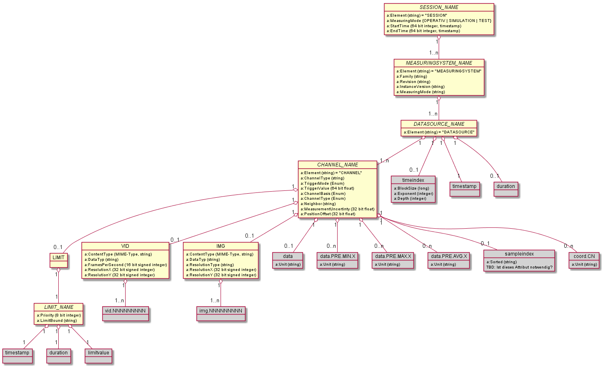

---
title: "RCM-DX Specification Document"
keywords: [RCM-DX, Specification]
logo: "images/SBB-Logo.png"
logo-width: 150
lang: "de-CH"
titlepage: true
titlepage-rule-color: "EB0000"
...

# RCM-DX Specification

TODOS:
- Alle Tabellen und deren Verwendung kontrollieren, sowie eventuell anpassen! Datenset Tabellen oder Tabellen für Attribute haben unterschiedlichen Inhalt und somit anderen Titel usw.

## History

| Version | Datum | Beschreibung | Autor |
|---|---|---|---|
| V1.0 | 14.10.2019 | Hauptversion geschrieben | Michael Ammann (SBB) |

## Approval

| Datum | Name | Funktion |
|---|---|---|
| Noch | keines | vorhanden! |

## Referenzierte Dokumente

| ID | Dakumentenname | Version | Datum |
|:---:|---|---|---|
| ? | RCM-DX-TGMS | V0.1? | 15.10.2019 ?? |

## Glossar

> TODO!
> In wie weit muss dies gehen?

## Introduction  

### Motivation  

Um die Sicherheit der Reisenden in den SBB Schienenfahrzugen sicherzustellen, überprüft und repariert die SBB ihr Schienennetz regelmässig. Die Überprüfung wird neben den Manuellen Messungen auch automatisch durchgeführt, dies mit Hilfe von Mess- und Diagnosefahrzeugen. Bei den Messungen fällt eine riesige Datenmenge an, die danach einfach verarbeitet und archiviert werden soll.  
Für die Darstellung und Weiterverarbeitung dieser Daten, wurde bereits ein ganzes Ökosystem aufgebaut. Aus diesem Grund soll mit dieser Spezifikation und somit dem RCM-DX, eine definierte Schnittstelle beschrieben werden, damit Umsysteme die sich an diese Spezifikation richten, die Daten in irgend einer Form, weiterverarbeiten können.  
Diese Spezifikation können andere Bahnbetreiber ebenfalls verwenden. Aus diesem Grund liegt diese Spezifikation der Öffentlichkeit zur Verfügung. Die Weiterentwicklung wird durch die SBB getrieben, diese ist auch für die Koordination und das Release dieser Spezifiklation verantwortlich.

## Definitionen

In diesem Dokument werden neben den Inhaltichen Beschreibungen auch Technische Restriktionen spezifiziert. Dieses Kapitel gibt eine Übersicht über die verwendeten Datentypen, Arten von Benennungen und vielen weiteren wichtigen Punken.

### Benennung von Gruppen

Ist die Rede von einer Gruppe in diesem Dokument, sind die Gruppen im HDF5 Format gemeint (vom Typ HDF5 Group). Diese enthalten weitere Gruppen oder Datensets (vom Typ HDF5 Dataset).  

Ist ein name einer Gruppe in Grossbuchstaben geschrieben (zum Beispiel TOPOLOGY), so ist dieser exakt so in der RCM-DX Datei zu finden. Ist der Name der Gruppe nicht fix definiert, so wird das im entsprechenden Kapitel beschrieben.

Soll ein Name einer Gruppe in einer Form sichtbar Trennungen enthalten, so soll dies mit einem Punkt erfolgen, dazu das Beispiel: "XPOS.DATA.LONGITUDE".

### Bennenung von Attribute

Im RCM-DX können Attribute den Gruppen sowie den Datensets zugewiesen werden. Die Namen der Attribute werden in der "upper camel case" Notation geschrieben.  

Ein Attribut enthält folgende Informationen:

| Bezeichnung | Inhalt |
|---|---|
| Name | Name des Attribut |
| Type | Datentyp des Werts des Attrbuts |
| Array Size | Typ oder Art des Inhalts |
| Value | Inhalt oder Wert |

Beispiel eines Arrays:

| Name | Type | Array Size | Value |
|---|---|---|---|
| EndTime | 64 bit integer | Scalar | 1553237099000000000 |

### Datentypen

Mögliche Datentypen für Kanäle, sollen aus der HDF5 Spezifikation entnommen werden.  

Nachfolgend sind Datentypen beschrieben die in dieser Spezifikation verwendet wurden und eine genauere Beschriebung benötigen.  

| Name | Beschreibung | Beispiel |
|---|---|---|
| UUID | Universally Unique Identifier als Eindeutige ID | 550e8400-e29b-11d4-a716-446655440000 |
| Timestamp | Eindeutiger und Weltweit definiertes Format eines Zeitpunktes, seit dem 1. Januar 1970 00:00 Uhr UTC ohne Schaltsekunden | 1553237099000000000 |

### Datasets

Ein Kanal und dessen Datenset kann verschiedene Arten von Daten aufnehmen. Die HDF5 Gruppe definiert die Art und Weise der Ablage und auch einige Typen.  
Nachfolgend eine Auflistung der möglichen Formate wie die aufgenomenen Daetne abgelegt werden können:  

| Name | Format |
|---|---|
| Einzelwerte | Einfaches Array, Dimension 1D |
| Dünnbesetzte Datenmatrix | TODO |
| Bilder | Bilder die zu einem definierten Zeitpunkt aufgenommen wurden |
| Videos | Videos die als Stream gespeichert werden und nicht als Einzelbilder |

Datensets werden immer in der "camel Case" Notation beschrieben.

#### Einzelwerte

Kanäle die einzelne Messwerte erfassen, enthalten ein Datenset mit dem Namen "data", dieses Dataset ist obligatorisch. Einzelwerte werden in diesem Datenset als 1D Array abgelegt, die länge dieses Array's (oder Liste), ist dabei nicht begrenzt.

Die möglichen Datentypen sind durch die HDF5 Group definiert, und können auf der Webseite der HDF5 Group nachgelesen werden.

Boolsche Werte (true/false) werden als ```8 bit integer, litle endian``` abgebildet, Null bedeutet "false", alle Werte grösser Null bedeuten "true".  

Werden Messdaten aufgenommen im 3D Raum, so müssen drei verschiedene Kanäle erstellt werden.

Das Attribut "Unit" des Dartensets, kann eine physikalische Einheit sein oder leer bleiben, falls die Daten keiner physikalischen Einheit entsprechen.  

##### Koordinaten

Messdaten die einem Koordinatensystem zugewiesen werden können, erhalten einen definierten Namen nach folgendem Muster: cord.CN  
Diese Art der Datenspeicherung erlaubt es, mehrere Einträge pro Messzeitpunkt aufzunehmen.

| Element | Beschreibung |
|---|---|
| cord | Einfache Zeichenfolge zur Kennzeichnung von Daten des Typs Koordinaten|
| . |Trennzeichen|
| C |Zusatzzeichen zur Kennzeichnung von Daten des Typs Koordinaten|
| N |Index Nummer beginnend mit "0", steigend je weiteren Kanal|

Das Datenset ist wie folgt definiert:

| Name | HDF5 Type | Type | Mandatory | Dimensions |
|---|---|---|:---:|---|
| "cord" mit Erweiterung wie oben genannt | HDF5 Dataset | 8 bit signed integer, oder 32 bit signed integer, oder 64 bit signed integer, oder 32 bit floating point, oder 64 bit floating point; (jeweils litle endian) | yes | Array[n] |

HDF5 Chunking ist erlaubt und empfohlen.  
Die HDF5 Compression ist erlaubt.  

Das Attribut "Unit" des Dartensets, kann eine physikalische Einheit sein oder leer bleiben, falls die Daten keiner physikalischen Einheit entsprechen.  

##### Sample Index

Werden Datensets für Koordinaten angelegt, so muss zwingend ein Datenset mit dem Namen "sampleindex" vorhanden sein. Dieses Datenset beinhaltet pro Messzeitpunkt (pro Eintrag im Datenset "timestamp"), die genaue Anzahl der Messeinträge in den Datenset, mit der Bezeichnung "cord.CN". Beim lesen und intepretieren der Daten ist diese Information wichtig, da die Daten in den Datenset's "cord.CN" als Array und ohne weitere Information dazu abgelegt sind.  

Die im Datenset "sampleIndex" angegebene Gruppengrösse kann/darf untereinander abweichen.

##### Example

Als Beispiel dient hier die Gleisgeometrie. Zu einem Zeitpunkt werden mehrere Punkte einer Schiene gemessen und abgelegt. Es wird jeweils für die X-Achse sowie für die Y-Achse ein Kanal angelegt mit den Namen "cord.C0" und "cord.C1".

Im Datenset "sampleindex" wird nun die Anzahl der zusammengehörenden Einträge aufgenommen. Steht darin zum Beispiel die Zahl "10", so gehören die ersten zehn Einträge von "cord.C0" udn "cord.C1" zusammen. Der erste Eintrag aus "cord.C0" ist der Wert auf der X-Achse und bei "cord.C1" der Wert der Y-Achse und dies gilt für die nächsten 10 Einträge. Nach den ersten zehn Einträgen folgt die nächste Gruppe mit den nächsten zehn Einträgen.

Nachfolgend ein Bild einer Gleisgeometrie mit ungefähr 2000 Messpunkten:


#### Bilder

Bilder können als "HDF5 Image" oder als JPEG gespeichert werden. Für Bilder die nicht komprimiert werden sollen, muss der Typ "HDF5 Image" verwendet werden, ansonsten JPEG.  
Bilder werden als Binäre Datenblöcke abgelegt, ein Bild ergibt ein Datensatz.  

##### HDF5 Images

| Name | HDF5 Type | Type | Mandatory | Dimensions | HDF5 Chunking | HDF5 Compression |
|---|---|---|:---:|---|----|---|
| IMG.NNNNNNNNN | HDF5 Dataset | 8 bit integer | yes | Ein Bild pro Zeitstempel | recommended | allowed |

###### Benennung

Für jedes Bild wird ein Datenset erstellt, dies in der Gruppe mit dem Namen "IMG". Die Bilder werden nach folgendem Muster benannt: IMG.NNNNNNNNN

|Element|Beschreibung|
|---|---|
| IMG | Zeichenkette für die bezeichnung eines Bildes |
| . | Trennzeichen |
| NNNNNNNNN | Bildnummer, beginnend mit 000000000 (neun Zeichen)|

##### JPEG

| Name | HDF5 Type | Type | Mandatory | Dimensions |
|---|---|---|:---:|---|
| JPEG.NNNNNNNNN | HDF5 Dataset | JPEG Bild, Datentyp gesetzt auf Inahltstyp: "<image/jpeg>" | yes | Ein Bild pro Zeitstempel |

HDF5 Chunking ist **nicht** erlaubt und **nicht** empfohlen.  
Die HDF5 Compression ist **nicht** empfohlen.  

###### Benennung

Für jedes Bild wird ein Datenset erstellt, dies in der Gruppe mit dem Namen "JPEG". Die Bilder werden nach folgendem Muster benannt: JPEG.NNNNNNNNN

|Element|Beschreibung|
|---|---|
| JPEG | Zeichenkette für die bezeichnung eines JPEG Bildes |
| . | Trennzeichen |
| NNNNNNNNN | Bildnummer, beginnend mit 000000000 (neun Zeichen), aufsteigend|

#### Videos

> TODO: genau spezifizieren!
> Wann wird ein neues Dataset erstellt?
> Wann gibt es ein Preamble und ein Trailer?
> Wo sind die Codecs geschrieben und wann werden die geschrieben?

Videos werden als Binäre Datenblöcke abgelegt.

| Name | HDF5 Type | Type | Mandatory | Dimensions |
|---|---|---|:---:|---|
| VID.NNNNNNNNN | HDF5 Dataset | TODO: BESCHREIBUNG | yes | ????? | not recommended | not recommended |

HDF5 Chunking ist **nicht** erlaubt und **nicht** empfohlen.  
Die HDF5 Compression ist **nicht** empfohlen.  

## Datasource Arrays

### Timestamp Array

Jeder Eintrag in einem Kanal, hat eine Referenz auf ein Datenset mit dem Namen *timestamp* innerhalb der Datenquellen Gruppe. In diesem *timestamp* Datenset, gibt es gleichviel Einträge wie es Einträge in einem Datenset eines Kanals gibt.  

Die Zeitstempel sind immer in steigender Reienfolge abgelegt und dürfen keine Sprünge enthalten.  

| Name | HDF5 Type | Date Type | Parent | Mandatory | Dimensions | HDF5 Chunking | HDF5 Compression | Unit |
|---|---|---|---|:---:|---|----|---|---|
| timestamp | HDF5 Dataset | 64 bit integer | datasource_group | yes | Array[n] | recommended | allowed | Nanosekunden seit dem 01.01.1970 um 00:00 Uhr UTC |

> TODO: Link weiter unten

Diese Zeitstempel werden entweder anhand einer Definierten gefahrenen Strecke oder anhand einer Frequenz aufgezeichnet, dies wird im Kapitel []() genauer Beschrieben. Neben den Zeitstempel folgen die Messmittel dieser Vorgaben und nehmen zum gleichen Zeitpunkt auch Messdaten auf. Ein Zentrales System dient als Taktgeber für die Datenaufnahme aller Systeme (Messdaten und Zeitstempel).

### Time Indices

Für ein schnelles finden von Zeitstempeln wird dieses Datenset zusätzlich zum erstellt. Das Zeitindex Datenset speichert einen binären Baum von als Index von Zeitstempeln.  

| Name | HDF5 Type | Date Type | Parent | Mandatory | Dimensions | HDF5 Chunking | HDF5 Compression | Unit |
|---|---|---|---|:---:|---|----|---|---|
| timeindex | HDF5 Dataset | 64 bit integer | datasource_group | yes | 1x | recommended | allowed | Nanosekunden, vielfaches der Blockgrösse |

Folgende Attribute sind dem Zeitindex Datenset zugewiesen:

| Name | HDF5 Type | Data Type | Parent | Mandatory | Description |
|---|---|---|---|:---:|---|
| BlockSize | HDF5 Attribute | long | timeindex | yes | Zeitdauer in Nanosekunden eines Zeitblocks. Zeitstempel innerhalb des selben Zeitblocks werden mit dem gleichen Wert indiziert |
| LogTimeBlocks | HDF5 Attribute | integer | timeindex | yes | $2^{LogTimeBlocks}$ ist gleich der Anzahl an Blöcke die für die Generierung des binären Baumes. Es können grössere Zeitversätze als $2^{LogTimeBlocks}*BlockSize$ im Zeitstempel Datenset enthalten sein, diese werden dann aber nicht indexiert. |
| Depth | HDF5 Attribute | integer | timeindex | yes | Tiefe des binären Baumes (Level) |


> TODO: Genauer spezifizieren und die Beschreibung in der Word Spezifikation aufnehmen!
> Hier mit Hilfe von Bildern Arbeiten, wie es in der Word Spezifikation gemacht wurde!


### Durations

Werden Daten aufgenommen die für eine bestimmte Zeitdauer gültig sind, so wird das Datenset mit dem namen "duration" zum Datenset "timestamp" hinzugefüght. Der aufgenommene Zeitstempel gibt den Zeitpunkt an, andem der Wert aufgenommen wurde und in der Duration steht, wie lange dieser Wert gültig ist.

| Name | HDF5 Type | Date Type | Parent | Mandatory | Dimensions | HDF5 Chunking | HDF5 Compression | Unit |
|---|---|---|---|:---:|---|----|---|---|
| duration | HDF5 Dataset | 32 bit integer | datasource_group | yes | 1x | recommended | allowed | Nanosekunden als Zeitdauer der Gültigkeit des Eintrags |

## RCM-DX file format  

Das RCM-DX besteht aus einem Dateiformat der [HDF5-Gruppe](http://www.hdfgroup.org/HDF5/) in der Version 2.0. Dieses erlaubt das Speichern der Daten in einer Baumstruktur. Diese Struktur, besser gesagt die Bennenung der Gruppen und Datensets, wird nicht durch die HDF5-Gruppe vorgegeben, jedoch durch das hier spezifizierte RCM-DX. Die Datensets können unterscheidliche Daten aufnehmen, was genau enthalten ist wird als Metadaten angegeben.  

Eine Änderung an der Struktur bedeutet eine neue Version und somit ein neues Release dieser Spezifikation.  

Um das HDF5 Dateiformat zu lesen und schreiben, bietet die HDF5 Gruppe für verschiedene Sprachen Bibliotheken an. Diese können die hier Spezifizierte Struktur ohne Probleme lesen und schreiben.  
  
Weitere Informationen zum Aufbau des HDF5-Dateiformats sind unter folgendem Link zu finden: [HDF5 Dateiformat](https://portal.hdfgroup.org/display/HDF5/Introduction+to+HDF5)

## RCM-DX Data hierarchy  

Im RCM-DX werden die einzelnen Gruppen und Datensets sowie deren Benennung definiert. Nachfolgend eine Übersicht über die in diesem Dokument spezifizierte Struktur:  

  
Für einzelne Strukturgruppen wurden eigene, separate und detailiertere Spezifikation geschrieben. An einem Mess und Inspektionsfahrzeug können mehrere Messmittel verbaut sein. Jedes dieser Messmittel erzeugt neue Kanäle an Daten sie in das RCM-DX einfliessen. Da diese Kanäle für jedes Messmittel unterschiedlich sein kann, wurden die Spezifikationen getrennt. Ein weiterer Grund dafür, ist die Tatsache, dass andere Bahnbetreiber wiederum andere Mess- und Inspektionsmittel einsetzen.  

Nachfolgend in den Unterkategorien werden die einzelnen Gruppen genauer spezifiziert.

### Root Group  

Die Root-Gruppe beinhaltet alle weiteren Untergruppen. Diese Gruppe definiert das RCM-DX und trägt dessen Namen und bezieht dich damit auf diese Spezifikation.

| Name | HDF5 Type | Parent | Mandatory |
|---|---|---|:---:|
| RCMDX | HDF5 Group | none | yes |

#### Attributes  

Nachfolgende Attribute sind der Gruppe RCMDX zugeordnet:

| Name | Data Type | Mandatory | Description |
|---|---|:---:|---|
| MajorVersion | 16-bit integer | yes | Major version number of the file format |
| MinorVersion | 16-bit integer | yes | Minor version version number of the file format |
| FeatureVersion | 16-bit integer | yes | Feature version number of the file format |

### Session Group  

Die Session Gruppe enthält Daten die im gleichen Zeitraum erhoben wurden. in einer Session Gruppe sind Daten von unterschiedlicher Herkunft. In einem RCM-DX File können mehrere dieser Session Gruppen enthalten sein und diese wiederum können sich zeitlich überlappen. Daten einer Quelle kann nur in einer Session Gruppe auf einmal sein, somit können sich diese nicht überlappen, somit ist zu jedem Zeitpunkt dieser Quelle nur eine Session die diese Daten aufnimmt.

#### Namensgebung

Da mehrere Session Gruppen in einer RCM-DX Datei enthalten sein könenn, müssen diese einen eindeutigen Namen erhalten. Um dieses Ziel zu erreichen, werden die Namen nach folgendem Muster vergeben:

| Name | HDF5 Type | Parent | Mandatory |
|---|---|---|:---:|
| YYYY-MM-ddTHH:mm:ss.SSSZ | HDF5 Group | RCMDX | yes |

In einer Session Gruppe sind die Daten der Messmittel enthalten. Für eine gegebene Millisekunde kann nur eine Session vorhanden sein, dies muss der Ersteller implementieren und sicherstellen.

##### Pattern definition  

| Pattern | Content |
|---|---|
| YYYY | The year in four digit representation |
| MM | The month in the year (01 for January) |
| dd | The day in the month |
| "T" | "T" as date marking |
| HH | The hour in the day (0-23) |
| mm | The minute in the hour |
| ss | The second in the minute |
| SSS | The the millisecond |
| "Z" | "Z" as marking of the time |
| "-" or ":" or "." | Charagters as separator |

#### Attributes  

| Name | Data Type | Mandatory | Description |
|---|---|:---:|---|
| StartTime | long | yes | Zeitstempel in Nanosekunden seit dem 1.1.1970 UTC als Startzeit der Session |
| EndTime | long | no | Zeitstempel in Nanosekunden seit dem 1.1.1970 UTC als Endzeit der Session. Falls die Session noch nicht geschlossen wurde, fehlt dieses Attribut |
| MeasuringMode | string | yes | Gibt aufschluss auf den Messmodus. Details unter [Messmodus](#messmodus).|

##### Messmodus

Es gibt drei verschiedene Messmodus die nachfolgend einzeln erklärt werden:

| Name | Beschreibung |
|---|---|
| PRODUCTIVE | Produktive Daten die weiter verwendet werden. |
| TEST | Testdaten die auf einer Messfahrt aufgenommen wurden, mit dem Ziel der Kontrolle und dem Testen der Messmittel. |
| SIMULATION | Simulierte Werte die die Messsysteme selber produzieren und nicht weiter verwendet werden. |

### Sections Group

Eine Section Gruppe beinhaltet Informationen zu einer Session.

| Name | HDF5 Type | Parent | Mandatory |
|---|---|---|:---:|
| SECTIONS | HDF5 Group | SESSION | yes |

#### Section Info

In dieser Gruppe sind die Informationen bezüglich der Session selber enthalten.

| Name | HDF5 Type | Parent | Mandatory |
|---|---|---|:---:|
| SectionInfo | HDF5 Group | SESSION | yes |

##### Datafields

Nachfolgende Datenfelder sind in der Gruppe "SectionInfo" enthalten:

| Name | HDF5 Type | Data Type | Mandatory | Dimensions |
|---|---|---|:---:|---|
| coachDirection | HDF5 Dataset | 8 bit integer | yes | 1x pro Abschnitt |
| firstTrackOffset | HDF5 Dataset | 64 bit float | yes | 1x pro Abschnitt |
| lastTrackOffset | HDF5 Dataset | 64 bit float | yes | 1x pro Abschnitt |
| startTimestamp | HDF5 Dataset | 64 bit integer | yes | 1x pro Abschnitt |
| startTimestamp | HDF5 Dataset | 64 bit integer | yes | Array[n] |
| trackInfoOffset | HDF5 Dataset | 64 bit float | yes | 1x pro Abschnitt |

HDF5 Chunking ist bei allen erlaubt und empfohlen.  
Die HDF5 Compression ist erlaubt.  

###### coachDirection

Definiert die Fahrtrichtung des Messfahrzeugs pro Abschnitts. Dieses Array enthält nur so viele Einträge wie es Abschnitte gibt.

| Nummer | Fahrtrichtung |
|:---:|---|
|0|Vorwärtsfahrt|
|1|Rückwärtsfahrt|

###### firstTrackOffset

Gibt die Distanz zwischen dem Start der Schiene und der Position zu Beginn der Messung in Meter an. Dieses Array enthält nur so viele Einträge wie es Abschnitte gibt.

###### lastTrackOffset

Gibt die Distanz zwischen der Position am Ende der Messung bis zum Ende der Schiene in Metern an. Dieses Array enthält nur so viele Einträge wie es Abschnitte gibt.

###### startTimestamp

Startzeitpunkt des Abschnitts als Zeitstempel seit dem 1.1.1970 um 00:00 Uhr UTC.

###### startTimestamp (Array)

> TODO? Woher kommt dieses Element? Ist in der Spezifikation nicht enthalten!

###### trackInfoOffset

In diesem Datenset wird definiert, wie viele Einträge in den Datensets der "Track Info Gruppe", zu einem Abschnitt gehören. Pro Abschnitt in einer Session, wird hier ein Eintrag erstellt und die Anzahl Einträge definiert. Eine Gruppengrösse kann bestimmt werden, indem der angegebene offset Wert, an der Position $x$ minus der offset Wert an der Position $x-1$ verrechte wird.

#### Track Info

In dieser Gruppe sind die Informationen bezüglich der Session selber enthalten.

| Name | HDF5 Type | Parent | Mandatory |
|---|---|---|:---:|
| SectionInfo | HDF5 Group | SECTIONS | yes |

##### Datafields

| Name | HDF5 Type | Data Type | Mandatory | Dimensions |
|---|---|---|:---:|---|
| trackId | HDF5 Dataset | 32 bit signed integer, litle endian | yes | [1] |
| trackStartTimestamp | HDF5 Dataset | 64 bit signed integer, litle endian | yes | [1] |
| trackEndTimestamp | HDF5 Dataset | 64 bit signed integer, litle endian | yes | [1] |
| trackOrientation | HDF5 Dataset | 8 bit signed integer, litle endian | yes | [1] |
| trackStartCoveredDistance | HDF5 Dataset | 64 bit float, litle endian | yes | [1] |
| trackEndCoveredDistance | HDF5 Dataset | 64 bit float, litle endian | yes | [1] |

HDF5 Chunking ist bei allen erlaubt und empfohlen.  
Die HDF5 Compression ist erlaubt.  

### Plattform Group

Eine Plattform Gruppe beinhaltet Informationen zu einem Messfahrzeug das die Daten sammelt.  
Die Namensgebung muss **pro Fahrzeug eindeutig** sein, ist aber ansonsten nicht weiter spezifiziert.  

| Name | HDF5 Type | Parent | Mandatory |
|---|---|---|:---:|
| PLATFORM | HDF5 Group | SESSION | yes ????????????????? TODO: zu definieren! |

#### Attribute

Die Platform Gruppe enthält folgende Attribute:

| Name | Data Type | Mandatory | Description |
|---|---|:---:|---|
| Name | string | yes | Eindeutiger Name des Fahrzeugs |
| VehicleNumber | string | yes | Eindeutige Nummer des Fahrzeugs |

#### Configuration

In den Datasets dieser Gruppe, können Konfigurationen von diversen Systemen abgelegt werden. Die Datensets sind so angelegt, dass Globale und Netzwerkspezifische Konfigurationen abgelegt werden können.

| Name | HDF5 Type | Parent | Mandatory |
|---|---|---|:---:|
| CONFIGURATION | HDF5 Group | PLATFORM | yes TODO: zu definieren! |

Datensets:

| Name | HDF5 Type | Date Type | Parent | Mandatory | Dimensions | HDF5 Chunking | HDF5 Compression |
|---|---|---|---|:---:|---|----|---|
| global | HDF5 Dataset | string | CONFIGURATION | yes | 1x | recommended | allowed |
| network | HDF5 Dataset | string | CONFIGURATION | yes | 1x | recommended | allowed |

### Logging Group

> TODO!
> Wo finde ich Informationen dazu?

### Messages Group

> TODO!
> Wo finde ich Informationen dazu?

### Outages Group

> TODO!
> Wo finde ich Informationen dazu?

### Clearance information Group

> TODO!
> Wo finde ich Informationen dazu?

### Environment Group

> TODO!
> Wo finde ich Informationen dazu?

### Measuring System Group

Jedes Messsystem hat seine eigenen Datenquellen, die einen eigenen Namen haben, sowie eigenen Kanälen die wiederum eigene Namen haben. Gemiensamkeiten werden in dieser Spezifikation beschrieben, alles andere ist jeweils in einer eigenen Spezifikation defineirt. Da dieser Teil sich stark von Bahnbetrieben und Messmitteln unterscheidet, wurde auf eine starre Spezifizierung verzichtet, dennoch wird ein gewisser Rhmen vorgegeben.

Für jedes System das Daten erfasst, wird eine Gruppe erstellt. Der Name der Gruppe ist für pro System eindeutig. Wie sich dieser Name zusammenstellt, ist nicht vorgegeben. Jedes System enthält weitere Untergruppen die am Ende jeweils eine Datenquelle beinhaltet.



#### Exapmle

Als Beispiel soll hier ein Messsystem beschrieben werden, dass Umgebungdaten aufnimmt. Dieses Messsystem kann mehrere Typen von Daten erfassen, gehört aber zur Messsystem Gruppe "ADDITIONAL_DATA". Die Daten werden in einzelnen Datenquellen Gruppen abgelegt, dies ist im Kapitel [Datasource Group](#datasource-group) beschrieben.

#### Attributes  

Folgende Attribute sind in der Gruppe des Messystems enthalten:

| Name | Data Type | Mandatory | Description |
|---|---|:---:|---|
| Family | string |  yes | Allgemeiner Name des Messystems |
| Version | string | yes | Versionstand der Software auf dem Messystem, vergeben durch den Messmittelhersteller |
| Family | string | yes | Version des Datenformat das vom Messmittel erstellt wird. Diese Version kann unterschiedlich sein innerhalb verschiedener Messmittel der gleichen Familie |

### Datasource Group

Eine Datenquellen Gruppe kann mehrere Kanäle und somit mehrere Datenquellen enthalten. Diese Gruppe fasst diese Kanäle zusammen. Die Benennung kann frei gewählt werden, muss aber eindeutig sein.  

Für jeden einzelnen Messpunkt, innerhalb eines Datenquellen Gruppe, ist ein Zeitstempel vorhanden. Für eine Datenquellen Gruppe gibt es zwei Arten der Datenerfassung. Die eine ist immer nach einer definierten Distanz (zum Beispiel alle 25 Zentimeter) und die andere ist die Messdatenaufnahme in einer Bestimmten Frequenz (zum Beispiel 4000 Hz).
Die Art wie die Messdaten erfasst wurden, steht in zwei Attrubuten bei jeder Kanal Gruppe. Eine Beschreibung ist unter [Common Trigger Distance or Frequence](#common-trigger-distance-or-frequence).

#### Example

In unserem Beispiel wird nun der Name der Datenquellen Gruppe vergeben, die unsere Umgebungsmessdaten enthalten soll, diese nennen wir "ENVIRONMENT".  
In dieser Gruppe befindet sich nun auch das Dataset "timestamp".  

#### Timestamp Dataset

In jeder Datenquellen Gruppe befindet sich ein Datenset mit dem namen "timestamp". Darin sind alle Zeitstempel, an dem eine Messung aufgenommen wurde. Die grösse dieser Liste an Zeitstempeln, ist gleich gross wie die der Datensets pro Kanal.

Eine genauere Beschreibung dazu ist im Kapitel [Timestamp Array](#timestamp-array) zu finden!

### Channel Group

Eine Kanal Gruppe enthält Metadaten zu den eigentlichen Messdaten und somit zu den verschiedenen Kanälen. Die Benennung kann frei gewählt werden, muss aber innerhalb der Datenquellen Gruppe eindeutig sein.  

Folgende Attribute sind in dieser Gruppe enthalten:

| Name | Data Type | Unit | Mandatory | Description |
|---|---|---|---|---|
| PositionOffset | 32 bit float | Meter | yes | [Position Offset](#position-offset) |
| TriggerMode | string | none | yes | [Trigger Mode](#trigger-mode) |
| ChannelBasis | string | none | yes | [Channel Basis](#channel-basis) |
| CommonTriggerDistance | 32 bit float | Meter | yes | [Common Trigger Distance or Frequence](#common-trigger-distance-or-frequence) |
| CommonTriggerFrequence | 32 bit float | Herz | yes | [Common Trigger Distance or Frequence](#common-trigger-distance-or-frequence) |
| ChannelTyp | string | none | yes | [Channel Type](#channel-type) |
| Neighbor | string | none | yes | [Neighbor](#neighbor) |

#### Channel Basis

Beschreibung des Kanals was und in welcher Richtung gemessen wurde. Da sich ein Messfahrzeug auf einer Schiene in zwei Richtungen bewegen kann und sich der Sensor somit auf der jeweils anderen Seite befinden könnte, sollte dies angegeben werden können. Hier ist der Platz dafür.

Mögliche Werte sind:

| Value | Beschreibung |
|---|---|
| SENSOR_VERTICAL_LEFT | ? |
| SENSOR_VERTICAL_RIGHT | ? |
| MOVE_DIRECTION_VERTICAL_LEFT | ? |
| MOVE_DIRECTION_VERTICAL_RIGHT | ? |
| SENSOR_VERTICAL_TOTAL | ? |
| MOVE_DIRECTION_VERTICAL_TOTAL | ? |
| TOTAL | ? |

#### Common Trigger Distance or Frequence

Die beiden Attribute "CommonTriggerFreq" und "CommonTriggerDistance" definieren einmal die Art der Messdatenaufnahme und einmal in welchem Abstand diese Messdaten aufgenommen wurden.

Werden die Messdaten in einem bestimmten Abstand aufgenommen, zum Beispiel alle 20 Millimeter, so wird das Attribut "CommonTriggerDistance" angegeben und bei "CommonTriggerFreq" wird der Wert "0.0" angegeben. Beim Attribut "TriggerMode" wird der Wert "DISTANCE" vermerkt.

Werden die Daten in einer gewissen Frewuenz aufgenommen, so wir beim Attribut "CommonTriggerFreq" die Frequenz in Herz angegeben, zum beispiel "40000.0" für 4kHz. Bei "CommonTriggerDistance" bleibt der Wert "0.0". Beim Attribut "TriggerMode" wird der Wert "TIME" vermerkt.

> In einer Datenquellen Gruppe ist immer nur eine gemeinsame Auslösefrequenz oder eine Auslösedistanz, eine Mischung innerhalb der Gruppe ist nciht zulässig!
> Beide Attribute haben den Wert "0.0", wenn bei "TriggerMode" der Wert "EVENT" enthalten ist.

#### Channel Type

Defineiert wie ein Wert entstanden ist. Dieser kann gemessen, errechnet oder aus einer zuvor definierten Datenquelle stammen, die von da ausgelesen und in die Datei eingefüght wurden.

Folgende Werte sind möglich:

| Value | Beschreibung |
|---|---|
| MEASURED | Gemessene Werte |
| REFERENCE | Ein Sollwert einer dritten Quelle |

Ein Beispiel für Referenzwerte, sind definierte Sollwerte die aus einer anderen Quelle (Datei, Datenbank usw.) einfliessen und für Vergleiche verwendet werden sollen.

#### Neighbor

Verweist auf den Namen eines Benachbarten Kanals. Dies kann zum Beispiel bei der Messung der Gleistemperatur der linken Schiene, die rechete Schiene sein.  
Somit würde im Attribut "neighbor" von des Kanals "TEMP_RAIL_L" der Name "TEMP_RAIL_L" stehen und umgekehrt.  

#### Position Offset

Beschreibt die Distanz zwischen einem definierten Nullpunkt (Position) am Messfahrzeug, zu einem Messsystem. Diese Angabe dient dem Umrechnen der genauen Zeit an dem die Messung aufgenommen wurde, zu einem definierten Nullpunkt mit Hilfe der gefahrenen Geschwindigkeit und der zum Zeitpunkt aufgenommenen Position.  

#### Trigger Mode

Dieses Attribut definiert, in welcher Art die Daten aufgenommen wurden.

Mögliche Werte sind:

| Value | Beschreibung |
|---|---|
| TIME | Zeitbasierte Messdatenaufnahme |
| DISTANCE | Distanzbasierte Messdatenaufnahme |
| EVENT | Event basierte Aufnahme |

#### Example

Als Kanal folgen hier alle Arten von Daten die zum gleichen Zeitpunkt aufgenommen werden. Die Namen der Kanäle sind frei wählbar:

| Name | HDF5 Type | Mandatory | Description |
|---|---|:---:|---|
| TEMP | HDF5 Group | no | Temperatur |
| WIND_DIR | HDF5 Group | no | Windrichtung |
| WIND_SPEED | HDF5 Group | no | Windgeschwindigkeit |
| HUM | HDF5 Group | no | Feuchtigkeit |

Weiter erhalten alle Kanäle die folgenden Attribute und Werte:

| Attribut Name | Wert (als Beispiel) |
|---|---|
| ChannelBasis | TOTAL |
| CommonTriggerDistance | 0.0 |
| CommonTriggerFreq | 1.0 |
| MeasurementType | MEASURED_VALUE |
| Neighbor | "" |
| PositioOffset | 0.0 |
| TriggerMode | TIME |

##### Data object

Jede Kanal Gruppe erhält ein Datenset mit den eigentlichen Messdaten:

| Name | HDF5 Type | Mandatory |
|---|---|:---:|
| data | HDF5 Dataset | yes |

> Es gibt genau so viele Messdateneinträge wie es Zeitstempel im Dataset "timestamp" gibt, das der Datenquellen Gruppe beiliegt.

Das Datenset benötigt weitere Informationen, diese werden als Attribute dazu angegeben:

| Name | Type | Mandatory | Description |
|---|---|:---:|---|
| Unit | string | yes | Beschreibung der Einheit der Messdaten, wie zum Beispiel "Millimeter" |

Das Datenset und die möglichen Daten, die abgespeichert werden können, wird in einem eigenen Kapitel genauer beschrieben: [Daten](#data)

###### Example

Zu unseren definierten Kanälen kommen nun die Einheiten hinzu. Jedes Datenset erhält nun noch ein Attribut für diese Einheit:

| Kanalname | Attribut Name | Einheit |
|---|---|---|
| TEMP | "Unit" | DegreeCelsius |
| WIND_DIR | "Unit" | Degree |
| WIND_SPEED | "Unit" | MeterPerSecond |
| HUM | "Unit" | RelativeHumidity |

#### Logging Group

> TODO!

##### Messages

> TODO!

##### Outages

> TODO!

### Topology Group

In einer Topology Gruppe befinden sich alle Informationen zum Streckennetz der jeweiligen Bahngesellschaft.  

| Name | HDF5 Type | Parent | Mandatory |
|---|---|---|:---:|
| TOPOLOGY | HDF5 Group | SESSION | yes |

> TODO: Hier wäre ein Bild als Erklärung von Linie und Punkten sowie GTG usw. von Vorteil für die nachfolgenden Erklärungen!?

#### Attribute

Die *Topology Gruppe* enthält folgende Attribute:

| Name | Data Type | Mandatory | Description |
|---|---|:---:|---|
| DfAExportTimestamp  me | string | yes | Zeitpunkt an dem die DfA exportiert wurde und somit ein Verweis auf die Version |

Die DfA (Datenbank feste Anlagen) ist ein SBB Konstrukt und wiederspiegelt das Streckennetz der SBB. Die Daten stammen aus einer Datenbank und werden als Datei an die Messfahrzeuge der SBB verteilt. Diese können die darin enthaltenen Informationen lesen und fügen diese auch dem RCM-DX hinzu. Für die Positionierung wird diese DfA verwendet und es ist somit möglich, die Gemessenen Daten einem Objekt aus dem Streckennetz zuzuordnen.

> TODO: Definieren ob dies so sein soll mit "DfAExportTimestamp" oder ob diese einen anderen namen erhält... Siehe [Link hier.](https://confluence.sbb.ch/display/MUDTOOLCHA/8.1+Fachliche+Strukturen)

### Tracks Group

Diese Gruppe enthält Informationen zu den Gleissträngen des Streckennetze. Die Informationen sind jeweils in eigenen Datensets abgelegt.

| Name | HDF5 Type | Parent | Mandatory |
|---|---|---|:---:|
| TRACKS | HDF5 Group | TOPOLOGY | yes |

Folgende Datensets sind in dieser Gruppe enthalten, davon werden einige in den Unterkapiteln genauer beschrieben:

| Name | Data Type | Mandatory | Description |
|---|---|:---:|---|
| direction | 8 bit signed integer, little endian | yes | Richtung des Gleisstrangs (wichtig bei einer Weiche) |
| id | 32 bit integer, little endian | yes | Eindeutige ID des Gleisstrangs. Diese ist in Metern angegeben |
| gtgId | string | yes | Eindeutige GTG-ID eines GTG-Strang. Diese ID ist als UUID abgelegt. |
| length | string | yes | Die länge des Gleisstrangs |
| name | string | yes | Name des Gleisstrangs |
| nrLine | string | yes | Nummer der Linie für den Gleisstrangs |
| pointFrom | 32 bit integer, little endian | yes | ID des Startpunktes des Gleisstrangs |
| pointTo | 32 bit integer, little endian | yes | ID des Endpunktes des Gleisstrangs |
| switchType | 8 bit signed integer, little endian | yes | Definiert die Art einer Weiche |
| trackType | 8 bit signed integer, little endian | yes | Definiert die Art des Gleisstrangs |

#### direction

In diesem Datenset wird die Richtung einer Weiche angegeben.  
Ist der Gleisstrang vom Typ "Weiche", so ist hier ein Wert grösser als Null zu wählen. Welche Nummer was bedeutet, ist in folgender Tabelle ersichtlich:  

> TODO: Stimmt dies so oder habe ich das falsch verstanden!? Arten der Weiche in der Beschreibung kontrollieren!

| Wert | Beschreibung |
|:---:|---|
| 0 | keine Weiche |
| 1 | Geradliniges Weichengleis |
| 2 | Nach links laufende Weiche |
| 3 | Nach rechts laufende Weiche |

#### trackType

Die Zahl im Datenset *trackType*, definiert die Art des dazugehörenden Gleisstrangs. Welche Nummer was bedeutet, ist in folgender Tabelle ersichtlich:

| Wert | Beschreibung |
|:---:|---|
| 0 | Bahnhofsgleis |
| 1 | Strecke |
| 2 | Weiche |

##### switchType

Ist der Gleisstrang vom Typ "Weiche", so ist hier ein Wert grösser als Null zu wählen. Welche Nummer was bedeutet, ist in folgender Tabelle ersichtlich:

| Wert | Beschreibung |
|:---:|---|
| 0 | Alles andere als eine Weiche |
| 1 | einfache Weiche |
| 2 | Doppelweiche |
| 3 | einfache Kreuzweiche |
| 4 | doppelte Gleisverbindung |
| 5 | Doppelkreuzungsweiche |

### Lines Group

Diese Gruppe enthält Informationen zu einer Linie im Streckennetz. Die Informationen sind jeweils in eigenen Datensets abgelegt.

| Name | HDF5 Type | Parent | Mandatory |
|---|---|---|:---:|
| LINES | HDF5 Group | TOPOLOGY | yes |

Folgende Datensets sind in dieser Gruppe enthalten:

| Name | Data Type | Mandatory | Description |
|---|---|:---:|---|
| id | 32 bit signed integer, little endian | yes | Definiert die ID der Linie. Diese ist Eindeutig pro ID |
| name | string | yes | Der Name der Linie |
| firstStation | string | yes | Der Name der ersten Station dieser Linie |
| lastStation | string | yes | Der Name der letzten Station dieser Linie |
| fromKilometer | string | yes | Startkilometer der Linie, in Kilometer angegeben |
| toKilometer | string | yes | Endkilometer der Linie, in Kilometer angegeben |

### Switch Tracks Group

Diese Gruppe enthält Informationen über Weichen im Streckennetz. Die Informationen sind jeweils in eigenen Datensets abgelegt.

> TODO: Diese Daten sind nicht genügend beschrieben. Müssen diese vorhanden sein oder können die gestricken werden?

| Name | HDF5 Type | Parent | Mandatory |
|---|---|---|:---:|
| SWITCHTRACKS | HDF5 Group | TOPOLOGY | yes |

Folgende Datensets sind in dieser Gruppe enthalten:

| Name | Data Type | Mandatory | Description |
|---|---|:---:|---|
| gleisstrangId | 32 bit signed integer | yes | Eine referenz auf die GTG-ID |
| gleisstrangBez | string | yes | Enthält eine Beschreibung zum Gleisabschnitt |
| weicheId | 32 bit signed integer | yes | Enthäöt die ID's der Weichen als Referenz |
| ablenkRichtung | string | yes | TODO: Keine Beschreibung gefunden! |
| ablenkung | string | yes | TODO: Keine Beschreibung gefunden! |
| betriebspunkt | string | yes | TODO: Keine Beschreibung gefunden! |
| herzStueck | string | yes | TODO: Keine Beschreibung gefunden! |
| minRadius | 32 bit signed integer | yes | TODO: Keine Beschreibung gefunden! |
| nr | 32 bit signed integer | yes | TODO: Keine Beschreibung gefunden! |
| zusNr | string | yes | TODO: Keine Beschreibung gefunden! |
| schienenProfil | string | yes | TODO: Keine Beschreibung gefunden! |
| status | string | yes | TODO: Keine Beschreibung gefunden! |
| schienenProfil | string | yes | TODO: Keine Beschreibung gefunden! |
| schwellenArt | string | yes | TODO: Keine Beschreibung gefunden! |
| typenPlanNr | 32 bit signed integer | yes | TODO: Keine Beschreibung gefunden! |
| typNrZusatz | string | yes | TODO: Keine Beschreibung gefunden! |
| weichenArt | string | yes | TODO: Keine Beschreibung gefunden! |
| weichenTyp | string | yes | TODO: Keine Beschreibung gefunden! |
| weichenForm | string | yes | TODO: Keine Beschreibung gefunden! |
| weichenZunge | string | yes | TODO: Keine Beschreibung gefunden! |

> TODO: Beschreibung der einzelnen Datensets als Subkategorie oder in der Tabelle selber!

### Track Objects Group

Diese Gruppe enthält Informationen über Objekte im Streckennetz, dies kann zum Beispiel eine Balise sein. Die Informationen sind jeweils in eigenen Datensets abgelegt.

| Name | HDF5 Type | Parent | Mandatory |
|---|---|---|:---:|
| TRACKOBJECTS | HDF5 Group | TOPOLOGY | yes |

Folgende Datensets sind in dieser Gruppe enthalten:

| Name | Data Type | Mandatory | Description |
|---|---|:---:|---|
| trackId | 32 bit signed integer | yes | Enthält die ID des Objektes |
| type | 32 bit signed integer | yes | Typ des Objekts |
| positionStart | 32 bit signed integer | yes | Startposition des Objekts in Meter |
| positionEnd | 32 bit signed integer | yes | Endposition des Objekts in Meter |
| extraInfo | string | yes | Zusätzliche Information zum Objekt, zum Beispiel die ID einer Balise |

> TODO: Beschreibung der einzelnen Datensets als Subkategorie oder in der Tabelle selber!
> Wo sind die Typen der Objekte hinterlegt?
> Müssen die Typen auch noch in diese Beschriebung oder ist dies wieder zu SBB Spezifisch?

### Track Points Group

Diese Gruppe enthält Informationen über Definierte Punkte auf dem Streckennetz. Die Informationen sind jeweils in eigenen Datensets abgelegt.

| Name | HDF5 Type | Parent | Mandatory |
|---|---|---|:---:|
| TRACKPOINTS | HDF5 Group | TOPOLOGY | yes |

Folgende Datensets sind in dieser Gruppe enthalten:

| Name | Data Type | Mandatory | Description |
|---|---|:---:|---|
| trackId | 32 bit signed integer | yes | Referenz auf die ID des Gleisstrangs |
| lineId | 32 bit signed integer | yes | Referenz auf die ID der Linie |
| x | 32 bit float | yes | X-Koordiante des Punktes |
| y | 32 bit float | yes | Y-Koordiante des Punktes |
| z | 32 bit float | yes | Z-Koordiante des Punktes |
| radius | 32 bit float | yes | Der Radius eines Punktes, in Metern angegeben |
| kilometer | 32 bit float | yes | Enthält den Linienkilometer des Punktes im Streckennetz, in kilometern angegeben |
| position | 32 bit float | yes | Position des Punktes, in Metern angegeben |
| cant | 32 bit float | yes | Die Neigung an diesem Punkt, in Milimetern angegeben |
| inclination | 32 bit float | yes | Steigung an diesem Punkt, in Promille angegeben $[‰]$|

### Properties Group

Diese Gruppe enthält Informationen über Merkmale zu  . Die Informationen sind jeweils in eigenen Datensets abgelegt.

| Name | HDF5 Type | Parent | Mandatory |
|---|---|---|:---:|
| PROPERTIES | HDF5 Group | TOPOLOGY | yes |

Folgende Datensets sind in dieser Gruppe enthalten:

| Name | Data Type | Mandatory | Description |
|---|---|:---:|---|
| propertyId | 32 bit signed integer | yes | Eindeutige ID des Merkmals |
| name | string | yes | Name des Merkmals |
| description.ge | string | yes | Beschreibugn des Merkmals in der Sprache Deutsch |
| description.fr | string | yes | Beschreibugn des Merkmals in der Sprache Französisch |
| description.it | string | yes | Beschreibugn des Merkmals in der Sprache Italienisch |
| description.en | string | yes | Beschreibugn des Merkmals in der Sprache Englisch |

### Events Group  

Die Event Gruppe dient der Ablage von Ereignissen, die während der Aufnahme von Daten geschehen sind. Ereignisse sind Kanal-, System- oder Session gebunden und haben einen Link auf darauf. Neben Ereignissen können auch Protokolleinträge erstellt werden, diese werden im Kapitel [Record Group](#record-group) genauer beschrieben.  
Systeme können zum Beispiel ein Ereignis bei einer Grenzwertüberschreitung auslösen. Ereignisse sind immer Zeitgebunden was bedeutet, ein Ereignis beinhaltet den genauen Zeitpunkt des Auftretens sowie die Zeitdauer des Ereignisses. Die Dauer kann auch Null sein, somit ist das Ereignis genau zum angegebenen Zeitpunkt aufgetreten.  

| Name | HDF5 Type | Parent | Mandatory |
|---|---|---|:---:|
| EVENTS | HDF5 Group | Session Group | yes |

Innerhalb der Gruppe gibt es nachfolgende Datenfelder:

| Name | HDF5 Type | Data Type | Mandatory | HDF5 Chunking | HDF5 Compression |
|---|---|---|:---:|---|----|
| channelref | HDF5 Dataset | string | yes | recommended | allowed |
| data | HDF5 Dataset | string (XML) | yes | recommended | allowed |
| duration | HDF5 Dataset | 64 bit signed integer litle endian | yes | recommended | allowed |
| eventtype | HDF5 Dataset | string | yes | recommended | allowed |
| systemref | HDF5 Dataset | string  | yes | recommended | allowed |
| timestamp | HDF5 Dataset | 64 bit signed integer litle endian | yes | recommended | allowed |

Jedes dieser Datensets enthält eine Liste mit Informationen zu einem Eintrag, zu einem bestimmten Zeitpunkt.  
Jedes Datenset wird nachfolgend in den jeweiligen Unterkapitel, genauer beschrieben.  

#### Channel Refenrence "channelref"

In dieser Liste sind pro Ereignis Eintrag, eine Referenz (Namen) auf den Erzeuger dieses Eintrags.

| No. of Dimensions | Max Dimension Size(s) | Dimension Size(s) |
|---|---|---|
|1|unlimited|unlimited|

#### Event Data

| Name | HDF5 Type | Data Type | Mandatory | Dimensions |
|---|---|---|:---:|---|
| "data" | HDF5 Dataset | string | yes | Array[n] |

HDF5 Chunking ist erlaubt und empfohlen.  
Die HDF5 Compression ist erlaubt.  

In diesem Datenset sind die eigentlichen Informationen zu einem Ereignis enthalten, dies in der XML-Notation die in jedem Kapitel der Ereignistypen genauer beschrieben wird.  
Die Ereignisse werden in diesem Datenset als Liste abgespeichert. Für jedes Ereignis kann ein Typ hinterlegt werden. Diese werden im Kapitel [Event Types](#event-types) genauer erklärt.

#### Duration

Definiert pro Ereignis die Zeitdauer des Ereignisses selber. Dieser Wert kann auch Null sein.

| Name | HDF5 Type | Data Type | Mandatory | Dimensions |
|---|---|---|:---:|---|
| "duration" | HDF5 Dataset | 64 bit integer | yes | Array[n] |

HDF5 Chunking ist erlaubt und empfohlen.  
Die HDF5 Compression ist erlaubt.  

#### Event Types

Beinhaltet den Typ eines Ereignisses.

| Name | HDF5 Type | Data Type | Mandatory | Dimensions |
|---|---|---|:---:|---|
| "eventtype" | HDF5 Dataset | string | yes | Array[n] |

HDF5 Chunking ist bei allen erlaubt und empfohlen.  
Die HDF5 Compression ist erlaubt.  

In der Liste "eventtype" wird der Typ, des zu diesem Zeitpunkt aufgenommenen Ereignisses, aufgezeigt. Die verschiedenen Typen enthalten unterschiedliche Informationen die in folgenden Unterkapiteln aufgezeigt werden. Für alle Typen liegen entsprechende XML-Schemas vor die, die Technischen Vorgaben definieren.

##### Defect

Ein Defekt kann zum Beispiel, ein Bild einer Schiene sein, das eine Beschädigung der Oberfläche aufzeigt. Dieser Fehler wird von einem System aufgenommen. Es kann vorkommen, dass dieser Fehler jedoch keiner ist (falsch erkannt), diese Information kann im nachhinein angegeben werden (Attribut "PossibleValidationResults").  
Defekte sind immer Kanalgebunden und von einem System aufgenommen oder ausgewertet.  
Nachfolgend werden die Elemente und Attribute, die in einem Defect als XML vorkommen, genauer beschrieben.  

###### Elements

Nicht alle dieser Elemente müssen vorhanden sein, detaisl dazu kann aus dem XML-Schema entnommen werden.  

| Name | Beschreibung | Elternobjekt |
|---|---|---|
| Defect| Root Element | none |
| PossibleDefectNames | Name eines möglichen Fehlers | Defect |
| PossibleClassifications | Klassifizierung eines möglichen Fehlers | Defect |
| PossibleValidationResults | Mögliche Bestätigungen des Fehlers | Defect |

###### Attribute

Nachfolgend die Attribute des Root-Elements "Defect":

| Name | Beschreibung | Elternobjekt |
|---|---|---|
| Classification | Klassifizierung des Fehlers | Defect |
| DefectName | Name des Fehlers | Defect |
| Details | Weitere Informationen oder genauere Beschreibungen zum Fehler | Defect |
| Parameter1Name | Name des Parameters 1 | Defect |
| Parameter1Value | Wert des Parameters 1 | Defect |
| Parameter2Name | Name des Parameters 2 | Defect |
| Parameter2Value | Wert des Parameters 2 | Defect |
| Parameter3Name | Name des Parameters 2 | Defect |
| Parameter3Value | Wert des Parameters 3 | Defect |
| ID | Einmalige Nummer zur Identifikation des Fehlers | Defect |

##### Detected Object

Diese Ereignisse weisen auf ein gefundenes Objekt während einer Messfahrt hin. Dies können zum Beispiel erkannte Balisen oder auch Tunnel sein. Was genau als gefundenes Objekt gilt, wird in dieser Spezifikation nicht definiert, nur die Informationen zu einem aufgenommenen Ereignis.

###### Elements

Nicht alle dieser Elemente müssen vorhanden sein, detaisl dazu kann aus dem XML-Schema entnommen werden.

| Name | Beschreibung | Elternobjekt |
|---|---|---|
| DetectedObject | Root Element | none |
| object | Element mit Informationen zum gefundenen Objekt im Element selber oder in den Attributen | DetectedObject |
| Reference | Referenz auf eine Liste von bekannten und eindeutig zuweisbaren Objekten der Bahngesellschaft | DetectedObject |
| ObjectAttribute | Weitere Informationen zum Objekt, die Informationen sind in den Attributen enthalten | DetectedObject |

###### Attribute

| Name | Beschreibung | Elternobjekt |
|---|---|---|
| ID | Eindeutige ID des Ereignisses | DetectedObject |
| Type | Typ des gefundenne Objekts | object |
| Description | weitere Beschreibung oder Informationen zum/vom Objekt | object |
| ObjectConsistency | Hinweis auf die Korrektheit der angegebenen Daten | object |
| ReferenceSystem | Verweis auf den Namen der Referenz | Reference |
| Key | Informationen zu den Daten die im Element "ObjectAttribute" enthalten sind | ObjectAttribute |

##### Consistency Failure

> TODO: Abklären ob diese Information hier rein soll oder nicht!
> **Antwort Jakob**: Muss noch abgeklärt werden!

##### Limit Violation

Grenzüberschreitungen von Messwerten eines Kanals, können auch als Ereignis aufgenommen werden.

###### Elements

| Name | Beschreibung | Elternobjekt |
|---|---|---|
| LimitViolation | Root Element | none |

###### Attribute

| Name | Beschreibung | Elternobjekt |
|---|---|---|
| TimestampMaxViolation | Zeitpunkt der Grenzwertüberschreitung | LimitViolation |
| ViolatedLimit | Name der definierten Grenze | LimitViolation |
| ID | Eindeutige ID des Ereignisses | LimitViolation |

#### System Reference "systemref"

Beinhaltet eine Liste mit Einträgen, die den Namen des Systems beinhalten, welches das Ereignis ausgelöst hat.

| Name | HDF5 Type | Data Type |  Mandatory | Dimensions |
|---|---|---|:---:|---|
| "systemref" | HDF5 Dataset | string | yes | Array[n] |

HDF5 Chunking ist erlaubt und empfohlen.  
Die HDF5 Compression ist erlaubt.  

#### Timestamp

Beinhaltet eine Liste von Zeitstempeln seit dem 1.1.1970 um 00:00 Uhr UTC als 64-bit integer.

| Name | HDF5 Type | Data Type | Mandatory | Dimensions |
|---|---|---|:---:|---|
| "timestamp" | HDF5 Dataset | string | yes | Array[n] |

HDF5 Chunking ist erlaubt und empfohlen.  
Die HDF5 Compression ist erlaubt.  

### Record Group

Anders als Ereignisse werden Protokolle nur von einem Benutzer und nicht von einem System erstellt.  
Für alle Protokoll Typen, liegen entsprechende XML-Schemas vor, die die Technischen Vorgaben definieren. Metadaten sind in den jeweiligen Kanälen definiert.
Protokolleinträge können Referenzen zu Systeme, Sessions udn Kanäle haben.  

| Name | HDF5 Type | Mandatory |
|---|---|:---:|
| RECORDS | HDF5 Group | yes |

Innerhalb der Gruppe gibt es nachfolgende Datenfelder:

| Name | HDF5 Type | Data Type | Mandatory | HDF5 Chunking | HDF5 Compression |
|---|---|---|:---:|---|----|
| channelref | HDF5 Dataset | string | yes | recommended | allowed |
| data | HDF5 Dataset | string (XML) | yes | recommended | allowed |
| duration | HDF5 Dataset | 64 bit signed integer litle endian | yes | recommended | allowed |
| eventtype | HDF5 Dataset | string | yes | recommended | allowed |
| systemref | HDF5 Dataset | string  | yes | recommended | allowed |
| timestamp | HDF5 Dataset | 64 bit signed integer litle endian | yes | recommended | allowed |

Jedes dieser Datensets enthält eine Liste mit Informationen zu einem Eintrag, zu einem bestimmten Zeitpunkt.  
Jedes Datenset wird nachfolgend in den jeweiligen Unterkapitel, genauer beschrieben.  

#### Channel Refenrence "channelref"

In dieser Liste sind pro Protokoll Eintrag, eine Referenz (Namen) auf den Erzeuger dieses Eintrags.

| No. of Dimensions | Max Dimension Size(s) | Dimension Size(s) |
|---|---|---|
|1|unlimited|unlimited|

#### Record Data

| Name | HDF5 Type | Data Type | Mandatory | Dimensions |
|---|---|---|:---:|---|
| "data" | HDF5 Dataset | string | yes | Array[n] |

HDF5 Chunking ist erlaubt und empfohlen.  
Die HDF5 Compression ist erlaubt.  

In diesem Datenset sind die eigentlichen Informationen zu einem Protokolleintrag enthalten, dies in der XML-Notation die in jedem Kapitel der Protokolltypen genauer beschrieben wird.  
Die Protokolleinträge werden in diesem Datenset als Liste abgespeichert. Für jeden Eintrag, kann ein Typ hinterlegt werden. Diese werden im Kapitel [Record Types](#record-types) genauer erklärt.

#### Duration

Definiert pro Eintrag die Zeitdauer des Protokolleintrag selber. Dieser Wert kann auch Null sein.

| Name | HDF5 Type | Data Type | Mandatory | Dimensions |
|---|---|---|:---:|---|
| "duration" | HDF5 Dataset | 64 bit integer | yes | Array[n] |

HDF5 Chunking ist erlaubt und empfohlen.  
Die HDF5 Compression ist erlaubt.  

#### System Reference "systemref"

Beinhaltet eine Liste mit Einträgen, die den Namen des Systems beinhalten, welches das diesen ausgelöst hat.

| Name | HDF5 Type | Data Type | Mandatory | Dimensions |
|---|---|---|:---:|---|
| "systemref" | HDF5 Dataset | string | yes | Array[n] |

HDF5 Chunking ist erlaubt und empfohlen.  
Die HDF5 Compression ist erlaubt.  

#### Record Types

Beinhaltet den Typ eines Protokolleintrag.

| Name | HDF5 Type | Data Type | Mandatory | Dimensions |
|---|---|---|:---:|---|
| "recordtype" | HDF5 Dataset | string | yes | Array[n] |

HDF5 Chunking ist erlaubt und empfohlen.  
Die HDF5 Compression ist erlaubt.  

In der Liste "recordtype" wird der Typ, des zu diesem Zeitpunkt aufgenommenen Protokolleintrag, aufgezeigt. Die verschiedenen Typen enthalten unterschiedliche Informationen, die in folgenden Unterkapiteln aufgezeigt werden. Für alle Typen liegen entsprechende XML-Schemas vor die, die Technischen Vorgaben definieren.

##### Comment

Kommentare die während einer Messfahrt durch den Benutzer aufgenommen wurden. Der Inhalt ist nicht spezifiziert, nur die XML-Struktur.

###### Elements

| Name | Beschreibung | Elternobjekt |
|---|---|---|
| Comment | Root Element und Meldung, aufgenommen durch den Benutzer | none |

###### Attributes

| Name | Beschreibung | Elternobjekt |
|---|---|---|
| Username | Name des Benutzers der die Meldung aufgenommen hat | Comment |
| ID | Eindeutige ID dieser Meldung | Comment |

##### Corrupt

Meldungen vom Typ "beschädigt" oder "unbrauchbar" erhalten keine Inhaltliche Spezifikation, nur die XML-Struktur ist vorgegeben und hier beschrieben.

###### Elements

| Name | Beschreibung | Elternobjekt |
|---|---|---|
| Corrupt | Root Element und Meldung, aufgenommen durch den Benutzer | none |

###### Attributes

| Name | Beschreibung | Elternobjekt |
|---|---|---|
| Username | Name des Benutzers der die Meldung aufgenommen hat | Corrupt |
| ID | Eindeutige ID dieser Meldung | Corrupt |

#### Timestamp

Beinhaltet eine Liste von Zeitstempeln seit dem 1.1.1970 um 00:00 Uhr UTC als 64-bit integer. Zu diesem Zeitpunkt wurde der Eintrag erfasst.

| Name | HDF5 Type | Data Type | Mandatory | Dimensions |
|---|---|---|:---:|---|
| "timestamp" | HDF5 Dataset | string | yes | Array[n] |

HDF5 Chunking ist erlaubt und empfohlen.  
Die HDF5 Compression ist erlaubt.  

### Configuration Group

In der Konfigurationsgruppe können Daten in beliebigem Format abgelegt werden, die für die Konfiguration eines oder mehrerer Systeme verwendet wurden. Jede Untergruppe definiert ein System.  
Diese Gruppe ist unterhalb der eines Messsystems und somit in der Gruppe [Measuring System Group](#measuring-system-group).  

| Name | HDF5 Type | Mandatory | Parent |
|---|---|:---:|---|
| CONFIGURATION | HDF5 Group | yes | MEASURINGSYSTEM |

In dieser Gruppe sind weitere Gruppen enthalten, deren Name frei gewählt werden können, jedoch jeweils eindeutig untereinander sein müssen.  

#### Untergruppen

| Name | HDF5 Type | Mandatory | Parent |
|---|---|:---:|---|
| "zu definieren" | HDF5 Group | yes | CONFIGURATION |

Die Untergruppen müssen ein Attribut mit dem Namen *Datatype* enthalten. Darin ist angegeben, welchen Datentyp der Inhalt des Datensets dieser Untergruppe hat. Das Attribut hat folgende Eigenschaften:

| Name | Typ | Array Size | Wert |
|---|---|---|---|
| Datatype | string | Scalar | Frei definierbar, Beispiel: "Content-Type: <text/plain>" |

Die Untergruppen anthalten jeweils ein Dateset mit dem Namen *setting*. Darin können die Konfigurationsdaten abgelegt werden (Format definiert im Attribut der Gruppe). Weiter ist ein *timestamp* Datenset notwendig. Darin der Zeitpunkt der Aufnahme der konfiguration.

### Data Processing Group

> TODO: Beschreibung noch definieren, habe keine Infos dazu gefunden!
> Key Value Pairs laut der Übersicht von Jakob
