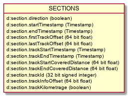

# Specification of the RCM-DX Format version 2.0

## License

> TODO: Lizenzhinweise notieren für RCM-DX
> TODO: Lizenzhinweise oder Copyright notieren für HDF5

## Contribution

The RCM-DX specification is open source and freely accessible and usable by all with respect to the license. Any person who wants to improve this specification can do so. How exactly this works can be read on the Github website. The repository can be found at [RCM-DX repository](https://github.com/SchweizerischeBundesbahnen/rcm-dx) and the website at [RCM-DX specification website](https://schweizerischebundesbahnen.github.io/rcm-dx/).

## Change history

| Document version | RCM-DX version | Date | Autor | Change |
|-|-|-|--|-----|
| 0.1.0 | 0.1 | 06.03.2015 | Martin Frey (SCS) | Initial version |
| 0.2.0 | 0.2 | 20.03.2015 | Martin Frey (SCS) | Extensions |
| 0.3.0 | 0.3 | 15.04.2015 | Patrik Wernli (SCS) | Review |
| 0.4.0 | 0.4 | 20.04.2015 | Martin Frey (SCS) | Extensions and revised |
| 0.5.0 | 0.5 | 03.05.2015 | Patrik Wernli (SCS) | Formal Adaptions |
| 0.6.0 | 0.6 | 12.05.2015 | Martin Frey (SCS) | PDR Feedback: Storing of Booleans, comments allowed on all levels, format independent of video codec, flags (including simulation) on session level. Schemas for exceedances, comments and drawings added |
| 0.7.0 | 0.7 | 13.07.2015 | Patrik Wernli (SCS) | Finalized for CDR |
| 0.8.0 | 0.8 | 02.10.2015 | Martin Frey (SCS) | Event model added, reference to specification event schema added. |
| 0.9.0 | 0.9 | 30.11.2015 | Patrik Wernli (SCS) | Adaptions for Infotrans position model. Version concept removed. Event model updated. |
| 0.10.0 | 0.10 | 21.12.2015 | Martin Frey (SCS) | Review |
| 0.11.0 | 0.11 | 21.12.2015 | Patrik Wernli (SCS) | Revised after review |
| 0.12.0 | 0.12 | 16.02.2016 | Pascal Brem (SCS) | Topology model in configuration. |
| 0.13.0 | 0.13 | 17.02.2016 | Martin Frey (SCS) | Review topology model |
| 0.14.0 | 0.14 | 19.02.2016 | Pascal Brem (SCS) | Sections added to file format. |
| 0.15.0 | 0.15 | 23.02.2016 | Martin Frey (SCS) | Global configuration and settings updated |
| 0.16.0 | 0.16 | 11.07.2016 | Pascal Brem (SCS) | New Hash code attribute for the topology. |
| 0.17.0 | 0.17 | 15.07.2016 | Pascal Brem (SCS) | New units and data types for positions |
| 0.18.0 | 0.18 | 03.01.2018 | Pascal Brem (SCS) | New GTG Track Id in the Topology. |
| 0.19.0 | 0.19 | 03.01.2018 | Pascal Brem (SCS) | Events are stored on session level. |
| 0.20.0 | 0.20 | 09.01.2018 | Pascal Brem (SCS) | Events and Sections in a group. |
| 0.21.0 | 0.21 | 09.01.2018 | Patrik Wernli (SCS) | Added chapter “HDF5 File Format Versions” |
| 0.22.0 | 0.22 | 11.04.2018 | Patrik Wernli (SCS) | Changed document template to official publishing template |
| 0.23.0 | 0.23 | 16.08.2018 | Pascal Brem (SCS) | Changes in the channel basis definition. |
| 0.24.0 | 0.24 | 16.08.2018 | Pascal Brem (SCS) | New attributes on the picture block channel. |
| 0.25.0 | 0.25 | 04.09.2018 | Pascal Brem (SCS) | New minor version. |
| 0.26.0 | 0.26 | 28.11.2018 | Pascal Brem (SCS) | New minor version for the topology attributes. |
| 0.27.0 | 0.27 | 08.01.2019 | Pascal Brem (SCS) | New availability group. |
| 0.28.0 | 0.28 | 05.06.2019 | Pascal Brem (SCS) | New switchtracks in the DfA |
| 2.0.0 | 2.0 | 28.04.2020 | Michael Ammann (SBB), Jakob Grilj (SBB) | Adaptation of the structure to new requirements. New major release with version number 2.0, due to major changes in the structure and goal for publication of the specification. |

## Introduction  

### Motivation  

Railroad companies continuously gather data of their rail, overhead line, and telecommunications networks by means of mobile and stationary measuring systems. Data flows from these systems through processing units -- which enrich, evaluate and validate the data --, to systems that display the data to subject matter experts and also to systems that automatically analyse it.

This specification defines the rail condition monitoring data exchange format (RCM-DX format) which is a data format optimised for data in the railroad context, i.e. for data points localised within a railroad network. The RCM-DX format is a file format based on the HDF5 specification and defines a structure of HDF5 groups, datasets, and attributes. The document at hands also describes the content of the elements defined. Although the format is open and can in principle be implemented right away by any railroad company, this specification contains a few non-generic elements and naming conventions that are specific to SBB. The reason for this is that any file that adheres to this specification can be used with the _RCM Viewer_, an application available soon to the public.

<!-- TODO: link to RCM-DX Viewer website, if existing -->

The RCM-DX format is a file format detailing the HDF5 format version 2.0. HDF5 was chosen for several reasons, including that it is an open format. HDF5 is a hierarchical data storage where the data in arranged in a tree structure. The HDF5 format is described on the webpage of the [HDF5-group](http://www.hdfgroup.org/HDF5/), in particular on the site [HDF5 file format specification](https://portal.hdfgroup.org/display/HDF5/Introduction+to+HDF5). The HDF5 group offers tools and libraries for various programming languages and operating systems that allow to read and write HDF5 files.

### Hints

#### RCM-DX structure

RCM-DX defines a structure of HDF5 groups, datasets, and attributes that software solutions that use this format must adhere to.  
The extension of the specification is permitted. However, it must be taken into account that such data may no longer be read or processed by existing systems.  

#### Versioning

The RCM-DX data format is subject to changes, these are indicated by the version number in the document, see chapter [\ref{root-group} Root Group](#root-group). The version number consists of two numbers, separated by dots and is composed as follows: **[Major].[Minor]**. Example: **1.0**  

**Major**  
Defines the main version and indicates when major changes have been made. These are, for example, that changing the basic structure or renaming groups, datasets or attributes (major, minor attribute as an example), which are mandatory.

**Minor**  
Indicates minor changes, such as changing the name of an attribute that is not mandatory or defining new groups, attributes, or datasets. These changes do not affect anything that cannot be read with an existing RCM-DX read-write library.

**Revision**  
To version this specification, a third digit is introduced with the abbreviation **[Rev]** for revision. This, however, is only valid for this document as a help and not for the overview of changes to the structure itself. This third version number is not visible in the RCM-DX files. If the major and/or minor version number is increased, the revision number is reset to zero '0'.

See chapter [\ref{change-history} Change history](#change-history).

#### Diagrams

The following figure shows the color coding used in diagrams:

{width=320px}

## Definitions

This document defines technical restrictions as well as content descriptions. This chapter provides an overview of the data types used, types of names, and other important points.

### File names

Files following the RCM-DX specification get their own defined file extension, which is `rcmdx`.  

Example of a file name: `20201228_081522_TGMS.rcmdx`.

### Primitive and extended data types

#### Primitive data types

Below are the supported data types used in this specification including a short description.
Not all data types possible with HDF5 are described. The read and write library specifies which data types can be used for data sets and attributes.

| Data type | Description | Examples |
|---|----|----|
| boolean | Two values are possible, `true` or `false`, `0` or `1` | `true` |
| byte | One byte or an unlimited number of bytes are possible | - |
| signed integer | Positive and negative values are allowed. Possible bit depths are: 8, 16, 32 or 64 | `1256442`; `-62334` |
| unsigned integer | Only positive values are allowed. Possible bit depths are: 8, 16, 32 or 64 | `1256442`; `-62334` |
| float | Positive and negative values are allowed. Possible bit depths are: 32 or 64 | `12.53`; `-3212.546` |
| sring | Multiple characters of undefined length | "RCM-DX is great!" |

#### Extended data types

Extended data types use the primitive data types, but have a more specialized format or meaning. The following is a list of the extended data types used.

| Name | Description | Example |
|--|-----|---|
| Timestamp | Unique and worldwide defined format of a time, since January 1, 1970 00:00 UTC without leap seconds, defined under [wikipedia.org/wiki/Timestamp](https://en.wikipedia.org/wiki/Timestamp). Datatype is `64 bit unsigned integer` | `1553237099000000000` |
| Enum | Enumerations are predefined (and always capitalized) strings defined in this specification. Datatype is `string` | `MAX`, `MIN`, `RIGHT`, `LEFT` |

### (HDF5) Group

If we are talking about a group in this document, we mean the groups in HDF5 format (of the type `HDF5 Group`). These contain additional groups or datasets.

If a name of a group in this document is written in capital letters (for example `TOPOLOGY`), it is exactly the same as in the RCM-DX file. If the naming of a group is not fixed, the corresponding chapter describes in more detail how the name is composed.

Groups are described in this specification as follows:

| Name | Parent object | Mandatory |
|--|--|--|
| `SESSION` | `RCMDX` | yes |

**Name**  
The name of the group.

**Parent object**  
A group can be a subgroup of a group, here the name of this group is mentioned. If the name is written in quotation marks, it can be freely chosen by the creator of the file. Without quotation marks, the name of the group is meant.

**Mandatory**  
If the group is absolutely necessary and must exist, `yes` is written here, otherwise `no`.

> Group names whose ending is "_NAME" are wildcard names and are replaced as described in the corresponding paragraph. Example: *SESSION_NAME*

### (HDF5) Attribut

In the RCM-DX, attributes, groups and datasets can be assigned. The names of the attributes are written in the UpperCamelCase-Notation^1^. Attributes are always of type `HDF5 attribute` unless otherwise specified.

Attributes are described in this specification as follows:

| Name | Data type | Parent object | Mandatory | Description |
|---|---|---|---|-----|
| StartTime | 64 bit integer | *SESSION_NAME* | yes | Start time in miliseconds, for example: `1553237099000000000` |

**Name**  
The name of the attribute.

**Data type**  
Primitive data type of the attribute, this describes the type of the content in the attribute itself.

**Parent object**  
An attribute is always assigned to a group or a data set, here the name of this group or data set is mentioned.

**Mandatory**  
If the attribute is absolutely necessary and must exist as well as contain a value, `yes` is written here, otherwise `no`.

**Description**  
Description and or examples of the attribute.

^1^Upper-Camel-Case-Notation: The Upper Camel Case Notation defines the way a composite name is written. Further information can be found at the following link: [Upper Camel Case](https://en.wikipedia.org/wiki/Camel_case)

### (HDF5) Datasets

A channel as a group always has one data set. A channel defines a type of sensor data that is stored in its data set. Several channels form a data source. Further information on the structure is described further down in this specification.

A data set is always of the HDF5 type `HDF5 Dataset`.  
Below is a list of ossible ways in which data can be stored in the RCM-DX:

| Type of storage | Description |
|---|------|
| Array | Data array of arbitrary length |
| Image | An image taken at a defined time |
| Video | A video that has been streamed into several individual blocks of defined size, split and saved |

The datasets are described in the lowerCamelCase-Notation^2^. Datasets are described in this specification as follows:

| Name | Data type | Parent object | Mandatory | Storage type |
|--|---|----|---|-----|
| timestamp | Timestamp | *DATASOURCE_NAME* | yes | `Array` |

**Name**  
The name of the data set.

**Data type**  
Primitive data type of the content in the data set, thus the data type of the contained data.

**Parent object**  
A data set is always assigned to a group, here the name of this group is mentioned.

**Mandatory**  
If the data set is absolutely necessary and must be present, `yes` is written here, otherwise `no`.

**Storage type**  
One of the storage types described in this chapter.

Descriptions of the data set are added outside the table.  

**^2^lower-Camel-Case-Notation**: The lower camel case notation defines the way a composite name is written. Further information can be found under the following link: [www.wikipedia.org/wiki/Camel_case](https://en.wikipedia.org/wiki/Camel_case)

#### HDF5 Chunking

The "HDF5 Chunking" is for data within a data set. This means that the data is divided into blocks, which in turn can be processed independently. This also allows faster access to parts of the data. Whether a splitting is allowed and recommended can be seen with each data set, for example: "HDF5 Chunking" is allowed and recommended. The HDF5 chunking is described in more detail on the website of the HDF5 group: [www.support.hdfgroup.org/HDF5/doc/H5.user/Chunking.html](https://support.hdfgroup.org/HDF5/doc/H5.user/Chunking.html)

## Data structures

Within a channel group, one of the following structures can be contained: Array, Limits, Coordinates, Pictures or Videos. These structures are described in more detail in this chapter.  

### Array

Channels which record individual measured values contain a data set with the name `data`, this data set is mandatory. Single values are stored in this data set as a 1D array, the length of this array (or list) is not limited.

The possible data types are defined in chapter [\ref{primitive-and-extended-data-types} Primitiv and extended data types](#primitive-and-extended-data-types)

Multidimensional measured values are given their own channel group per dimension and thus their own data set called `data`.

| Name | Data type | Parent object | Mandatory | Storage type |
|----|---|----|---|----|
| data | A primitive or extended data type | *CHANEL_NAME* | yes | `Array` |

The following attributes are assigned to this type of data set:

| Name | Data type | Parent object | Mandatory | Description |
|---|---|---|---|-----|
| `Unit` | string | data set `data` | yes | A physical unit or empty if the data does not correspond to a physical unit |

#### Limits

A channel group can contain zero or one limit groups. Each limit sub-group *`LIMIT_NAME`* contains its own `timestamp` data set and contains a `duration` data set. The data set `limitvalue` contains the limit values. When which limit value is valid is defined in the dataset `timestamp` and how long it is valid is defined in the dataset `duration`. Values at the same index position of all three data resources belong together.

{width=320px}

The group of limit values is defined as follows:

| Name | Parent object | Mandatory |
|--|--|--|
| `LIMIT` | *CHANNEL_NAME* | yes |

The group `LIMIT` now contains further groups, each with the name of the limit exceeding:

| Name | Parent object | Mandatory |
|--|--|--|
| *LIMIT_NAME* | `LIMIT` | yes |

The following attributes are assigned to this group:

| Name | Data type | Parent object | Mandatory | Description |
|---|---|---|---|-----|
| Priority | 8 bit integer | *LIMIT_NAME* | yes | Priority of defined limit, lower values are priories. |
| LimitBound | Enum | *LIMIT_NAME* | yes | Defines the type of limit, possible values are `MAX` or `MIN`. |

It contains the following datasets:

| Name | Data type | Parent object | Mandatory | Storage type |
|----|---|----|---|----|
| limitvalue | A primitive or extended data type | *LIMIT_NAME* | yes | `Array` |
| timestamp | Timestamp | *LIMIT_NAME* | yes | `Array` |
| duration | Timestamp | *LIMIT_NAME* | yes | `Array` |

### Coordinates

Measurement data that can be assigned to a coordinate system are given a defined name according to the following pattern: `coord.CN`.  
This type of data storage allows several entries to be recorded per measurement timestamp. Thus there are more entries in these datasets than in the data set `timestamp`. How many entries per timestamp belong to each other (as a group) is stored in another data set with the name `sampleindex`. The data set `sampleindex` is describes in chapter [\ref{sample-index} Sample index](#sample-index).

| Element | Description |
|--|------|
| coord | Simple character string for identifying data of type Coordinates |
| . | Separators
| C | Additional character for identifying data of type Coordinates |
| N | Index number beginning with "0", increasing for each additional coordinate datasets |

The data set is defined as follows:

| Name | Data type | Parent object | Mandatory | Storage type |
|--|------|--|--|--|
| coord.CN | A primitive or extended data type | *CHANNEL_NAME* | yes | Single |

The following attributes are assigned to this type of data set `coord.CN`:

| Name | Data type | Parent object | Mandatory | Description |
|---|---|---|---|-----|
| `Unit` | string | Dataset `coord.CN` | yes | One physical unit or empty if the data does not have any physical unit |

#### Coordinate related measured values

Further measured values can be recorded for each coordinate measuring point. These are stored in individual data sets. In the following the definition of these data sets:

| Element | Description |
|--|------|
| value | Simple character string for identifying data of type Coordinates |
| . | Separators
| V | Additional character for identifying data of type value |
| N | Index number beginning with "0", increasing for each additional value set |

The data set is defined as follows:

| Name | Data type | Parent object | Mandatory | Storage type |
|--|---|---|--|--|
| value.VN | A primitive or extended data type | *CHANNEL_NAME* | no | Single |

The following attributes are assigned to this type of data set `value.VN`:

| Name | Data type | Parent object | Mandatory | Description |
|---|---|---|---|-----|
| `Type` | string | Dataset `value.VN` | yes | Describes the content and type of the data it contains. |

#### Sample Index

If datasets are created for coordinates, a data set on the same level and with the name `sampleindex` must be available. The index number of an entry in `coord.CN`, is entered as the start of the next group. If the data set `sampleindex` has a value of $21$ at index zero, the first $20$ entries from the data set `coord.CN` belong together, the next data group start at with index number $21}. The number of entries in `sampleindex` corresponds to those in the data set `timestamp`.

The group sizes can vary among themselves, this can be seen from the index positions in `sampleIndex`.

*Example*  
The rail cross profile serves as an example here. At one point, several points of a rail profile are measured and stored. A channel with the name `coord.C0` for the X-axis and `coord.C1` is created for the Y-axis.

The data set `sampleindex` now contains the number of entries that belong together.  

Below is a picture of a rail cross section measurement with about 2000 measuring points:


### Pictures

Images can be saved in compressed or uncompressed form. The format of the images is stored in an attribute so that the image can be read correctly.  
Images are stored as binary data blocks, so an image results in a data set.
All images are stored in a group called `IMG`. All images in this group have the same properties that are stored in the attributes.  

| Name | Parent object | Mandatory |
|--|----|--|
| `IMG` | *DATASOURCE_NAME* | yes |

The group `IMG` gets the following attributes for the more detailed description of the images contained therein:

| Name | Data type | Parent object | Mandatory | Description |
|---|---|---|---|-----|
| ContentType | string | `IMG` | yes | Data type of images specified as MIME^3^ type, for example `Content-Type: <image/jpeg>`|
| DataType | string | `IMG` | no | Description of data type, if no standard image, see [\ref{contenttype-without-image-mime-type} ContentType without Image MIME type](#contenttype-without-image-mime-type) |
| ResolutionType | Enum | `IMG` | yes | Description in chapter [\ref{image-resolution-types} Image resolution types](#image-resolution-types) |
| ResolutionInfoX | 32 bit float | `IMG` | yes | Resolution in X direction |
| ResolutionInfoY | 32 bit float | `IMG` | yes | Resolution in Y-direction |

Images can have different resolutions in X and Y direction, this must be considered for a correct representation and evaluation of the images.

**^3^MIME:** A list of possible MIME types can be found at the link [www.iana.org/assignments/media-types/media-types.xhtml](https://www.iana.org/assignments/media-types/media-types.xhtml). This is maintained by the [www.iana.org/](https://www.iana.org/).

#### Image resolution types

The 'ResolutionType' attribute contains information about the values of the 'ResolutionInfoX' and 'ResolutionInfoY' attributes.  
ResolutionType' can contain the following values: 'none', 'mmPerPixel' or 'dimension

**`none`**  
No information available.  

**`mmPerPixel`**  
Defines the pixel size in mm. The values in 'ResolutionInfoX' and 'ResolutionInfoY' give information about the real size of a pixel in millimeters.  

**`dimension`**  
Defines the resolution of the image. The values in `ResolutionInfoX` and `ResolutionInfoY` give information about the image size in pixels.  

#### ContentType without Image MIME Type

If the created and saved image requires a special software to display it, the following MIME type should be added to the attribute `ContentType`: `Content-Type: <application/octet-stream>`.  
To store more information, for example which system created the data, a new attribute can be added to the group `IMG`. The attribute gets the name `DataTyp`.

#### Naming the data set for an image

| Name | Data type | Parent object | Mandatory | Storage type |
|---|-----|--|--|--|
| img.NNNNNNNNN | integer, bit depth depending on color depth | `IMG` | yes | image |

The images are named according to the following pattern: `img.NNNNNNNNN`, hereinafter a description of the individual elements.

| Element | Description |
|--|-------|
| img | String for the name of an image |
| . | Separators.
| NNNNNNNNN | Picture number, beginning with 000000000 (nine characters)|

### Videos

| Name | Data type | Parent object | Mandatory | Storage type |
|---|-----|--|--|--|
| vid.NNNNNNNNN | integer, bit depth depending on color depth | `VID` | yes | image |

As with the images, videos can be saved in compressed or uncompressed form. The format is stored in an attribute to make it easier to read the images.  
Videos are stored as streams in individual blocks. The blocks are single datasets with a given name.

| Name | Parent object | Mandatory |
|--|--|--|
| VID | *DATASOURCE_NAME* | yes |

Below is a list of the attributes assigned to the data group `VID`:

| Name | Data type | Parent object | Mandatory | Description |
|----|---|---|---|-----|
| ContentType | string | `VID` | yes | Data type of the video stream specified as MIME^4^ type, for example `Content-Type: <video/h264>`|
| DataType | string | `VID` | no | Description of data type if no standard video format, see [\ref{contenttype-without-video-mime-type} ContentType without video MIME type](#contenttype-without-video-mime-type) |
| ResolutionType | Enum | `VID` | yes | Description in chapter [\ref{video-resolution-types} Video resolution types](#video-resolution-types) |
| ResolutionX | 32 bit integer | `VID` | yes | Resolution in X direction in pixels |
| ResolutionY | 32 bit integer | `VID` | yes | Resolution in Y direction in pixels |
| FramesPerSecond | 16 bit integer | `VID` | yes | Number of frames per second (fps) in which the video was recorded |

**^4^MIME**: A list of possible MIME types can be found at the link [www.iana.org/assignments/media-types/media-types.xhtml](https://www.iana.org/assignments/media-types/media-types.xhtml). This is maintained by the [www.iana.org](https://www.iana.org/).

#### Video resolution types

The 'ResolutionType' attribute contains information about the values of the 'ResolutionInfoX' and 'ResolutionInfoY' attributes.  
ResolutionType' can contain the following values: 'mmPerPixel' or 'dimension

**`none`**  
No information available.

**`mmPerPixel`**  
Defines the pixel size in mm. The values in 'ResolutionInfoX' and 'ResolutionInfoY' give information about the real size of a pixel in millimeters. 

**`dimension`**  
Defines the resolution of the video in pixel. The values in `ResolutionInfoX` and `ResolutionInfoY` give information about the video size in pixels.  

#### ContentType without Video MIME Type

If the created and saved video stream needs its own special software to display it, the following MIME type should be added to the `ContentType` attribute: `Content-Type: <application/octet-stream>`.  
To store more information, for example which system created the data, a new attribute can be added to the group `VID`. The attribute gets the name `DataTyp`.

#### Name of the data set for a video

A video data block is named according to the following pattern: `vid.NNNNNNNNN`, hereinafter a description of the individual elements.

| Element | Description |
|--|---|
| vid | String for the name of a video |
| . | Separator |
| NNNNNNNNN | Video number, starting with 000000000 (nine characters), ascending +1|

## Time-based data structures

### Timestamp

Each entry in a data set of a channel has a reference to an entry in a data set with the name `timestamp`, which lies within the data source group. In this `timestamp` data set, there are as many entries as there are entries in a data set of a channel.  

The time stamps are always stored in ascending order.  

| Name | Data type | Parent object | Mandatory | Storage type |
|----|---|----|---|----|
| timestamp | Timestamp | *DATASOURCE_NAME* | yes | `Array` |

These time stamps are recorded either by a defined distance travelled or by a frequency, this is described in more detail in the chapter [\ref{triggermode} Trigger mode](#triggermode).

### Durations

If data is recorded that is valid for a certain period of time, the data set with the name `duration` is added to the data set `timestamp`. The timestamp recorded in the `timestamp` data set specifies the time at which the value was recorded and the `duration` data set specifies how long this value is valid in nanoseconds. The data set `duration` is `timestamp` within a data source group next to the data set.  

The differentiation between discrete (data for discrete `timestamp`) and continuous (data for `timestamp` with `duration`) data is done on data source level. The existence or absence of a `duration` array defines if the data source is **"Discrete"** (no `duration` array) or **"Continuous"** (with `duration` array).

Example: Assuming there is a data source with a temperature value every second and a calculated average temperature for every minute. Such an average temperature would be stored in a continuous data source, within a array, with duration of 60 sec.

| Name | Data type | Parent object | Mandatory | Storage type |
|--|---|-----|--|--|
| duration | 64 bit integer | *DATASOURCE_NAME* | **Yes** for continuous values, otherwise **no** | `Array` |

## RCM-DX file format  

The RCM-DX consists of a file format of the HDF5-group [www.hdfgroup.org/HDF5](http://www.hdfgroup.org/HDF5/) in version 2.0. This allows to save the data in a tree structure. This structure, or rather the naming of the groups and datasets, is not specified by the HDF5 group, but by the RCM-DX specified here. The datasets can hold different data, what exactly is contained is specified as metadata.

A change to the structure means a new version and thus a new release of this specification.

To read and write the HDF5 file format, the HDF5 group offers libraries for different languages. These can read and write the structure specified here without problems.

Further information about the structure of the HDF5 file format can be found under the following link: [www.portal.hdfgroup.org/display/HDF5/Introduction+to+HDF5](https://portal.hdfgroup.org/display/HDF5/Introduction+to+HDF5)

## RCM-DX data hierarchy  

In the RCM-DX, the individual groups and datasets as well as their names are defined. Below is an overview of the structure specified in this document:


Separate and more detailed specifications have been written for individual structure groups. Several measuring instruments can be installed on one measuring platform. Each of these measuring devices generates new channels of data, which flow into the RCM-DX. Since these channels can be different for each measuring device, the specifications were separated. Another reason for this is the fact that other railway operators use different measuring and inspection equipment.

The individual groups are specified in more detail below in the subcategories.

### Root Group

The root group contains all other subgroups. This group defines the RCM-DX and bears its name and thus refers to this specification.

| Name | Parent object | Mandatory |
|--|--|--|
| `RCMDX` | this is the root node | yes |

{width=360px}

#### Attributes  

The following attributes are assigned to the group `RCMDX`:

| Name | Data type | Parent object | Mandatory | Description |
|---|---|---|---|-----|
| Major | 16 bit integer | `RCMDX` | yes | Major Version of the RCM-DX specification that corresponds to the structure of the created file |
| Minor | 16 bit integer | `RCMDX` | yes | Minor Version of the RCM-DX specification that corresponds to the structure of the created file |

### Platform Group

A platform group contains information about a measuring vehicle that collects the data.  
The naming of the group is defined according to which platform produced the data. An overview of all names and the corresponding platform is specified in the chapter [\ref{platforms-at-the-sbb} Platforms at the SBB](#platforms-at-the-sbb).

| Name | Parent object | Mandatory |
|--|--|--|
| Platform | `RCMDX` | yes |

{width=320px}

#### Attributes

The platform group contains the following attributes:
 
| Name | Data type | Mandatory | Description |
|---|---|---|------|
| Name | Enum | yes | Unique platform name of the vehicle, [\ref{platforms-at-the-sbb} Platforms at the SBB](#platforms-at-the-sbb) |
| VehicleNumber | string | yes | Unique number of the vehicle |

#### Platforms at the SBB

Below is a list of the defined unique names of the platforms and their names.

| Platform Name | Abbreviation | Vehicle Number |
|---|---|-----|
| DFZ00 | DFZ | - |
| DFZ01 | gDFZ | - |
| DFZ02 | SPZ | - |

#### Platform Configuration Group

Configurations of various systems can be stored in the datasets of this group. The datasets are designed so that global and network specific configurations can be stored. The Configuration can change and have not to be the same in each session.

| Name | Parent object | Mandatory |
|--|--|--|
| CONFIGURATION | `PLATFORM` | no |

Subsequent datasets are subordinate to this group:

| Name | Data type | Parent object | Mandatory | Storage type |
|----|---|----|---|----|
| global | string | `CONFIGURATION` | yes | Single values |
| network | string | `CONFIGURATION` | yes | Single values |

### Session Group  

The session group contains data that was collected during the same period. A session group contains data from different sources. A RCM-DX file contains exactly one session group.


#### Naming

The name of a session group is assigned according to the following pattern:

| Name | Parent object | Mandatory |
|--|--|--|
| YYYYMMDD_hhmmss.SSS | `PLATFORM` | yes |

Example: 20190212_231255.592

The individual elements and their meaning are described below:

| Pattern | Content |
|---|-------|
| YYYY | The year in four digit representation |
| MM | The month in the year (01 for January) |
| DD | The day in the month |
| hh | The hour in the day (0-23) |
| mm | The minute in the hour |
| ss | The seconds in the minute |
| SSS | The milliseconds in the seconds
| "_" or "." | Characters as separator

For a certain period of time, only one session can exist in a file, this must be ensured by the creator of the file.

#### Attributes  

| Name | Data type | Parent object | Mandatory | Description |
|---|---|---|---|-----|
| Element | string | *SESSION_NAME* | yes | Names the type of the group, this is fix "SESSION" |
| StartTime | Timestamp | *SESSION_NAME* | yes | Timestamp in nanoseconds as start time of the session |
| EndTime | Timestamp | *SESSION_NAME* | no | Timestamp in nanoseconds as end time of the session. If the session has not yet been closed, this attribute is missing |
| PositionSource | string | *SESSION_NAME* | yes | Contains the name of the source (group) of the positioning. |

### Section Group

The group `SECTION`, contains information about a session.

| Name | Parent object | Mandatory |
|--|--|--|
| `SECTION` | *SESSION_NAME* | yes |

{ width=300px }

#### Section info

This group contains the information regarding the sections itself.

| Name | Parent object | Mandatory |
|--|--|--|
| `SECTIONINFO` | `SECTION` | yes |

##### Data fields

The following data fields are contained in the group "SECTIONINFO":

| Name | Data type | Parent object | Mandatory | Storage type |
|---|----|---|--|--|
| firstTrackOffset | 64 bit float | `SECTIONINFO` | yes | `Array` |
| lastTrackOffset | 64 bit float | `SECTIONINFO` | yes | `Array` |
| startTimestamp | Timestamp | `SECTIONINFO` | yes | `Array` |
| endTimestamp | Timestamp | `SECTIONINFO` | yes | `Array` |
| coachOrientation | Enum | `SECTIONINFO` | yes | `Array` |
| trackInfoOffset | 64 bit float | `SECTIONINFO` | yes | `Array` |

**coachOrientation**  
Indicates the orientation of travel of the measuring vehicle in the given section. This array contains only as many entries as there are sections.

Possible values of this enumeration are:

| Value | Orientation of travel |
|--|---|
| FORWARD | forward |
| REVERSE | reverse |

**firstTrackOffset**  
Indicates the distance in meters between the start of the track and the position at the beginning of the section. This array contains only as many entries as there are sections.

**lastTrackOffset**  
Indicates the distance in meters between the position at the end of the measurement and the end of the rail. This array contains only as many entries as there are sections.

**startTimestamp**  
Start time of the section as time stamp since 1.1.1970 at 00:00 UTC.

**endTimestamp**  
End time of the section as time stamp since 1.1.1970 at 00:00 UTC. `endTimestamp` must be greater than `startTimestamp`.

**trackInfoOffset**  
This data set lists how many entries in the datasets of the "Track list group" belong to section. One entry is created per section in a session and the number of entries is defined. The number of tracks belonging to each section can be determined by calculating the specified offset value at the $x$ position minus the offset value at the $x-1$ position.

### Track list group

This group lists all tracks that were covered in the session. The order reflects the order of measurement.

| Name | Parent object | Mandatory |
|--|--|--|
| `TRACKLIST` | `SECTION` | yes |

#### Data fields

| Name | Data type | Parent object | Mandatory | Storage type |
|------|-----|----|---|---|
| id | 32 bit signed integer | `TRACKLIST` | yes | `Array` |
| startTimestamp | Timestamp | `TRACKLIST` | yes | `Array` |
| endTimestamp | Timestamp | `TRACKLIST` | yes | `Array` |
| orientation | Enum | `TRACKLIST` | yes | `Array` |
| startCoveredDistance | 64 bit float | `TRACKLIST` | yes | `Array` |
| endCoveredDistance | 64 bit float | `TRACKLIST` | yes | `Array` |

**id**  
ID of the tracks that are part of the section.

**startTimestamp**  
Time since beginning of the session at which the measurement on a track started.

**endTimestamp**  
Time since the beginning of the session at which the measurement on a track ended. `endTimestamp` must be greater than `startTimestamp`.

**orientation**  
Orientation of the track with respect to the section’s driving direction.

The following values are allowed:

| Value | Meaning |
|--|----|
| ASCENDING | The track kilometrage increases with the driving direction |
| DESCENDING | The track kilometrage decreases with the driving direction |

**startCoveredDistance**  
Start covered distance of the track in the section.

**endCoveredDistance**  
End covered distance of the track in the section.

### Position group

This group contains general information on the position.  

| Name | Parent object | Mandatory |
|--|--|--|
| `POSITION` | `SESSION` | yes |

#### Data fields

| Name | Data type | Parent object | Mandatory | Storage type |
|------|-----|----|---|---|
| coveredDistance | 64 bit float | `POSITION` | yes | `Array` |
| coachOrientation | Enum | `POSITION` | yes | `Array` |
| vehicleSpeed | 64 bit float | `POSITION` | yes | `Array` | <!-- TODO! -->
| trackOrientation | Enum | `POSITION` | yes | `Array` |
| trackId | 32 bit integer | `POSITION` | yes | `Array` |
| lineId | 32 bit integer | `POSITION` | yes | `Array` |
| trackOffset | 64 bit float | `POSITION` | yes | `Array` |
| lineKilometer | 64 bit float | `POSITION` | yes | `Array` |
| positionAccuracy | 8 bit integer | `POSITION` | yes | `Array` |
| positionQuality | 8 bit integer | `POSITION` | yes | `Array` |
| timestamp | Timestamp | `POSITION` | yes | `Array` |

**coveredDistance**  
Total length of a session.

**vehicleSpeed**  
Speed of the vehicle at the time.  <!-- TODO! -->

**trackId**  
Defined track ID on which the vehicle is located at the time of recording.

**lineId**  
Defined line ID on which the vehicle is located at the time of recording.

**trackOffset**  
Distance between starting point of track and current position.

**lineKilometer**  
Kilometrage of the current position.

**positionQuality**  
Marker for the quality of the position determination ranging from 0 meaning "very good" to 15 for "very poor".

**positionAccuracy**  
The position accuracy in meters.

**timestamp**  
The timestamp  for each position. Serves as primary key.

Unit's are defined in the attribute `Unit` of each data field. <!-- TODO! -->

#### Coach Orientation

The data set `coachOrientation` contains the coach direction of the vehicle. This information influences the position of the measuring systems.

This data set can contain the following values:  

| Value | Description |
|--|-----|
| FORWARD | Vehicle moving forward | <!-- TODO! -->
| REVERSE | Vehicle moving reversing |

#### Track Orientation

<!-- TODO! Namen überlegen-->

The data set `trackOrientation` contains the alignment of the track. This information serves the correct evaluation of the kilometer data of the line, see data set `trackOffset`.

This data set can contain the following values:  

The following values are allowed:

| Value | Meaning |
|---|----|
| ASCENDING | The rail was crossed in **ascending** |
| DESCENDING | The rail was crossed in **degreasing** |

### Environment Group

| Name | Parent object | Mandatory |
|--|--|--|
| `ENVIRONMENT` | *SESSION_NAME* | no |

Information about the environment can be stored in the subgroups and their datasets. Since such information applies to all measurement systems, this is the right place for it.  

As always with a data source, the data set `timestamp` must **not** be forgotten.


#### Vehicle Speed

| Name | Parent object | Mandatory |
|--|--|--|
| `VEHICLESPEED` | `ENVIRONMENT` | no |

The data set contains a measured vehicle speed for each time stamp.

| Name | Data type | Parent object | Mandatory | Storage type |
|--|---|-----|---|----|
| data | 16 bit float | `VEHICLESPEED` | no | `Array` |

**Unit: meters per second [m/s]**

#### Ambient Temperature Group

This group contains a data set containing the ambient temperatures.

| Name | Parent object | Mandatory |
|--|--|--|
| `AMBIENTTEMPERATURE` | `ENVIRONMENT` | no |

Data set:

| Name | Data type | Parent object | Mandatory | Storage type |
|--|---|-----|---|----|
| data | 16 bit float | `AMBIENTTEMPERATURE` | no | `Array` |

**Unit: degrees [°C]**

#### Wind Speed Group

The wind speed can be stored in the data set of the group `WINDSPEED`.

| Name | Parent object | Mandatory |
|--|--|--|
| `WINDSPEED` | `ENVIRONMENT` | no |

For each time stamp, the wind speed is entered in the data set.

| Name | Data type | Parent object | Mandatory | Storage type |
|----|---|----|---|----|
| data | 16 bit float | `WINDSPEED` | no | `Array` |

**Unit: meters per second [m/s]**

#### Wind Direction Group

In addition to the wind speed, the wind direction is also saved, this is done in this group.

| Name | Parent object | Mandatory |
|--|--|--|
| `WINDDIRECTION` | `ENVIRONMENT` | no |

For each time stamp, the wind direction is entered in the data set.

| Name | Data type | Parent object | Mandatory | Storage type |
|----|---|----|---|----|
| data | 16 bit float | `WINDIRECTION` | no | `Array` |

**Unit: degree [°] (where zero $0°$ is North)**

#### Weather Conditions Group

The weather has an influence on the measurements. How the weather was at the time of the measurements is recorded in this group.

| Name | Parent object | Mandatory |
|--|--|--|
| `WEATHERCONDITIONS` | `ENVIRONMENT` | no |

For each time stamp, the weather conditions are entered in the data set.

| Name | Data type | Parent object | Mandatory | Storage type |
|--|---|-----|---|----|
| data | Enum | `WEATHERCONDITIONS` | no | `Array` |

The following values are valid:  
`SUNNY`, `OVERCAST`, `RAIN`, `STORM`, `FOG`, `CHANCE_OF_SNOW`, `RAIN_AND_SNOW`, `SNOW`, `ICY`, `ICE_SNOW`

### Measuring System Group

Each measuring system has its own data sources, which have their own names, as well as their own channels, which in turn have their own names. Common features are described in this specification, everything else is defined in a separate specification. Since this part differs greatly among railway companies and with measuring equipment, a rigid specification has been dispensed with, but a certain framework is still given.

A group is created for each system that collects data. The name of the group is unique for each system. The composition of this name is not predefined.

| Name | Parent object | Mandatory |
|--|--|--|
| *MEASURINGSYSTEM_NAME* | `PLATFORM` | yes |

{width=320px}

#### Attributes  

The following attributes are contained in the group of the measuring system:

| Name | Data type | Parent object | Mandatory | Description |
|---|---|-----|---|-----|
| Family | string | *MEASURINGSYSTEM_NAME* | yes | General name of the measuring system |
| Revision | string | *MEASURINGSYSTEM_NAME* | yes | Version of the hardare and software on the measuring system, issued by the owner of the platform |
| InstanceVersion | string | *MEASURINGSYSTEM_NAME* | yes | Version of the data format created by the measuring instrument. This version can be different within different gauges of the same family |
| Element | string | *MEASURINGSYSTEM_NAME* | yes | Indicates the type of the group, this is fixed `MEASURINGSYSTEM` |
| MeasuringMode | Enum | *MEASURINGSYSTEM_NAME* | yes | Indicates the measuring mode, defined in chapter [\ref{measurement-mode} Measuring mode](#measurement-mode) |

##### Measurement mode

There are three different measurement modes, which are explained individually below.

| Name | Description |
|----|------|
| OPERATIVE | Productive data that will be further used. |
| TEST | Test data recorded during a diagnostic run with the aim of checking and testing the measuring equipment. |
| SIMULATION | Simulated values that the measuring systems produce themselves and are no longer used. |

### Datasource Group

A data source group can contain several channels and thus several data sources. This group combines these channels. The naming can be freely selected, but must be unique.

| Name | Parent object | Mandatory |
|--|--|--|
| *DATASOURCE_NAME* | *MEASURINGSYSTEM_NAME* | yes |

A timestamp is available for each individual measuring point within a data source group. There are two types of data acquisition for a data source group. One is always after a defined distance (e.g. every 250 millimeters) and the other is the recording of measurement data at a certain frequency (e.g. 4000 Hz).
The way the measurement data was recorded is shown in two attributes for each channel group. For a description see [\ref{triggermode} Trigger mode](#triggermode).

{width=320px}

#### Attributes

The following attribute is assigned to the group:

| Name | Data type | Parent object | Mandatory | Description |
|---|---|-----|---|-----|
| Element | string | *DATASOURCE_NAME* | yes | Contains the type of the group, this is fix `DATASOURCE` |

#### Example

In our example the name of the data source group is assigned, which should contain our environmental measurement data, which we call `ENVIRONMENT`.

#### Timestamp data set

Each data source group contains a data set called `timestamp`. It contains all timestamps at which a measurement was recorded. The size of this list of timestamps is the same as the size of the datasets per channel.

A more detailed description can be found in the chapter [\ref{timestamp} Timestamp Array](#timestamp)!

### Channel Group

A channel group contains metadata for the actual measurement data and thus for the various channels. The naming can be freely selected, but must be unique within the data source group.

| Name | Parent object | Mandatory |
|--|--|--|
| *CHANNEL_NAME* | *DATASOURCE_NAME* | yes |


The following attributes are contained in this group:  

| Name | Data type | Parent object | Mandatory | Description |
|------|---|----|---|----|
| TriggerMode | Enum | *CHANNEL_NAME* | yes | See chapter [\ref{triggermode} Trigger Mode](#triggermode) |
| TriggerValue | 64 bit float | *CHANNEL_NAME* | yes | See below |
| ChannelBasis | Enum | *CHANNEL_NAME* | yes | See below |
| ChannelType | Enum | *CHANNEL_NAME* | yes | See below |
| Neighbor | string | *CHANNEL_NAME* | yes | See below |
| MeasurementUncertainty | 32 bit float | *CHANNEL_NAME* | yes | This attribute contains the measurement accuracy of the channel according to the specifications of the measurement system. | <!-- TODO -->
| PositionOffset | 32 bit signed float | *CHANNEL_NAME* | yes | See below |
| Element | string | *CHANNEL_NAME* | yes | Contains the type of the group, this is fix `CHANNEL` |

**TriggerValue**  
The trigger value defines when a value is measured based on the trigger mode.  

> In a data source group there is always only one common trigger mode! A mixture within the group is not permitted!
> The attribute has the value "0.0" if `TriggerMode` contains the value `EVENT`.

**ChannelBasis**  
Description of the channel, what was measured and in which direction. Since a measuring vehicle can move on a rail in two directions and the sensor could therefore be on the other side, it should be possible to indicate this. Here is the place for it.

Possible values are:

| Value | Description |
|---|-----|
| COACH_LEFT | Sensor is installed on the left hand side of the measuring platform. The data has not been corrected for direction of travel |
| COACH_RIGHT |Sensor is installed on the right hand side of the measuring platform. The data has not been corrected for direction of travel |
| RAIL_LEFT | Channel contains data of the left rail in terms of travel direction. The data has been corrected for direction of travel |
| RAIL_RIGHT | Channel contains data of the right rail in terms of travel direction. The data has been corrected for direction of travel |
| ABSOLUTE | Channel is not associated with a single rail |

**ChannelType**  
Defines how a value was created. This can be measured, calculated or taken from a previously defined data source that was read from there and inserted into the file.

The following values are possible:

| Value | Description |
|---|---------|
| MEASURED | Measured values |
| REFERENCE | A setpoint of a third source |

An example for reference values are defined target values which flow in from another source (file, database etc.) and are to be used for comparisons.

**Neighbor**  
Refers to the name of an adjacent channel. This can be the right rail, for example, when measuring the track temperature of the left rail.
Thus the attribute `neighbor` of the channel "TEMP_RAIL_**L**" would contain the name "TEMP_RAIL_**R**" and vice versa.

**PositionOffset**  
Describes the distance between a defined zero point (position) on the measuring vehicle and a the measuring sensor. This specification is used to convert the exact time at which the measurement was taken to a defined zero point. The value can be positive or negative and has the unit millimeter.  

#### TriggerMode

This attribute defines how the data was recorded.

Possible values are:

| Value | Description | `TriggerValue` Unit |
|---|----------|---|
| TIME | Time-based measurement data recording | Nanoseconds |
| FREQUENCY | Frequency-based measurement data recording | Hz |
| DISTANCE | Distance-based measurement data acquisition | Milimeter |
| EVENT | Event based recording | none |

#### Data object

Each channel group receives a data set with the actual measurement data:

| Name | HDF5 Type | Mandatory |
|--|---|--|
| data | HDF5 Dataset | yes |

> There are as many measurement data entries as there are timestamps in the data set `timestamp` which is included in the channel group.

The data set needs more information, this is given as attributes:

| Name | Data type | Parent object | Mandatory | Storage type |
|----|---|----|---|----|
| Unit | string | *CHANNEL_NAME* | yes | `Array` |

**Unit:** The physical unit of the measurement data, such as "millimeter". If no physical unit can be assigned to the data, this attribute remains empty.

The data set and the possible data that can be stored are described in more detail in the chapter [\ref{hdf5-datasets} Dataset](#hdf5-datasets).

### Logging Group

The logging group contains information about the status of the measuring systems. The data is divided into two subgroups, `OUTAGES` and `MESSAGES`. These are described in separate chapters.

| Name | Parent object | Mandatory |
|--|---|--|
| `LOGGING` | *MEASURINGSYSTEM_NAME* | no |

{width=320px}

#### Outage Group

In this group, failures and interruptions of measurement systems are recorded in a defined structure, each as its own data set.

| Name | Parent object | Mandatory |
|--|---|--|
| `OUTAGES` | `LOGGING` | yes |

The following datasets are included in this group:

| Name | Data type | Parent object | Mandatory | Storage type |
|----|---|----|---|----|
| message | string | `OUTAGES` | yes | `Array` |
| systemReference | string | `OUTAGES` | yes | `Array` |
| channelReference | string | `OUTAGES` | yes | `Array` |
| datasourceReference | string | `OUTAGES` | yes | `Array` |
| level | Enum | `OUTAGES` | yes | `Array` |
| timestamp | Timestamp | `OUTAGES` | yes | `Array` |
| duration | 64 bit integer | `OUTAGES` | yes | `Array` |

This group receives a `timestamp` data set as well as a `duration` data set to indicate the time of the measurement failure.

**message**  
This data set contains one message per entry about a failure of a measuring instrument.

**systemReference**  
A reference to the measurement system.

**channelReference**  
A reference to a channel.

**datasourceReference**  
A reference to a data source.

**level**  
See chapter [\ref{outage-level} Outage level](#outage-level)

##### Outage level

Defines the severity of the failure or interruption of a measurement system. Following values are possible:

| level | description |
|----|----|
| CORRECTLY | The measuring system or the sensor functioned without problems and the measured values can be reused. |
| TOTAL_FAILURE | The measuring system or sensor has completely failed and has not recorded any measured values during the session. |
| PARTIAL_FAILURE | The measuring system or the sensor has partially failed and has only recorded measured values for a certain time during the session. |
| MALFUNCTION | The measuring system or the sensor had a malfunction and the measured values cannot be used because they may not be correct. |

#### Message Group

This group contains messages, generated from a measurement system or a person, structured in data set.

| Name | Parent object | Mandatory |
|--|---|--|
| `MESSAGES` | `LOGGING` | yes |

The following datasets are included in this group:

| Name | Data type | Parent object | Mandatory | Storage type |
|----|---|----|---|----|
| message | string | `MESSAGES` | yes | `Array` |
| level | Enum | `MESSAGES` | yes | `Array` |
| systemReference | string | `MESSAGES` | yes | `Array` |
| channelReference | string | `MESSAGES` | yes | `Array` |
| timestamp | Timestamp | `MESSAGES` | yes | `Array` |

**message**  
This data set contains one message per entry about a failure of a measuring instrument.

**systemReference**  
A reference to the measurement system.

**channelReference**  
A reference to a channel.

**level**  
See chapter [\ref{message-level} Message level](#message-level)

##### Message level

Defines the importance of a message. Following values are possible:

| level | description |
|----|----|
| VERY_HIGHT | Priority of the message is very high. |
| HIGHT | Priority of the message is not high. |
| MEDIUM | Priority of the message is medium important. |
| LOW | Priority of the message is not important.|

### Topology Group

A topology group contains all information on the route network of the respective railway company.  
This chapter has been optimised for SBB and may differ between railway companies. SBB's data processing chain provides for this structure, which is why it is described here.

| Name | HDF5 Type | Parent object | Mandatory |
|--|--|---|--|
| `TOPOLOGY` | HDF5 Group | *SESSION_NAME* | yes |


#### Attributes

The group `TOPOLOGY` contains the following attributes:

| Name | Data type | Parent object | Mandatory | Storage type |
|---|--|---|--|--|
| Version | string | `TOPOLOGY` | yes | `Array` |

**Version**  
Version number of topology, included to check validity.

The DfA (Database of fixed assets) is a SBB construct and reflects the SBB route network. The data comes from a database and is distributed as a file to the SBB measuring vehicles. They can read the information contained therein and also add it to the RCM-DX. This DfA is used for positioning and it is therefore possible to assign the measured data to an object from the route network.

### Track Group

This group contains information on the tracks of the railway network. The information is stored in separate datasets.

| Name | Parent object | Mandatory |
|--|--|--|
| `TRACK` | `TOPOLOGY` | yes |

The following datasets are included in this group, some of which are described in more detail in the subchapters:

| Name | Data type | Parent object | Mandatory | Storage type |
|--|---|--|--|---|
| direction | 8 bit signed integer | TRACK | yes | `Array` |
| id | 32 bit integer | TRACK | yes | `Array` |
| gtgId | string | TRACK | yes | `Array` |
| length | string | TRACK | yes | `Array` |
| name | string | TRACK | yes | `Array` |
| pointFrom | 32 bit integer | TRACK | yes | `Array` |
| pointTo | 32 bit integer | TRACK | yes | `Array` |
| switchType | 8 bit signed integer | TRACK | yes | `Array` |
| trackType | 8 bit signed integer | TRACK | yes | `Array` |

**direction**  
The direction of a switch is specified in this data set.  
If the track is of the type "switch", a value greater than zero must be selected here. Which number means what is shown in the following table:  

| Value | Description |
|--|---|
| 0 | No crossover |
| 1 | Straight line switch track |
| 2 | Left-handed switch |
| 3 | switch running to the right |

**id**  
ID of the track.

**gtgId**  
Unique GTG ID of a GTG string, this ID is stored as UUID.

**length**  
The length of the track section.

**name**  
Name of the track section.

**pointFrom**  
ID of the starting point of the track section.

**pointTo**  
ID of the end point of the track section.

**switchType**  
If the track is of the type "Switch", a value greater than zero must be selected here. Which number means what is shown in the following table:

| Value | Description |
|--|---|
| 0 | Anything but a turnout |
| 1 | simple switch |
| 2 | Double switch |
| 3 | Simple crossovers |
| 4 | Double track connection |
| 5 | Double crossover |

**trackType**  
The number in the *trackType* data set defines the type of track that belongs to it. Which number means what is shown in the following table:

| Value | Description |
|--|---|
| 0 | Station track |
| 1 | Track |
| 2 | Switch |

### Line Group

This group contains information about a line in the route network. The information is stored in separate datasets.

| Name | Parent object | Mandatory |
|--|--|--|
| `LINE` | `TOPOLOGY` | yes |

The following datasets are included in this group:

| Name | Data type | Parent object | Mandatory | Storage type |
|----|---|----|---|----|
| id | 32 bit signed integer | `LINE` | yes | `Array` |
| name | string | `LINE` | yes | `Array` |
| firstStation | string | `LINE` | yes | `Array` |
| lastStation | string | `LINE` | yes | `Array` |
| fromKilometer | string | `LINE` | yes | `Array` |
| toKilometer | string | `LINE` | yes | `Array` |

**id**  
Defines the ID of the line, this is unique.

**name**  
The name of the line.

**firstStation**  
The name of the first station of this line.

**LastStation**  
The name of the last station of this line.

**km**  
Start kilometre of the line, expressed in kilometres.

**toKilometer**  
Final kilometer of the line, in kilometers.

### Switch Track Group

This group contains information about switches in the route network. The information is stored in separate datasets.

| Name | Parent object | Mandatory |
|--|--|--|
| `SWITCHTRACK` | `TOPOLOGY` | yes |

The following datasets are included in this group:

| Name | Data type | Parent object | Mandatory | Storage type |
|----|---|----|---|----|
| gleisstrangId | 32 bit signed integer | `SWITCHTRACK` | yes | `Array` |
| gleisstrangBez | string | `SWITCHTRACK` | yes | `Array` |
| soft | 32 bit signed integer | `SWITCHTRACK` | yes | `Array` |
| deflecting direction | string | `SWITCHTRACK` | yes | `Array` |
| distraction | string | `SWITCHTRACK` | yes | `Array` |
| operating point | string | `SWITCHTRACK` | yes | `Array` |
| herzStueck | string | `SWITCHTRACK` | yes | `Array` |
| minRadius | 32 bit signed integer | `SWITCHTRACK` | yes | `Array` |
| nr | 32 bit signed integer | `SWITCHTRACK` | yes | `Array` |
| zusNr | string | `SWITCHTRACK` | yes | `Array` |
| rail profile | string | `SWITCHTRACK` | yes | `Array` |
| status | string | `SWITCHTRACK` | yes | `Array` |
| rail profile | string | `SWITCHTRACK` | yes | `Array` |
| thresholdArt | string | `SWITCHTRACK` | yes | `Array` |
| typesPlanNr | 32 bit signed integer | `SWITCHTRACK` | yes | `Array` |
| typeNraddition | string | `SWITCHTRACK` | yes | `Array` |
| softArt | string | `SWITCHTRACK` | yes | `Array` |
| softType | string | `SWITCHTRACK` | yes | `Array` |
| softForm | string | `SWITCHTRACK` | yes | `Array` |
| soft tongue | string | `SWITCHTRACK` | yes | `Array` |

**gleisstrangId**  
A reference to the GTG-ID.

**trackBez**  
Contains a description of the track section.

**softId**  
Contains the ID's of the switches as a reference.

<!-- For subsequent datasets the descriptions are still missing. These would have to be supplemented once! 29.10.2019 Ammann Michael
**Distracting riccation**   
**Deflection.  
**Operating point**   
**heartPiece**   
**minRadius**   
**nr**   
**toNr**   
**rail profile**   
**status**   
**rail profile**   
**ThresholdsType**   
**TypesPlanNr**   
**typeNradditional**   
**SwitchType**   
**pointsType**   
**pointsForm**   
**soft tongue**   
 -->

### Track Object Group

This group contains information about objects in the route network, for example a balise. The information is stored in separate datasets.

| Name | Parent object | Mandatory |
|--|--|--|
| `TRACKOBJECT` | `TOPOLOGY` | yes |

The following datasets are included in this group:

| Name | Data type | Parent object | Mandatory | Storage type |
|----|---|----|---|----|
| trackId | 32 bit signed integer | `TRACKOBJECT` | yes | `Array` |
| type | 32 bit signed integer | `TRACKOBJECT` | yes | `Array` |
| positionStart | 32 bit signed integer | `TRACKOBJECT` | yes | `Array` |
| positionEnd | 32 bit signed integer | `TRACKOBJECT` | yes | `Array` |
| extraInfo | string | `TRACKOBJECT` | yes | `Array` |

**trackId**  
Contains the ID of the track to which the track is connected.

**type**  
Type of the object.

**positionStart**  
Start position of the object in meters.

**positionEnd**  
End position of the object in meters.

**ExtraInfo**  
Additional information about the object, for example, the ID of a balise.

### Track Point Group

This group contains information about defined points on the route network. The information is stored in separate datasets.

| Name | Parent object | Mandatory |
|--|--|--|
| `TRACKPOINT` | `TOPOLOGY` | yes |

The following datasets are included in this group:

| Name | Data type | Parent object | Mandatory | Storage type |
|----|---|----|---|----|
| trackId | 32 bit signed integer | `TRACKPOINT` | yes | `Array` |
| lineId | 32 bit signed integer | `TRACKPOINT` | yes | `Array` |
| x | 32 bit float | `TRACKPOINT` | yes | `Array` |
| y | 32 bit float | `TRACKPOINT` | yes | `Array` |
| z | 32 bit float | `TRACKPOINT` | yes | `Array` |
| radius | 32 bit float | `TRACKPOINT` | yes | `Array` |
| kilometers | 32 bit float | `TRACKPOINT` | yes | `Array` |
| position | 32 bit float | `TRACKPOINT` | yes | `Array` |
| cant | 32 bit float | `TRACKPOINT` | yes | `Array` |
| inclination | 32 bit float | `TRACKPOINT` | yes | `Array` |

**trackId**  
Reference to the ID of the track section.

**lineId**  
Reference to the ID of the line.

**x**  
X-Koordiante of the point.

**y**  
Y-Koordiante of the point.

**z**  
Z-Koordiante of the point.

**radius**  
The radius of a point, given in meters.

**kilometers**  
Contains the line kilometre of the point in the route network, expressed in kilometres.

**position**  
Position of the point, in meters.

**cant**  
The inclination at this point, expressed in millimetres.

**inclination**  
Gradient at this point, expressed in parts per thousand.

### Property Group

This group contains information about properties of the topology itself. The information is stored in separate datasets.

| Name | Parent object | Mandatory |
|--|--|--|
| `PROPERTY` | `TOPOLOGY` | yes |

The following datasets are included in this group:

| Name | Data type | Parent object | Mandatory | Description |
|----|---|----|---|----|
| propertyId | 32 bit signed integer | `PROPERTY` | yes | `Array` |
| name | string | `PROPERTY` | yes | `Array` |
| description.ge | string | `PROPERTY` | yes | `Array` |
| description.fr | string | `PROPERTY` | yes | `Array` |
| description.it | string | `PROPERTY` | yes | `Array` |
| description.en | string | `PROPERTY` | yes | `Array` |

**propertyId**  
Unique ID of the characteristic.

**name**  
Name of the characteristic.

**description.ge**  
Description of the characteristic in the language German.

**description.fr**  
Description of the characteristic in French language.

**description.it**  
Description of the characteristic in Italian language.

**description.en**  
Description of the feature in English language.

### Event Group  

The Event group is used to store events that occurred during the recording of data. Events are bound to a channel, system or session and have a link to it. In addition to events, log entries can also be created, these are described in more detail in the chapter [\ref{record-group} Record Group](#record-group).
Systems can, for example, trigger an event when a limit value is exceeded. Events are always time-bound which means an event contains the exact time of occurrence and the duration of the event. The duration can also be zero, so the event occurred exactly at the specified time.  

| Name | HDF5 Type | Parent object | Mandatory |
|--|--|---|--|
| `EVENT` | HDF5 Group | *SESSION_NAME* | yes |

Within the group there are the following data fields:

| Name | Data type | Parent object | Mandatory | Storage type |
|----|---|----|---|----|
| systemReference | string | `EVENT` | yes | `Array` |
| channelReference | string | `EVENT` | no | `Array` |
| type | string | `EVENT` | yes | `Array` |
| defect | string | `EVENT` | yes | `Array` |
| duration | 64 bit signed integer | `EVENT` | yes | `Array` |
| timestamp | Timestamp | `EVENT` | yes | `Array` |

Each of these datasets contains a list with information about an entry, at a certain time.
Each data set is described in more detail in the following subchapters.

**systemReference**
Contains a list of entries containing the name of the system that triggered the event.

| Name | Data type | Parent Object | Mandatory | Storage Type |
|----|---|----|---|----|
| systemReference | string | `EVENT` | yes | `Array` |

**channelReference**
Contains a list of entries that refers to a channel to which the event applies.

| Name | Data type | Parent Object | Mandatory | Storage Type |
|----|---|----|---|----|
| channelReference | string | `EVENT` | no | `Array` |

**data**
This data set contains the actual information about an event, this in the XML notation which is described in more detail in each chapter of the event types (Defect event type, Detected object event type, Limit event type and Consistency event type).  
A type can be stored for each event. These are explained in more detail below.

| Name | Data type | Parent object | Mandatory | Storage type |
|----|---|----|---|----|
| data | string | `EVENT` | yes | `Array` |

**duration**
Defines for each event the duration of the event itself. This value can also be zero.

| Name | Data type | Parent object | Mandatory | Storage type |
|----|---|----|---|----|
| duration | 64 bit integer | `EVENT` | yes | `Array` |

**type**
Contains the type of an event.

| Name | Data type | Parent object | Mandatory | Storage type |
|----|---|----|---|----|
| type | string | `EVENT` | yes | `Array` |

In the list "type" the type of the recorded event is shown. The different types contain different information which is shown in the following subchapters. There are corresponding XML schemas for all types that define the technical specifications.

#### Defect event type

A defect can be, for example, an image of a rail showing a damage of the surface. This defect is recorded by a system. However, it may happen that this error is not one (incorrectly detected), this information can be specified afterwards (attribute "PossibleValidationResults").
Defects are always channel bound and recorded or evaluated by a system.
In the following, the elements and attributes that occur in a *Defect* as XML are described in more detail.

The XML Schema can be found in the chapter [\ref{events-defect} EventsDefect](#events-defect).

##### **XML elements**

Not all of these elements must be present, details can be taken from the XML Schema.  

| Name | Description | Parent object |
|---|-----|--|
| Defect| XML Root Element | none |
| PossibleDefectNames | Name of a possible error | Defect |
| PossibleClassifications | Classification of a possible defect | Defect |
| PossibleValidationResults | Possible confirmations of the defect | Defect |

##### **XML attributes**

Below are the attributes of the root element "Defect":

| Name | Description | Parent object |
|---|-----|--|
| Classification | Classification of the error | Defect |
| DefectName | Name of the error | Defect |
| Details | Further information or more detailed descriptions of the error | Defect |
| Parameter1Name | Name of the parameter 1 | Defect |
| Parameter1Value | Value of parameter 1 | Defect |
| Parameter2Name | Name of the parameter 2 | Defect |
| Parameter2Value | Value of Parameter 2 | Defect |
| Parameter3Name | Name of the parameter 3 | Defect |
| Parameter3Value | Value of parameter 3 | Defect |
| ID | Unique number for identification of the error | Defect |

#### Detected object event type

These events indicate an object found during a diagrose ride. These can be, for example, detected balises or tunnels. What exactly counts as a found object is not defined in this specification, only the information for a recorded event.

The XML Schema can be found in the chapter [\ref{events-generic} EventsGeneric](#events-generic).

##### **XML elements**

Not all of these elements must be present, details can be taken from the XML schema.

| Name | Description | Parent object |
|---|-----|--|
| DetectedObject | Root Element | none |
| object | Element with information about the found object in the element itself or in the attributes | DetectedObject |
| Reference | Reference to a list of known and uniquely assignable objects of the railway company | DetectedObject |
| ObjectAttribute | Further information about the object, the information is contained in the attributes | DetectedObject |

##### **XML attributes**

| Name | Description | Parent object |
|---|-----|--|
| Unique ID of the event | DetectedObject |
| Type | Type of object found | object |
| Description | further description or information about/from object | object |
| ObjectConsistency | Reference to the correctness of the specified data | object |
| ReferenceSystem | Reference to the name of the system from which the data originates | Reference |
| Key | Information about the data contained in the "ObjectAttribute" element | ObjectAttribute |

#### Limit violation event type

Limit value exceedances of measured values of a channel can also be recorded as events.  
The XML schema can be found in chapter [\ref{events-generic} EventsGeneric](#events-generic).  

##### **XML elements**

| Name | Description | Parent object |
|---|-----|--|
| LimitViolation | Root Element | none |

##### **XML attributes**

| Name | Description | Parent object |
|---|-----|--|
| TimestampMaxViolation | Time at which limit value was exceeded | LimitViolation |
| ViolatedLimit | Name of the defined limit | LimitViolation |
| ID | Unique ID of the event | LimitViolation |

#### Consistency event type

The message about the consistency of the data is triggered by a system that checks all data according to certain criteria. For example, this could be a check for black images in a video. If all frames in the video are black, something is wrong and the video is unusable. Messages are only created if a finding is present.

The XML Schema can be found in the chapter [\ref{events-generic} EventsGeneric](#events-generic).  

##### **XML element**

| Name | Description | Parent object |
|---|-----|--|
| Consistency | Root Element | none |

##### **XML attributes**

| Name | Description | Parent object |
|---|-----|--|
| Type | Type or type of consistency check in response to the question "What has been checked? | Consistency |
| ProcessName | Name of the process that checked consistency | Consistency |
| Result | Result of the consistency check. | Consistency |
| ID | Unique ID of the event (UUID) | Consistency |

**Result**  
The actual result of the consistency check. Each system that performs a consistency check has different results, which in turn must be described in more detail in its specification.

### Record Group

Unlike events, logs are only created by a user and not by a system.
For all protocol types, there are corresponding XML schemas that define the technical specifications. Metadata is defined in the respective channels.
Protocol entries can have references to systems, sessions, and channels.  

| Name | HDF5 Type | Mandatory |
|---|-----|--|
| `RECORD` | HDF5 Group | yes |

Within the group there are the following data fields:

| Name | Data type | Parent object | Mandatory | Storage type |
|----|---|----|---|----|
| type | string | `RECORD` | yes | `Array` |
| systemReference | string | `RECORD` | yes | `Array` |
| channelReference | string | `RECORD` | no | `Array` |
| data | string | `RECORD` | yes | `Array` |
| duration | 64 bit signed integer | `RECORD` | yes | `Array` |
| timestamp | 64 bit signed integer | `RECORD` | yes | `Array` |

Each of these datasets contains a list with information about an entry at a specific time.
Each data set is described in more detail in the following subchapters.  

**data**  
This data set contains the actual information for a protocol entry, this in the XML notation which is described in more detail in each chapter of the protocol types.  
The protocol entries are stored in this data set as a list. A type can be stored for each entry. These are explained in more detail below.

| Name | Data type | Parent object | Mandatory | Storage type |
|----|---|----|---|----|
| data | string | `RECORD` | yes | `Array` |

**duration**  
Defines for each entry the duration of the log entry itself. This value can also be zero.

| Name | Data type | Parent object | Mandatory | Storage type |
|----|---|----|---|----|
| duration | 64 bit integer | `RECORD` | yes | `Array` |

**systemReference**  
Contains a list of entries containing the name of the system that triggered the record.

| Name | Data type | Parent Object | Mandatory | Storage Type |
|----|---|----|---|----|
| systemReference | `RECORD` | string | yes | `Array` |

**channelReference**  
Contains a list of entries that refers to a channel to which the record applies.

| Name | Data type | Parent Object | Mandatory | Storage Type |
|----|---|----|---|----|
| channelReference | `RECORD` | string | yes | `Array` |

**type**  
Contains the type of a log entry.

| Name | Data type | Parent object | Mandatory | Storage type |
|----|---|----|---|----|
| recordtype | string | `RECORD` | yes | `Array` |

In the list "recordtype" the type of the recorded protocol entry is shown. The different types contain different information, which is shown in the following subchapters. Corresponding XML schemas are available for all types, which define the technical specifications.

#### Comment

Comments recorded during a diagnostic drive by the user. The content is not specified, only the XML structure.
The XML schema can be found in chapter [\ref{events-comment} EventsComment](#events-comment).  

##### XML elements

| Name | Description | Parent object |
|---|-----|--|
| Comment | Root element and message, recorded by the user | none |

##### XML attributes

| Name | Description | Parent object |
|---|-----|--|
| Username | Name of the user who recorded the message | Comment |
| ID | Unique ID of this message | Comment |

#### Corrupt

Messages of the type "damaged" or "unusable" do not receive a content specification, only the XML structure is predefined and described here.
The XML schema can be found in chapter [\ref{events-generic} EventsGeneric](#events-generic).  

##### XML elements

| Name | Description | Parent object |
|---|-----|--|
| Corrupt | Root element and message, recorded by the user | none |

##### XML attributes

| Name | Description | Parent object |
|---|-----|--|
| Username | Name of the user who recorded the message | Corrupt |
| ID | Unique ID of this message | Corrupt |

### Configuration Group

In the configuration group, data can be stored in any format that was used for the configuration of one or more measuring systems. Each subgroup defines a measurement system.  
This group is below that of a measurement system and thus within the group [\ref{measuring-system-group} Measuring System Group](#measuring-system-group).  

| Name | Parent object | Mandatory |
|--|--|--|
| `CONFIGURATION` | *MEASURINGSYSTEM_NAME* | no |

#### Configuration Group datasets

Within this group there are further groups whose names correspond to those of a measuring system to which the configuration contained therein belongs.  
In the following *SETTING_NAME* is used as placeholder of the actual name of the measuring system.

| Name | Parent object | Mandatory |
|--|--|--|
| *SETTING_NAME* | `CONFIGURATION` | no |

This group contains two datasets:

| Name | Data type | Parent object | Mandatory | Storage type |
|----|---|----|---|----|
| setting | string | *SETTING_NAME* | yes | `Array` |
| timestamp | 64 bit integer | *SETTING_NAME* | yes | `Array` |

**setting**  
Contains the actual configuration.

**timestamp**  
Contains the time from when this configuration is valid and was used.

The following attributes are contained in this group:  

| Name | Data type | Parent object | Mandatory | Description |
|---|---|---|---|-----|
| DataType | string | `setting` | yes | Defines the datatype of the configuration within the data set `setting`. Data type specified as MIME^3^ type, for example `Content-Type: <text/strings>` |

### Data Processing Group

The data source group `DATAPROCESSING` contains information on data processing. This information is written by systems that make changes to the data. These changes, for example, can be a conversion from millimeters to meters.

| Name | Parent object | Mandatory |
|--|--|--|
| `DATAPROCESSING` | `RCMDX` | yes |

#### Data Processing Group datasets

The group `DATAPROCESSING` contains one datasets:

| Name | Data type | Parent object | Mandatory | Storage type |
|---|---|-----|---|----|
| key | string | `DATAPROCESSING` | yes | `Array` |
| value | string | `DATAPROCESSING` | yes | `Array` |
| timestamp | 64 bit integer | `DATAPROCESSING` | yes | `Array` |

**key**  
This record contains a unique key as a reference to a data processing step. The number of values in this data set corresponds to the number in data set `value`. The key value in index no. $0$ of `key` belongs to the value in the data set `value` at index no. $0$ and so on.

**value**
This data set contains the value about what was done in that step or what the result was.

**timestamp**  
Contains the time of the acquisition of the entry in the `key` and `value` data set.

### Clearance Information Group

This group is used by SBB to record information about the data release of all parties who have processed this data. The information is stored in the form of key-value pairs in a data set.

| Name | Parent object | Mandatory |
|--|--|--|
| `CLEARANCEINFORMATION` | `RCMDX` | no |

The group `CLEARANCEINFORMATION` contains one datasets:

| Name | Data type | Parent object | Mandatory | Storage type |
|---|---|------|---|---|
| key | string | `CLEARANCEINFORMATION` | yes | `Array` |
| value | string | `CLEARANCEINFORMATION` | yes | `Array` |
| timestamp | 64 bit integer | `CLEARANCEINFORMATION` | yes | `Array` |

**key**  
This record contains a unique key as a reference to a clearance step. The number of values in this data set corresponds to the number in data set `value`. The key value in index no. $0$ of `key` belongs to the value in the data set `value` at index no. $0$ and so on.

**value**
This data set contains the value about what was done in that step or what the result was.

**timestamp**  
Contains the time of the acquisition of the entry in the `key` and `value` data set.

## Changes to the previous version

> TODO: Hier die Änderungen zur Version 0.1 vermerken!

## XML Schema Definitions

### Events Comment

```xml
<?xml version="1.0" encoding="UTF-8"?>
<xs:schema xmlns:xs="http://www.w3.org/2001/XMLSchema"
  xmlns:tns="http://www.sbb.ch/RCMDX/Events/Comment"
  targetNamespace="http://www.sbb.ch/RCMDX/Events/Comment"
  elementFormDefault="qualified">

  <xs:include schemaLocation="../RcmDxDataTypes.xsd" />

  <xs:element name="Comment">
    <xs:complexType>
      <xs:simpleContent>
        <xs:extension base="xs:string">
          <xs:attribute name="Username" type="xs:string" use="required" />
          <xs:attribute name="ID" type="tns:UUID" use="required" />
        </xs:extension>
      </xs:simpleContent>
    </xs:complexType>
  </xs:element>

</xs:schema>
```

### Events Defect

```xml
<?xml version="1.0" encoding="UTF-8"?>
<xs:schema xmlns:xs="http://www.w3.org/2001/XMLSchema"
  xmlns:tns="http://www.sbb.ch/RCMDX/Events/Defect"
  targetNamespace="http://www.sbb.ch/RCMDX/Events/Defect"
  elementFormDefault="qualified">

  <xs:include schemaLocation="../RcmDxDataTypes.xsd" />

  <xs:element name="Defect">
    <xs:complexType>
      <xs:sequence>
        <xs:element name="PossibleDefectNames" type="xs:string" minOccurs="0" maxOccurs="unbounded" />
        <xs:element name="PossibleClassifications" type="xs:string" minOccurs="0" maxOccurs="unbounded" />
        <xs:element name="PossibleValidationResults" type="xs:string" minOccurs="0" maxOccurs="unbounded" />
      </xs:sequence>
      <xs:attribute name="Classification" type="xs:string" use="required" />
      <xs:attribute name="DefectName" type="xs:string" use="required" />
      <xs:attribute name="Details" type="xs:string" use="required" />
      <xs:attribute name="Parameter1Name" type="xs:string" />
      <xs:attribute name="Parameter1Value" type="xs:string" />
      <xs:attribute name="Parameter2Name" type="xs:string" />
      <xs:attribute name="Parameter2Value" type="xs:string" />
      <xs:attribute name="Parameter3Name" type="xs:string" />
      <xs:attribute name="Parameter3Value" type="xs:string" />
      <xs:attribute name="ID" type="tns:UUID" use="required" />
    </xs:complexType>
  </xs:element>
</xs:schema>
```

### Events Generic

```xml
<?xml version="1.0" encoding="UTF-8"?>
<xs:schema xmlns:xs="http://www.w3.org/2001/XMLSchema"
  xmlns:tns="http://www.sbb.ch/RCMDX/Events/Generic"
  targetNamespace="http://www.sbb.ch/RCMDX/Events/Generic"
  elementFormDefault="qualified">

  <xs:include schemaLocation="../RcmDxDataTypes.xsd" />

  <xs:element name="Corrupt">
    <xs:complexType>
      <xs:simpleContent>
        <xs:extension base="xs:string">
          <xs:attribute name="Username" type="xs:string" use="required" />
          <xs:attribute name="ID" type="tns:UUID" use="required" />
        </xs:extension>
      </xs:simpleContent>
    </xs:complexType>
  </xs:element>

  <xs:simpleType name="ObjectConsistencyXml">
    <xs:restriction base="xs:string">
      <xs:enumeration value="Ok" />
      <xs:enumeration value="OnlyInReal" />
      <xs:enumeration value="OnlyInData" />
      <xs:enumeration value="Measured" />
    </xs:restriction>
  </xs:simpleType>

  <xs:element name="DetectedObject">
    <xs:complexType>
      <xs:sequence>
        <xs:element name="object" minOccurs="1" maxOccurs="1">
          <xs:complexType>
            <xs:simpleContent>
              <xs:extension base="xs:string">
                <xs:attribute name="Type" type="xs:string" use="required" />
                <xs:attribute name="Description" type="xs:string" use="required" />
                <xs:attribute name="ObjectConsistency" type="tns:ObjectConsistencyXml" use="required" />
              </xs:extension>
            </xs:simpleContent>
          </xs:complexType>
        </xs:element>
        <xs:element name="Reference" minOccurs="0" maxOccurs="unbounded">
          <xs:complexType>
            <xs:simpleContent>
              <xs:extension base="xs:string">
                <xs:attribute name="ReferenceSystem" type="xs:string" use="required" />
              </xs:extension>
            </xs:simpleContent>
          </xs:complexType>
        </xs:element>
        <xs:element name="ObjectAttribute" minOccurs="0" maxOccurs="unbounded">
          <xs:complexType>
            <xs:simpleContent>
              <xs:extension base="xs:string">
                <xs:attribute name="Key" type="xs:string" use="required" />
              </xs:extension>
            </xs:simpleContent>
          </xs:complexType>
        </xs:element>
      </xs:sequence>
      <xs:attribute name="ID" type="tns:UUID" use="required" />
    </xs:complexType>
  </xs:element>

  <xs:element name="LimitViolation">
    <xs:complexType>
      <xs:attribute name="TimestampMaxViolation" type="xs:long" use="required" />
      <xs:attribute name="ViolatedLimit" type="xs:string" use="required" />
      <xs:attribute name="ID" type="tns:UUID" use="required" />
    </xs:complexType>
  </xs:element>

  <xs:element name="Consistency">
    <xs:complexType>
      <xs:attribute name="Type" type="xs:string" use="required" />
      <xs:attribute name="ProcessName" type="xs:string" use="required" />
      <xs:attribute name="Result" type="xs:string" use="required" />
      <xs:attribute name="ID" type="tns:UUID" use="required" />
    </xs:complexType>
  </xs:element>

</xs:schema>
```

### RCM-DX Data types

```xml
<?xml version="1.0" encoding="UTF-8"?>
<xs:schema xmlns:xs="http://www.w3.org/2001/XMLSchema" elementFormDefault="qualified">
  <xs:simpleType name="restrictedString">
    <xs:restriction base="xs:string">
      <xs:minLength value="1" />
      <xs:maxLength value="512" />
      <xs:pattern value="[a-zA-Z0-9_\-\.]+" />
    </xs:restriction>
  </xs:simpleType>
  <xs:simpleType name="restrictedStringWithColon">
    <xs:restriction base="xs:string">
      <xs:minLength value="1" />
      <xs:maxLength value="512" />
      <xs:pattern value="[a-zA-Z0-9_\-\.:]+" />
    </xs:restriction>
  </xs:simpleType>
  <xs:simpleType name="restrictedID">
    <xs:restriction base="xs:ID">
      <xs:minLength value="1" />
      <xs:maxLength value="512" />
      <xs:pattern value="[a-zA-Z0-9_\-\.]+" />
    </xs:restriction>
  </xs:simpleType>
  <xs:simpleType name="restrictedIDREF">
    <xs:restriction base="xs:IDREF">
      <xs:minLength value="1" />
      <xs:maxLength value="512" />
      <xs:pattern value="[a-zA-Z0-9_\-\.]+" />
    </xs:restriction>
  </xs:simpleType>
  <xs:simpleType name="versionString">
    <xs:restriction base="xs:string">
      <xs:minLength value="1" />
      <xs:maxLength value="32" />
      <xs:pattern value="[a-zA-Z0-9_\-\.]+" />
    </xs:restriction>
  </xs:simpleType>
  <xs:simpleType name="portNumber">
    <xs:restriction base="xs:int">
      <xs:minExclusive value="0" />
      <xs:maxInclusive value="65535" />
    </xs:restriction>
  </xs:simpleType>
  <xs:simpleType name="ipAddress">
    <xs:restriction base="xs:string">
      <xs:pattern value="(([0-9]{1,3}\.){3}[0-9]{1,3})" />
    </xs:restriction>
  </xs:simpleType>
  <xs:simpleType name="network">
    <xs:restriction base="xs:string">
      <xs:pattern value="(([0-9]{1,3}\.){3}[0-9]{1,3})/[0-9]{1,2}" />
    </xs:restriction>
  </xs:simpleType>
  <xs:simpleType name="hostName">
    <xs:restriction base="xs:string">
      <xs:pattern value="(([a-zA-Z0-9]|[a-zA-Z0-9][a-zA-Z0-9\-]*[a-zA-Z0-9])\.)*([A-Za-z0-9]|[A-Za-z0-9][A-Za-z0-9\-]*[A-Za-z0-9])" />
    </xs:restriction>
  </xs:simpleType>
  <xs:simpleType name="ipAddressOrHostName">
    <xs:union memberTypes="ipAddress hostName" />
  </xs:simpleType>
  <xs:simpleType name="nonNegativeInt">
    <xs:restriction base="xs:int">
      <xs:minInclusive value="0" />
    </xs:restriction>
  </xs:simpleType>
  <xs:simpleType name="positiveInt">
    <xs:restriction base="xs:int">
      <xs:minInclusive value="1" />
    </xs:restriction>
  </xs:simpleType>
  <xs:simpleType name="positiveFloat">
    <xs:restriction base="xs:float">
      <xs:minExclusive value="0" />
    </xs:restriction>
  </xs:simpleType>
  <xs:simpleType name="positiveIntOrMinus1">
    <xs:restriction base="xs:int">
      <xs:minInclusive value="-1" />
    </xs:restriction>
  </xs:simpleType>
  <xs:simpleType name="positiveLong">
    <xs:restriction base="xs:long">
      <xs:minExclusive value="0" />
    </xs:restriction>
  </xs:simpleType>
  <xs:simpleType name="nonNegativeLong">
    <xs:restriction base="xs:long">
      <xs:minInclusive value="0" />
    </xs:restriction>
  </xs:simpleType>
  <xs:simpleType name="compressionLevel">
    <xs:restriction base="xs:integer">
      <xs:minInclusive value="0" />
      <xs:maxInclusive value="9" />
    </xs:restriction>
  </xs:simpleType>
  <xs:simpleType name="mimeType">
    <xs:restriction base="xs:string">
      <xs:pattern value="[!#$%'*+\-0-9A-Z\^_'a-z{|}~]+/[!#$%'*+\-0-9A-Z\^_'a-z{|}~]+(; *[^;]+)*" />
    </xs:restriction>
  </xs:simpleType>
  <xs:simpleType name="nonEmptyString">
    <xs:restriction base="xs:string">
      <xs:minLength value="1" />
    </xs:restriction>
  </xs:simpleType>
  <xs:simpleType name="UUID">
    <xs:restriction base="xs:string">
      <xs:pattern
        value="(urn:uuid:)?[0-9a-fA-F]{8}-[0-9a-fA-F]{4}-[0-9a-fA-F]{4}-[0-9a-fA-F]{4}-[0-9a-fA-F]{12}|\{[0-9a-fA-F]{8}-[0-9a-fA-F]{4}-[0-9a-fA-F]{4}-[0-9a-fA-F]{4}-[0-9a-fA-F]{12}\}" />
    </xs:restriction>
  </xs:simpleType>
  <xs:simpleType name="vehicleNumber">
    <xs:restriction base="xs:string">
      <xs:pattern value="[0-9]{2} [0-9]{2} [0-9]{4} [0-9]{3}-[0-9]" />
    </xs:restriction>
  </xs:simpleType>
  <xs:simpleType name="httpUrl">
    <xs:restriction base="xs:anyURI">
      <xs:pattern value="https?://.+" />
    </xs:restriction>
  </xs:simpleType>
</xs:schema>
```
