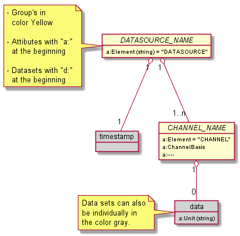
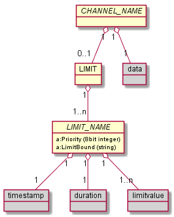
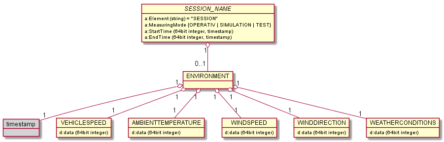
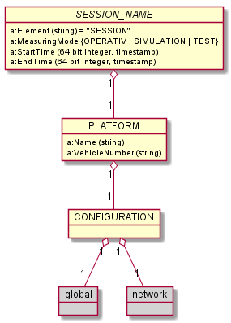
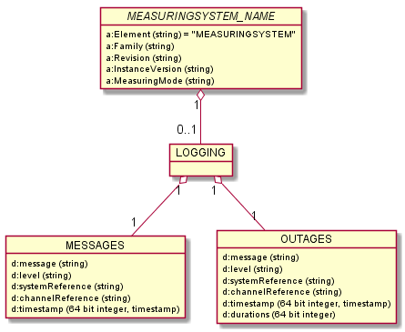
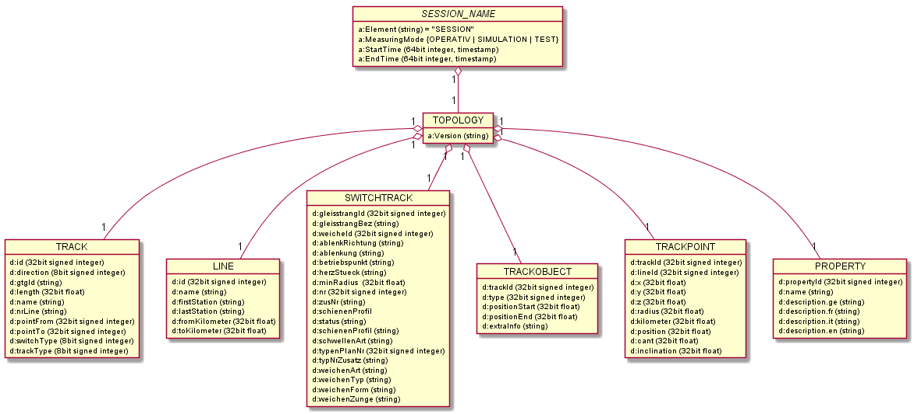
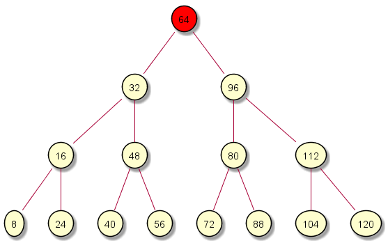
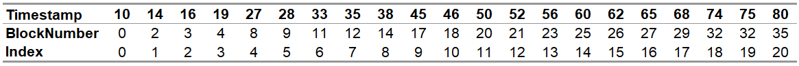
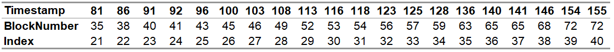
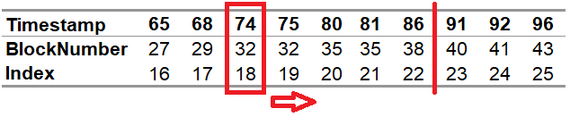

# Specification of the RCM-DX Format version 2.0.0
<!--- "RCM-DX" ohne "format" heisst "Schienenzustandsüberwachung Datenaustausch" also nicht viel. Dieses Dokument ist die Spezifikation in einer bestimmten Version, das gehört in den Titel. -->

## History

| Version | Datum | Autor | Beschreibung |
|--|--|---|------|
| V0.1 | 06.03.2015 | Martin Frey (SCS) | Initial version |
| V0.2 | 20.03.2015 | Martin Frey (SCS) | Extensions |
| V0.3 | 15.04.2015 | Patrik Wernli (SCS) | Review |
| V0.4 | 20.04.2015 | Martin Frey (SCS) | Extensions and revised |
| V0.5 | 03.05.2015 | Patrik Wernli (SCS) | Formal Adaptions |
| V0.6 | 12.05.2015 | Martin Frey (SCS) | PDR Feedback: Storing of Booleans, comments allowed on all levels, format independent of video codec, flags (including simulation) on session level. Schemas for exceedances, comments and drawings added |
| V0.7 | 13.07.2015 | Patrik Wernli (SCS) | Finalized for CDR |
| V0.8 | 02.10.2015 | Martin Frey (SCS) | Event model added, reference to specification event schema added. |
| V0.9 | 30.11.2015 | Patrik Wernli (SCS) | Adaptions for Infotrans position model. Version concept removed. Event model updated. |
| V0.10 | 21.12.2015 | Martin Frey (SCS) | Review |
| V0.11 | 21.12.2015 | Patrik Wernli (SCS) | Revised after review |
| V0.12 | 16.02.2016 | Pascal Brem (SCS) | Topology model in configuration. |
| V0.13 | 17.02.2016 | Martin Frey (SCS) | Review topology model |
| V0.14 | 19.02.2016 | Pascal Brem (SCS) | Sections added to file format. |
| V0.15 | 23.02.2016 | Martin Frey (SCS) | Global configuration and settings updated |
| V0.16 | 11.07.2016 | Pascal Brem (SCS) | New Hash code attribute for the topology. |
| V0.17 | 15.07.2016 | Pascal Brem (SCS) | New units and data types for positions |
| V0.18 | 03.01.2018 | Pascal Brem (SCS) | New GTG Track Id in the Topology. |
| V0.19 | 03.01.2018 | Pascal Brem (SCS) | Events are stored on session level. |
| V0.20 | 09.01.2018 | Pascal Brem (SCS) | Events and Sections in a group. |
| V0.21 | 09.01.2018 | Patrik Wernli (SCS) | Added chapter “HDF5 File Format Versions” |
| V0.22 | 11.04.2018 | Patrik Wernli (SCS) | Changed document template to official publishing template |
| V0.23 | 16.08.2018 | Pascal Brem (SCS) | Changes in the channel basis definition. |
| V0.24 | 16.08.2018 | Pascal Brem (SCS) | New attributes on the picture block channel. |
| V0.25 | 04.09.2018 | Pascal Brem (SCS) | New minor version. |
| V0.26 | 28.11.2018 | Pascal Brem (SCS) | New minor version for the topology attributes. |
| V0.27 | 08.01.2019 | Pascal Brem (SCS) | New availability group. |
| V0.28 | 05.06.2019 | Pascal Brem (SCS) | New switchtracks in the DfA |
| V0.29| 29.10.2019 | Michael Ammann (SBB) | Major changes to the format as well as the documentation. Details are given in the appendix |
<!--- just because we made major changes to the format, does not need to break the numbering of this file. In order to avoid parallel developments, let's stick to the sequence -->


## Approval

| Date | Name | Function |
|---|---|------|
| - | - | - |

## Referenced Documents

| ID | Document name | Version | Date |
|--|------|--|--|
<!--- das hat in meinen augen keinen Sinn, die vorherige Version zu referenzieren 
| P0402-4-350 | RCM_DX_specification_0.28.docx | V0.28 | 05.06.2019 | -->

## Text formatting and wording

The following typographical conventions are used in this document: <!--- I would hope that you did not choose them to make it harder to read...-->

<!--- all of these are useless explanations:
References to another chapter look like this: [Reference to chapter "Text Formatting"](#text-formatting)  
References to a external web page look like this: [Link to a URL "sbb.ch"$\to$](http://www.sbb.ch)  
A word that receives a reference to a footnote looks like this: footnote^[footnote: footnotes are displayed at the bottom of the page.]  

> This is an important hint, please note me!

#### Diagrams

The following figure shows an example of a used diagram type and its elements:


-->
- HDF5 groups are written in uppercase letters. The formatting distinguishes groups that have a literal name (e.g. the `TOPOLOGY` group) from those whose name varies from case to case e.g.  MEASURING SYSTEM or SESSION.
- HDF5 attributes are written in camel case starting with an uppercase letter (e.g the attribute `MajorVersion`). 
- HDF5 data sets are written in camel case starting with a lowercase letter (e.g. the data set `timestamp`)

For more details on the camel case notation, refer to  [wikipedia/Camel Case](https://en.wikipedia.org/wiki/Camel_case).

In this text, whenever we refer to a "group", we mean HDF5 groups as define in the HDF5 specification. <!--- don't repeat the HDF5 specification These contain additional groups or datasets.  -->
The same is true for attributes and data sets which both refer to the respective HDF5 elements. 

"Mandatory" means that a group, attribute or data set is required to exist _if the parent group or data set exists_. A file lacking a mandatory element is not compatible with this specification.

<!---
Not required:
### Naming conventions
- Logical units within a name are separated from each other with a period (e.g. "XPOS.DATA.LONGITUDE")
- Fully qualified names are used for elements that have to have a unique name when referenced among different data sets. <!--- this is not quite correct, is it?-->
<!--- this is not part of the format specification which only describes the content of the file
### File names
Files following the RCM-DX specification get their own defined file extension, which is `rcmdx`.  
Example of a file name: `20201228_081522_TGMS.rcmdx`.
-->


## Motivation  

<!--- to me the main motivation for defining is not the fact that we measure the rails but that we want to control the toolchain. 
I would NOT start with "SBB" for a format that is determined to be open source soon; for the same reason I would not mention as a very last point the "other railroad operators" "as well"; manual measurements are add-on; the format is not surrounding the existing systems-->

Railroad companies continuously gather data of their rail, overhead line, and telecommunications networks by means of mobile and stationary measuring systems. Data flows from these systems through processing units -- which enrich, evaluate and validate the data --, to systems that display the data to subject matter experts and also to systems that automatically analyse it.

This specification defines the rail condition monitoring data exchange format (RCM-DX format) which is a data format optimised for data in the railroad context, i.e. for data points localised within a railroad network. The RCM-DX format is a file format based on the HDF5 specification and defines a structure of HDF5 groups, data sets, and attributes. The document at hands also describes the content of the elements defined. Although the format is open and can in principle be implemented right away by any railroad company, this specification contains a few non-generic elements and naming conventions that are specific to SBB. The reason for this is that any file that adheres to this specification can be used with the _RCM Viewer_, an application available to the public via the website LINK MISSING.

The RCM-DX format is developed and maintained by the SBB company. An extension of the specification is permitted, yet, it must be taken into account that the resulting data file may no longer be read or processed by other systems supporting the RCM-DX format.

The RCM-DX format is a file format detailing the HDF5 format version 2.0. HDF5 was chosen for several reasons, including that it is an open format. HDF5 is a hierarchical data storage where the data in arranged in a tree structure. The HDF5 format is described on the webpage of the [HDF5-group](http://www.hdfgroup.org/HDF5/), in particular on the site [HDF5 file format specification](https://portal.hdfgroup.org/display/HDF5/Introduction+to+HDF5). The HDF5 group offers tools and libraries for various programming languages and operating systems that allow to read and write HDF5 files.

## The concept underlying the RCM-DX format

In the development of this specification, it was assumed that data is collected contemporaneously by several measuring systems that are installed on a measuring platform (such as, e.g., SBB's legendary DFZ). As the platform moves within the rail road network, each measuring system records several parameters (also called channels). Each data point (also called sample) within a channel is recorded at a well defined time and is associated with a certain position, i.e. is localised on the rail network. 


Channels can hold data of various types including integer and float values, coordinate-pairs, images, and videos. These are stored in a particular manner in RCM-DX files that is described in chapter TODO:LINK MISSING


<!--- 
COMMENTS ON THE ORIGINAL FIGURE:
.) there is an underline in the root node's name in the image "RCM_DX" 
.) "plattform" has two "t"
.) "MEASURING SYSTEM"
.) "SESSION"
.) multiplicity of SESSION is "1..n"
-->

In the RCM-DX format, the primary key to link sample values with the position on the rail network or sample values among each other, is the time stamp at which the data / position information was collected. Each MEASURING SYSTEM group contains so-called _data sources_ which unite channels triggered at identical instances of time. A given sample value is associated with a given timestamp of its parent data source. Positions in terms of a localisation in the rail network are stored in the `POSITION` group. The position determined at a particular time instance contains the localisation information of all samples recorded at the same time.

As the RCM-DX format uses a time stamp as the primary key to connect data and position, there are as many sample values stored in a CHANNEL as there entries in its DATASOURCE.timestamp array. The only exception to this are coordinates (see chapter TODO: LINK MISSING)

In practice, many measuring system optimized for railroads are triggered at equidistant chainage, not at fixed time intervals.
TODO: JUSTIFY THE USE OF TIMESTAMPS AS PRIMARY KEY

## Measurement sessions

During a measurement session, data is collected contemporaneously by several measuring systems. A session is reflected by a SESSION group in the RCM-DX format. A RCM-DX file can contain several sessions (hence SESSION groups) and these in turn can overlap in time. Data of a particular source recorded at a particular time can only be in one particular session group. To paraphrase, sessions cannot overlap for a given system. <!-- not sure the preceding sentence is correct -- TO VERIFY -->

The following information is available in a RCM-DX file about the measurement session
- data collected during the session: this is found in the nodes of the individual measuring systems
- localisation of the data in the railroad network: found in the node `POSITION`
- metadata on the session, such as start and end time: found in the attributes of the SESSION group
- logging information of the measuring systems: found in the node `LOGGING`
- data on the ambient conditions, such as outside temperature: found in the node `ENVIRONMENT`

### Naming of the SESSION group

Since several SESSION groups can be contained in one RCM-DX file, they must be given a unique name. To achieve this goal, session names are assigned according to the pattern YYYYMMDD_hhmmss.SSS
where
- YYYYMMDD is the date at which the data was collected written as year in four digit representation, month as two digit number (e.g. 01 for January) plus day in the month,
- hhmmss is the time of the day at which the session started (hour, minute, second with two digits each),
- SSS is the milliseconds in the second at which the session started, and
- "_" and "." are separators.

For example 20190212_231255.592 encodes February 12 2019 at 23:12:55.592 o'clock.

Only one session can exist for a given millisecond in a RCM-DX file. This must be implemented and ensured by the creator.

### Details of a measuring session

| Element Name | Element Type | Parent element | Mandatory | Description |
|--|--|---|--|-----|
| StartTime | long | SESSION | yes | Nanoseconds that passed between January 1, 1970 UTC and the start of the session |
| EndTime | long | SESSION | no | Nanoseconds that passed between 1.1.1970 UTC and the end time of the session. If the session has not been closed yet, this attribute is missing |
| Element | string | SESSION | yes | Indicates the type of the group. It equals to "SESSION" |

## Data

Various types of data is collected during a measurement session. On a coarse level one can distinguish
- principal data that allows conclusions about the railroad assets. This is contained in CHANNEL groups.
- deduced data such as limit exceedances. This is contained in `LIMIT` and `EVENT` groups. 
- metadata, namely the position at which a sample was recorded (contained in the `POSITION` and `SECTION` group), logging information in a broader sense (contained in the `LOGGING`, `CLEARANCEINFORMATION` AND `DATAPROCESSING` group), and supplementary information on data (contained in the `EVENTS`, `RECORDS` group).
- supporting data such as, e.g., ambient temperature. This is contained in the `ENVIRONMENT` group. TODO:OTHERS MISSING?

Apart from this classification, one can distinguish data that has been _recorded_ as opposed to _reference data_ originating from construction plans or alike. This is indicated via the attribute `ChannelType` assigned to each channel. For example, it is common to calculate a delta between the measured gauge and the TO-BE value of the gauge. In this case a channel with `ChannelType` = `reference` would provide the TO-BE value. 

In a similar vain, the RCM-DX format allows to store limits that indicate critical values for a given parameter. For details on their implementation, see chapter TODO: LINK MISSING

Finally, the purpose of the measurement can be data production for a consumer on one hand side or any type of testing on the other hand side. This is indicated via the attribute `MeasuringMode`. Within the testing, a simulation mode is made explicit by a separate value for `MeasuringMode`.
<!-- 
The measuring mode encodes the purpose and conditions of the measurement. The entire session is either productive or test (with the variant simulation). 
this is a flaw of our format! it should be possible that one of the measuring systems is test while others are productive; only "simulation" is session-wide -->

| Element Name | Element Type | Parent element | Mandatory | Description |
|--|--|--|--|--|
| `MeasuringMode` | string | MEASURING SYSTEM | yes | Indicates the measuring mode. Details below|
| `ChannelType` | string | CHANNEL | yes | Indicates the "origin" of data |
<!--- preceding links probably broken -->

#### Measuring modes

There are three different measurement modes possible:

| Value | Significance |
|---|------|
| PRODUCTIVE | Data for use in a productive environment of a data consumer |
| TEST | Test data recorded during a diagnostic run with the aim of checking and testing the measuring equipment. |
| SIMULATION | Data generated in a measuring system's simulation mode |

#### Channel types

The attributes `ChannelType` indicates how a value was created. This can either be measured, or calculated or taken from a previously defined data source. The following values are valid:

| Value | Significance |
|---|------|
| MEASURED | Data reflects the result of a measurement |
| REFERENCE | Data reflects reference values, e.g. from a construction plan |

### Channels

The CHANNEL group contains the actual data. Various data formats can be stored in an RCM-DX file using the respective data sets described below. For a given channel, only one format is allowed.

Depending on the data type, it differs in the elements present.

#### Metadata on the channel

| Element name | Element Type | Parent element | Mandatory | Description |
|--|---|----|---|------|
| PositionOffset | 32 bit float | CHANNEL | yes | see [Position Offset](#position-offset) |
| ChannelBasis | string | CHANNEL | yes | see [Channel Base](#channel-base) |
| Neighbor | string | CHANNEL | yes | see [Neighbor](#neighbor) |
| Element | string | CHANNEL | yes | Contains the type of the group, this is fix `CHANNEL` |

#### Channel base

Description of the channel, what was measured and in which direction. Since a measuring vehicle can move on a rail in two directions and the sensor could therefore be on the other side, it should be possible to indicate this. Here is the place for it.

Possible values are:

| Value | Description |
|---|---|
| SENSOR_VERTICAL_LEFT | TODO: MISSING |
| SENSOR_VERTICAL_RIGHT |TODO: MISSING |
| MOVE_DIRECTION_VERTICAL_LEFT |TODO: MISSING |
| MOVE_DIRECTION_VERTICAL_RIGHT |TODO: MISSING |
| SENSOR_VERTICAL_TOTAL |TODO: MISSING |
| MOVE_DIRECTION_VERTICAL_TOTAL |TODO: MISSING |
| TOTAL |TODO: MISSING |

#### Neighbor

Refers to the name of an adjacent channel. This can be the right rail, for example, when measuring the track temperature of the left rail.
Thus the attribute `neighbor` of the channel "TEMP_RAIL_**L**" would contain the name "TEMP_RAIL_**R**" and vice versa.

#### Position Offset

Describes the distance between a defined zero point (position) on the measuring vehicle and a measuring system. This specification is used to convert the exact time at which the measurement was taken to a defined zero point using the speed driven and the position taken at the time.  

#### Naming of CHANNEL group

The channel group’s name is a unique identifier. The unique identifier consists of the platform prefix, a point as separation sign, the data source name, a point as a separator, and a suffix. The suffix is assigned by the owner of the platform. The suffix names must be composed of only letters, numbers, points, spaces, underscores and dashes (minus signs).

#### Storage of principal data

##### Single value data
<!--- in our universe all data is recorded in 3d space -->
<!--- a channel does not record anything, it is the means of storing data -->

Channels which hold single value data contain a data set with the name _data_. This data set is mandatory. Single values are stored in this dataset as a 1D array, the length of this array (or list) is not limited by this specification. Multidimensional data is either stored as coordinates (see chapter TODO:LINK MISSING) or in multiple 1D arrays of distinct CHANNELS.

The Elements of the CHANNEL group of single value data are listed in the Table below

| Element name | Element Type | Parent element | Mandatory | Description |
|---|----|--|--|-----|
| CHANNEL | HDF5 group | DATA SOURCE | no | Parameter / channel of a measuring system |
| data | array of 8, 32 or 64 bit integer or array of 8, 32, or 64 bit float (little endian in each case) | CHANNEL | no | the actual data recorded |
| Unit | string | data | yes | The physical unit of the data contained (empty if the data does not have one) |

##### Coordinates

Apart from single value data that reflects, e.g., the track gauge at a certain chainage, there is data that reflects the measured position of a point in space, e.g. the measured rail cross profile at a certain chainage. In the RCM-DX format, such data is stored in multiple 1d arrays where each array is given a name of the pattern `coord.CN` where `coord.C` is a prefix and `N` is an integer number starting with zero. Note that in contrast to single value data, this type of data storage allows to have several entries for a given position (hence time stamp). Therefore the size of the coordinate data set does not match the size of the associated `DATASOURCE.timestamp` data set. Since the number of coordinate-pairs can vary from timestamp to timestamp, a dataset with the name `sampleindex` of equal length as `DATASOURCE.timestamp` exists which contains an index into the coordinate data set.

| Element name | Element type | Parent element | Mandatory | Description|
|--|------|--|---|---|---|---|
| coord.CN | 8, 32 or 64 bit signed integer or 64 or 32 bit floating point; (little endian in each case) | CHANNEL | no | |
| sampleindex | integer TODO:HOW MANY BIT; TODO:endianness | CHANNEL | yes if a coordindate dataset exists | |
<!--- there was a "yes" for mandatory but not every CHANNEL group has to contain a coord.CN dataset -->

Each data set coord.CN carries an attribute called `Unit` with the following specification:

| Name | Data Type | Parent object | Mandatory | Description |
|---|----|--|--|-----|
| Unit | string | coord.CN | yes | The physical unit of the data contained (empty if the data does not have one) |

*Example*  
The rail cross profile serves as an example here. At a give chainage, several hundreds of data points are recorded to represent the 2-dimensional rail profile, an example of which is given in the Figure below. The corresponding CHANNEL group contains two arrays with the names `coord.C0` and `coord.C1` representing the X-axis and the Y-axis, respectively. Assume the first rail profile measured within the session persists of 2000 data points and the second one of 1001. Then the first value in `sampleindex` equals to 0, the second value equals 1999, and the third to 2999. in the Figure below, a red dot is plotted for the first 2000 data points in coord.C0 and coord.C1.


##### Pictures

Channels carrying images contain a group called `IMG`. Within this group are the individual images in the form of datasets. Images are stored as binary data blocks with each image corresponding to a separate data set. The names of the images follow the pattern `IMG.NNNNNNNNN` where `IMG.` is a prefix and `NNNNNNNNN` is a nine digit integer starting with 0. All images within the same IMG group share the same properties. They are given in the attributes of the IMG group and defined below. Note that images can have different resolutions in X and Y direction. This must be considered for a correct representation and evaluation of the images.

To store more information on the image, for example which system created the data, the optional attribute `DataType` is available. <!--- this seems abuse of the field; Furthermore this should be in the group "dataprocessing". see also videos--> 

| Element name | Element type | Parent element | Mandatory | Description | 
|---|----|---|---|-----|
| `IMG` | HDF5 group | CHANNEL | no |
| `ContentType` | string | `IMG` | yes | Data type of images specified as MIME^3^ type, for example `Content-Type: <image/jpeg>`|
| `DataType` | string | `IMG` | no | Description of data type if not a standard image type, see [Pictures ContentType](#contenttype-without-image-mime-type) | <!--- link presumably broken -->
| `ResolutionType` | string | `IMG` | yes | Information about the point density of the image (example: ppmm = pixel per millimeter) |
| `ResolutionX` | 32 bit integer | `IMG` | yes | Resolution in X direction |
| `ResolutionY` | 32 bit integer | `IMG` | yes | Resolution in Y-direction |
| IMG.NNNNNNNNN | array of 8, 16, 32 bit integer, depending on color depth | `IMG` | no | image data |

###### Pictures ContentType

Images can be in compressed or uncompressed form. The format of the images is indicated in the attribute `ContentType` which contains the imgage's MIME type. A list of standard MIME types can be found on the webpage of  [https://www.iana.org/assignments/media-types/media-types.xhtml$\to$](https://www.iana.org/assignments/media-types/media-types.xhtml). This is maintained by the [Internet Assigned Numbers Authority, IANA$\to$](https://www.iana.org/). If the image requires a special software to display it, the following MIME type should be added to the attribute `ContentType`: `Content-Type: <application/octet-stream>`.  

TODO: do we use other funny abbreviations such as "ppmm"? If so, we need to specify them!

<!--- a whole paragraph for a pretty obvious information! what a waste of the reader's time!
The images are named according to the following pattern: `IMG.NNNNNNNNN`, hereinafter a description of the individual elements.

| Element | Description |
|--|-------|
| IMG | String for the name of an image |
| . | Separators.
| NNNNNNNNN | Picture number, beginning with 000000000 (nine characters)|

-->

##### Videos

Channels carrying videos contain a group called `VID`. Within this group are the individual videos in the form of datasets. Videos are stored as streams in individual blocks. The blocks are single data sets with a given name. The names of the videos follow the pattern VID.NNNNNNNNN where `VID.` is a prefix and `NNNNNNNNN` is a nine digit integer starting with 0. All videos within the same IMG group share the same properties. They are given in the attributes of the VID group and are defined below. To store more information, for example which system created the data, an attribute named `DataType` can be added to the group `VID`.  <!--- this is an abuse of such a field. Furthermore this should be in the group "dataprocessing". see also images -->

The duration of each video is stored in the VID.duration array. For details on duration arrays, see chapter TODO: LINK MISSING.

The properties of the videos are given by the attributes of the `VID` group. It is the data processors responsibility to ascertain that all videos of a CHANNEL share them.

| Element Name | Element Type | Parent element | Mandatory | Description |
|---|---|--|--|-----|
| `VID` | HDF5 group | CHANNEL | no |
| `ContentType` | string | `VID` | yes | Data type of the video stream specified as MIME^4^ type, for example `Content-Type: <video/h264>`|
| `DataType` | string | VID | no | Description of data type if no standard video format, see [Video ContentType](#contenttype-without-video-mime-type) | <!--- link presumably broken-->
| `ResolutionX` | 32 bit integer | `VID` | yes | Resolution in X direction in pixels |
| `ResolutionY` | 32 bit integer | `VID` | yes | Resolution in Y direction in pixels |
| `FramesPerSecond` | 16 bit integer | `VID` | yes | Number of frames per second (fps) of the video stream |
| VID.NNNNNNNNN | array of TODO | `VID` | yes |
| `duration` | `VID` | TODO |

<!--- not necessarily "recorded" but stored in this file>
<!---
| PreambleDuration | 64 bit integer | VID | yes | Duration of the introductory video range in nanoseconds |
| TrailerDuration | 64 bit integer | VID | yes | Duration of the video credits area in nanoseconds | 

preamble and trailer are to be deleted, correct? -->

###### Video ContentType

Just like images, videos can be saved in compressed or uncompressed form. The format is indicated in the attribute `ContentType`. A list of standard MIME types can be found at the link [https://www.iana.org/assignments/media-types/media-types.xhtml$\to$](https://www.iana.org/assignments/media-types/media-types.xhtml). This is maintained by the [Internet Assigned Numbers Authority, IANA$\to$](https://www.iana.org/). If the created and saved video stream needs its own special software to display it, the following MIME type should be added to the `ContentType` attribute: `Content-Type: <application/octet-stream>`.  

#### Storage of deduced data

##### Preview data

The RCM-DX format supports the inclusion of preview data for integer and float type data. Preview data provides a quick overview of the data recorded. It is aggreated from the "original" data by blocks of defined size. If a channel contains preview data, three data sets are generated:

| Name | Description | Mandatory | Parent |
|----|----|---|---|
| data.PRE.AVG.X | Mean value of the data block | no | CHANNEL |
| data.PRE.MIN.X | Minimum value within the data block | no | CHANNEL |
| data.PRE.MAX.X | Maximum value within the data block | no | CHANNEL |

The `X` in the data set name is an integer number that indicates the block size. For example, if a block size of ten entries is defined, the preview data sets name ends in `.10`. For a dataset `data` with 600 entries, the dataset `timestamp` contains the same number of entries while the dataset `data.PRE.AVG.10` contains only 60 entries. Bya.
<!--- IMHO "duration" does not make sense for the preview data -->

##### Limits

Limits are used to indicate the exceedance of critical values. Note that not the limit value itself is stored, but rather a flag that indicates when (and where) a given limit has been violated. It is possible to associated several limits with a single channel. Each limit formes its own HDF5 group with a unique name that is the name of that group -- a child of the `LIMIT` group.

If a measured value exceeds one of the limits associated with this group, an entry in the corresponding LIMIT NAME.`timestamp` data set is created. Using the optional data set LIMIT NAME.`duration`, the duration of a limit value exceedance is indicated. The number of elements in the LIMIT NAME.`timestamp` array therefore equals the number of the limit exceedances.

{width=210px}
<!--->
replace "channel_name" by "CHANNEL" => amm: why? der kanal kann irgend einen namen haben...
remove data types
cardinality of data is wrong! This is 1:1 
limit_name in uppercase (it is a group)
cardinality of LIMIT_NAME is 0..n (which does not make sense); in the table below LIMIT_NAME is mandatory which does not allow for 0.
-->

| Element Name | Element type | Parent element  | Mandatory | Description |
|--|--|--|--|--|
| `LIMIT` | HDF5 group | CHANNEL | no |
| LIMIT NAME | `LIMIT` | yes |
| `timestamp` | array of 64 bit integer | LIMIT NAME | yes |
| `duration` | array of 64 bit integer | LIMIT NAME | no | 

###### Limit names

TODO: Any restrictions?

### Supporting data: Ambient data

A couple of ambient data is (almost) always included in the data collection. It does not pertain to a certain measurement system (in the sense given above) and is therefore in a separate branch of the RCM-DX tree. It is, however, structured the same way, having a DATASOURCE group and CHANNELS.



The CHANNELS defined in the RCM-DX format are given in the table below:

| Name | Parent object | Mandatory | Description |
|--|--|--|--|
| `ENVIRONMENT` | SESSION | yes | Group gathering ambient data | 
| timestamp | `ENVIROMENT` | yes | timestamp at which the ambient data was recorded |
| DATASOURCE | `ENVIRONMENT` | yes | Group gathering the channels of the ambient data | 
| `VEHICLESPEED` | `ENVIRONMENT`.DATASOURCE | yes | Measured vehicle speed. The unit is given in the attribute `VEHICLESPEED`.data.Unit | 
| `AMBIENTTEMPERATURE` | `ENVIRONMENT`.DATASOURCE | yes | Measured ambient temperature. The unit is given in the attribute `AMBIENTTEMPERATURE`.data.Unit | 
| `WINDSPEED` | `ENVIRONMENT`.DATASOURCE | yes | Wind speed. The unit is given in the attribute `WINDSPEED`.data.Unit | 
| `WINDDIRECTION` | `ENVIRONMENT`.DATASOURCE | yes | Wind direction. The unit is given in the attribute WINDSPEED.data.Unit | <!-- WHAT IS THE UNIT HERE>
| `WEATHERCONDITIONS` | `ENVIRONMENT`.DATASOURCE | yes | Weather conditions as free text |

<!-- does it need a duration array? -->

The data sets within the individual groups are listed below.

| Element name | Element type | Parent element | Mandatory | Description |
|--|---|----|---|------|
| `data` | array of 64 bit integer | `VEHICLESPEED` | yes | see above |
| `data` | array of 64 bit integer | `AMBIENTTEMPERATURE` | yes | see above |
| `data` | array of 64 bit integer | `WINDSPEED` | yes | see above |
| `data` | array of 64 bit integer | `WINDIRECTION` | yes | see above |
| `data` | array of 64 bit integer | `WEATHERCONDITIONS` | yes | see above |

#### Weather conditions

The weather conditions are entered in the data set. This could be for example "rain, fog, snowfall".

TODO: Is there a defined vocabulary?

### Position data

Position information is contained in the `POSITION` group. This group contains the position for each timestamp present for any timestamp of the file <!-- is this really true?>

From a measurment session point of view, the session is split into so-called sections. A section is defined such that... TODO

#### Data fields

> To define, here some data are contained twice, these are also already contained in other groups!

| Element name | Element type | Parent element | Mandatory | Description |
|------|-----|----|---|---|
| coveredDistance | array of 64 bit float | `POSITION` | yes | Total length of a session. The unit of measure is given in the attribute `Unit` |
| vehicleOrientation | array of 8 bit integer | `POSITION` | yes | Forward or backward direction. See below |
| vehicleSpeed | array of 64 bit float | `POSITION` | yes | Current speed of the vehicle. The unit of measure is given in the attribute `Unit` |
| trackOrientation | array of 8 bit integer | `POSITION` | yes | Relative orientation of the track to the vehicle direction. See below |
| trackId | array of 32 bit integer | `POSITION` | yes |  |
| trackOffset | array of 64 bit float | `POSITION` | yes |  |
| lineKilometer | array of 64 bit float | `POSITION` | yes |  |
| positionAccuracy | array of 8 bit integer | `POSITION` | yes |  |
| positionQuality | array of 8 bit integer | `POSITION` | yes | Single values |
| Unit | string | `coveredDistance` | yes | Physical unit of the data in data set `coveredDistance` |
| Unit | string | `vehicleSpeed` | yes | Physical unit of the data in dta set ` vehicleSpeed` |
| Unit | string | `positionAccuracy` | yes | Physical unit of the data in `positionAccuracy` |

<!-- the units should not be hard coded but given in an Attribute 

**vehicleSpeed:** Speed of the vehicle at the time of recording in $[m/h]$  
**trackId:** Defined track ID on which the vehicle is located at the time of recording  
**trackOffset:** Distance between starting point of track and current position in meters $[m]$  
**lineKilometer:** Absolute position on the line travelled at the time of recording in kilometers $[km]$  
**PositionQuality:** Quality of the position measurement between zero (0) very good to 15 very bad  
**positionAccuracy:** The position accuracy in meters $[m]$  
-->

#### Vehicle Orientation

The data set `vehicleOrientation` contains the driving direction of the vehicle. This information influences the position of the measuring systems.  
This data set can contain the following values:  

| Value | Description |
|--|-----|
| 0 | Vehicle moving forward |
| 1 | Vehicle reversing |

#### Track Orientation

The data set `trackOrientation` contains the alignment of the track. This information serves the correct evaluation of the kilometre data of the line, see data set `trackOffset`.

This dataset can contain the following values:  

| Value | Description |
|--|-----|
| 0 | The kilometre indications of the line are **ascending**, based on the indicated vehicle orientation |
| 1 | The kilometre indications of the line are **decreasing**, based on the indicated vehicle orientation |


### Sections

A session is split into so-called sections when a track is passed twice ... TODO
The SECTION group itself is separated into two groups. The data sets in the `SECTIONINFO` give the basic contain one entry per section. 

The `TRACKINFO` lists all the tracks that have been. The attribute SECTIONINFO.trackInfoOffset is a pointer for each section into these lists. A group size can be determined by calculating the specified offset value at the $x$ position minus the offset value at the $x-1$ position.

| Element name | Element type | Parent element | Mandatory | Description |
|--|--|--|--|--|
| `SECTION` | HDF5 group | SESSION | yes | |
| `SECTIONINFO` | HDF5 group | `SECTION` | yes | |
| `TRACKINFO` | HDF5 group | `SECTION` | yes | |
| `coachDirection` | array of 8 bit integer | `SECTIONINFO` | yes | Defines the direction of travel of the measuring vehicle for each section |
| `firstTrackOffset` | array of 64 bit float | `SECTIONINFO` | yes | Indicates the distance in meters between the start of the track and the position at the beginning of the measurement |
| `lastTrackOffset` | array of 64 bit float | `SECTIONINFO` | yes | Indicates the distance in meters between the position at the end of the measurement and the end of the rail |
| `startTimestamp` | array of 64 bit integer | `SECTIONINFO` | yes | Start time of the section as time stamp since 1.1.1970 at 00:00 UTC |
| `trackInfoOffset` | array of 64 bit float | `SECTIONINFO` | yes | This data set defines how many entries in the data sets of the "Track Info Group" belong to a section. |
| `trackId` | 32 bit signed integer | `TRACKINFO` | yes |  |
| `trackStartTimestamp` | 64 bit signed integer | `TRACKINFO` | yes |  |
| `trackEndTimestamp` | 64 bit signed integer | `TRACKINFO` | yes |  |
| `trackOrientation` | 8 bit signed integer | `TRACKINFO` | yes |  |
| `trackStartCoveredDistance` | 64 bit float | `TRACKINFO` | yes |  |
| `trackEndCoveredDistance` | 64 bit float | `TRACKINFO` | yes |  |

##### coachDirection

 This array contains only as many entries as there are sections.

| Value | Meaning |
|:--:|:---:|
| 0 | forward direction of travel |
| 1 | Reverse direction of travel |

### Measurement Platform

Metadata on the platform can also be contained in a RCM-DX file, namely in the PLATFORM group. The name of the group specifies the TODO

For the configuration information of the platform refer to chapter TODO: LINK MISSING

| Element name | Element Type | Mandatory | Description |
|---|--|:--:|------|
| PLATFORM | HDF5 group | yes | Container for information related to the measurement platform |
| `Name` | string | no | Unique name of the vehicle |
| `VehicleNumber` | string | no | Unique number of the vehicle |

{ width=170px }

#### Platforms at the SBB

SBB regularly uses the platforms listed below. 

| Platform Code | Platform Name | Abbreviation | Vehicle Number |
|---|---|-----|--|
| DFZ00 | Diagnosefahrzeug | DFZ | MISSING |
| DFZ01 | gezogenes Diagnosefahrzeug | gDFZ | MISSING |
| DFZ02 | Schieneprüfzug | SPZ | MISSING |


### Measuring System

Each measuring system has its own data sources, which have their own names, as well as their own channels, which in turn have their own names. Common features are described in this specification, everything else is defined in a separate specification. Since this part differs greatly from railway companies and measuring equipment, a rigid specification has been dispensed with, but a certain framework is still given.

A group is created for each system that collects data. The name of the group is unique for each system. The composition of this name is not predefined. Each system contains further subgroups, each of which contains a data source at the end.


#### Metadata on the measuring system

| Name | Data Type | Parent object | Mandatory | Description |
|--|---|----|---|------|
| Family | string | MEASURING SYSTEM | yes | General name of the measuring system |
| Revision | string | MEASURING SYSTEM | yes | Model and Version of the measuring system. Note that this number is ideally attributed by the owner of the platform, not the manufacturer of the measuring system |
| InstanceVersion | string | MEASURING SYSTEM | yes | Version of the data format created by the measuring instrument. This version can be different within different gauges of the same family |
| Element | string | MEASURING SYSTEM | yes | Contains the type of the group, this is fixed "MEASURINGSYSTEM" |


### Triggering and associated elements in the RCM-DX format

Data collected by a given measuring system with the same triggering mode and frequency is united in a single DATASOURCE group. However, data might split in logical units, i.e. there might be data sources that have the same triggering mode and frequency but whose channels are are contained in different DATASOURCE groups for other reasons.

A measuring system can be triggered a) randomly, (not supported by the RCM-DX format) b) at equidistant chainage invervals or c) at equidistant time invervals. For performance reasons, the attributes that detail the triggering are located at the CHANNEL group, not the DATASOURCE group.

<!--There are two types of data acquisition for a data source group. One is always after a defined distance (e.g. every 250 millimeters) and the other is the recording of measurement data at a certain frequency (e.g. 4000 Hz).
The way the measurement data was recorded is shown in two attributes for each channel group. For a description see [Common Trigger Distance or Frequence](#common-trigger-distance-or-frequence).-->

As the triggering is shared among the channels of the datasource, they also share a common `timestamp` data set and potentially a common `duration` data set. See chapter chapter LINK MISSING for an explanation of these elements.

| Name | Data Type | Parent object | Mandatory | Description |
|--|---|----|---|------|
| Element | string | DATASOURCE | yes | Contains the type of the group, this is fix "DATASOURCE" |
| timestamp | array of 64 bit integer | DATASOURCE | yes | A timestamp for every sample in the channels contained |
| timestamp | array of 64 bit integer | POSITION | yes | TODO |
| duration | array of 64 bit integer | DATASOURCE | no | The duration of each sampe in the channels contained |
| TriggerMode | string | CHANNEL | yes | see [Trigger Mode](#trigger-mode) |
| CommonTriggerDistance | 32 bit float | CHANNEL | yes | see [Common Trigger Distance or Frequence](#common-trigger-distance-or-frequence) |
| CommonTriggerFrequence | 32 bit float | CHANNEL | yes | see [Common Trigger Distance or Frequence](#common-trigger-distance-or-frequence) |


#### Common Trigger Distance or Frequence

The two attributes `CommonTriggerFreq` and `CommonTriggerDistance` define the type of measurement data recording and the distance at which these measurement data were recorded.

If the measurement data are recorded at a certain distance, for example every 20 millimeters, the attribute `CommonTriggerDistance` is specified and the value "0.0" is specified for `CommonTriggerFreq`. At the attribute `TriggerMode` the value `DISTANCE` is noted.

If the data is recorded at a certain frequency, the frequency is given in Herz for the attribute `CommonTriggerFreq`, for example 40000.0 for 40kHz. With `CommonTriggerDistance` the value remains "0.0". At the attribute `TriggerMode` the value `TIME` is noted.

> In a data source group there is always only one common trigger frequency or one trigger distance. A mixture within the group is not permitted!
> Both attributes have the value "0.0" if `TriggerMode` contains the value `EVENT`.

#### Trigger Mode

This attribute defines how the data was recorded. Possible values are:

| Value | Description |
|---|----------|
| TIME | Time-based measurement data recording |
| DISTANCE | Distance-based measurement data acquisition |
| EVENT | Event based recording |

#### Timestamps

Timestamps are... TODO
<!---A timestamp is stored as 64 bit integer 1 dimensional array.--> It reflects the number of nanoseconds passed since 01.01.1970 at 00:00 UTC. The timestamp data set is sorted in ascending order and the values must strictly be equivalently spaced in time.  

TO VERIFY: I DOUBT THAT THE PRECEDING SENTENCE IS CORRECT!

Timestamps arrays exist in the following groups:
- DATASOURCE
- `POSITION`
- LIMIT NAME
- `EVENT`
- `RECORD`
- `MESSAGE`
- `OUTAGE`
- `SETTING`
- `ENVIRONMENT`.DATASOURCE

#### Durations

A sample can be valid for a certain period of time. The RCM-DX format supports this via data sets named `duration`. In such a case `timestamp` specifies the time from which onwards the value is valid and the correponding entry in the `duration` dataset specifies for how long (that is to say the number of nanoseconds) this value is valid for. In the case of videos, the `duration` array holds the length of the video.

Duration data sets can exist
- DATASOURCE
- LIMIT NAME
- `VID`
- `EVENT`
- `RECORD`
- `OUTAGE`
- `ENVIRONMENT`.DATASOURCE

 There are as many measurement data entries as there are timestamps in the dataset `timestamp` which is included in the channel group.

The dataset needs more information, this is given as attributes:

### Log data

The LOGGING group contains information about the status of the measuring systems. The data is divided into two subgroups, `OUTAGE` and `MESSAGE`. These are described in separate chapters.

| Name | Parent object | Mandatory | Description |
|--|---|--|--|
| LOGGING | MEASURING SYSTEM | no | |
| OUTAGE | LOGGING | no | |
| MESSAGE | LOGGING | no | |

{width=250px}

#### Outages

In this group, failures and interruptions of measurement systems are recorded in a defined structure, each as its own data set. The following data about outages is included in RCM-DX files:

| Name | Data type | Parent object | Mandatory | Description |
|--|---|----|---|------|
| reference | array of string | `LOGGING` | yes | A reference to the measurement system affected by the failure is stored in this dataset.|
| level | array of string | `LOGGING` | yes | Defines the severity of the failure or interruption of a measurement system. |
| message | array of string | `LOGGING` | yes | This data set contains one message per entry about a failure of a measuring instrument |
| timestamp | OUTAGE | yes | time at which the measurement system failed |
| duration | OUTAGE | no | duration of the outage |

#### Messages

Status messages for a system or data source are stored in this group. If no messages exist, this group remains empty.

| Element name | Element type | Parent element | Mandatory | Description |
|--|---|----|---|------|
| message | array of string | `LOGGING` | yes | The actual message to be recorded for a measurement system |
| level | array of string | `LOGGING` | yes |  |
| reference | array of string | `LOGGING` | yes | A reference to the affected measurement system or the data source itself is stored in this dataset |
| timestamp | array of 64 bit integer | `LOGGING` | yes |  |
| timestamp | MESSAGE | yes | instance of the measurment to which the message relates to |
| duration | MESSAGE | no | duratoin of the relevance of the message |

### Topology and railroad network master data

This group contains the topology of the network part of which was measured and master data of the assets that make up this network. This information is typically used to "fill the position" group. The data is grouped and contained in nodes giving detailed information on a certain aspect.

This group contains many elements who are specific to SBB. 

| Element name | Element type | Parent element | Mandatory | Description |
|---|--|---|--|--|--|
| `TOPOLOGY` | HDF5 group | SESSION | yes |  |
| DfAExportTimestamp | array of string | `TOPOLOGY` | yes  |  Datetime at which the data DfA was exported and therefore a link to the version |
| `TRACK` | HDF5 group | `TOPOLOGY` | yes | Topological and master data on the railroad tracks |
| `LINE` | HDF5 group | `TOPOLOGY` | yes | Naming of lines |
| `SWITCHTRACK` | HDF5 group | `TOPOLOGY` | yes | Master data on switchtracks |
| `TRACKOBJECT` | HDF5 group | `TOPOLOGY` | yes | Master data on assets other than trakcs and switchtracks |
| `TRACKPOINT` | HDF5 group | `TOPOLOGY` | yes | Geo-coordinates and related information |
| `PROPERTY` | HDF5 group | `TOPOLOGY` | yes | A big mess | 



**DfAExportTimestamp:**

 The DfA (Datenbank feste Anlagen) is a database containing the assets of selected railroad companies in Switzerland. It is the basis for the construction of the topology used during the measurements. It is also the source of IDs and other master data on the assets.

### Tracks Group

This group contains information on the tracks of the railway network. The information is stored in separate data sets.

| Element name | Element type | Parent element | Mandatory | Description |
|--|---|--|--|---|
| direction | array of 8 bit signed integer, little endian | `TRACK` | yes | see [direction](#direction) |
| id | array of 32 bit integer, little endian | `TRACK` | yes | ID of the track (DMD ID) |
| gtgId | array of string | `TRACK` | yes | UUID of the track (GTG ID) |
| length | array of string | `TRACK` | yes | track length in UNIT MISSING |
| name | array of string | `TRACK` | yes | Track name |
| nrLine | array of string | `TRACK` | yes |  Number of the line the track belongs to. See details below |
| pointFrom | array of 32 bit integer, little endian | `TRACK` | yes |  ID of the track starting point. Used to generated the topology |
| pointTo | array of 32 bit integer, little endian | `TRACK` | yes |  ID of the track end point. Used to generated the topology |
| switchType | array of 8 bit signed integer, little endian | `TRACK` | yes | see chapter [switchType](#switchtype) |
| trackType | array of 8 bit signed integer, little endian | `TRACK` | yes |  see chapter [trackType](#tracktype)|
<!-- links broken --> => Grund: Umgenennung der Kapitelnamen

#### Track and switchtrack type

The type of a track is indicated by the data set TRACK.trackType and further detailed in the data set TRACK.switchType for switchTypes. The encoding is listed in the tables below

| Value of TRACK.trackType | Description |
|--|---|
| 0 | Station track |
| 1 | Track |
| 2 | Switch |

| Value of TRACK.switchType | Description |
|--|---|
| 0 | Anything but a turnout |
| 1 | Simple switch |
| 2 | Double switch |
| 3 | Simple crossovers |
| 4 | Double track connection |
| 5 | Double crossover |

#### direction

I THINK THE FOLLOWING IS WRONG:

TRACKS.direction indicates the direction of a switch according to the following table

| Value | Description |
|--|---|
| 0 | No crossover |
| 1 | Straight line switch track |
| 2 | Left-handed switch |
| 3 | switch running to the right |

### Lines Group

This group contains information about a line in the rail network. The information is stored in separate data sets.

| Element name | Data type | Parent object | Mandatory | Storage type | Description |
|--|---|----|---|------|--|
| id | array of 32 bit signed integer | `LINE` | yes | Single values | ID of the line |
| name | array of string | `LINE` | yes | Single values | Name of the line |
| firstStation | array of string | `LINE` | yes | Single values | Name of the line's first station as free text, e.g. `Basel` |
| lastStation | array of string | `LINE` | yes | Single values | Name of the line's first station as free text, e.g. `St. Gallen` |
| fromKilometer | array of string | `LINE` | yes | Single values | Start chainage of the line in kilometers |
| toKilometer | array of string | `LINE` | yes | Single values | End chainage of the line in kilometers |

### Switch Tracks Group

This group contains master data of switchtracks. The information is stored in separate data sets.

| Name | Data type | Parent object | Mandatory | Description |
|--|---|----|---|--|
| trackId | array of 32 bit signed integer | `SWITCHTRACK` | yes | reference to TRACK.gtgid |
| gleisstrangBez | array of string | `SWITCHTRACK` | yes | Name of the  |
| soft | array of 32 bit signed integer | `SWITCHTRACK` | yes |  |
| deflecting direction | array of string | `SWITCHTRACK` | yes |  |
| distraction | array of string | `SWITCHTRACK` | yes |  |
| operating point | array of string | `SWITCHTRACK` | yes |  |
| herzStueck | array of string | `SWITCHTRACK` | yes |  |
| minRadius | array of 32 bit signed integer | `SWITCHTRACK` | yes |  |
| nr | array of 32 bit signed integer | `SWITCHTRACK` | yes |  |
| zusNr | array of string | `SWITCHTRACK` | yes |  |
| rail profile | array of string | `SWITCHTRACK` | yes |  |
| status | array of string | `SWITCHTRACK` | yes |  |
| rail profile | array of string | `SWITCHTRACK` | yes |  |
| thresholdArt | array of string | `SWITCHTRACK` | yes |  |
| typesPlanNr | array of32 bit signed integer | `SWITCHTRACK` | yes |  |
| typeNraddition | array of string | `SWITCHTRACK` | yes |  |
| softArt | array of string | `SWITCHTRACK` | yes |  |
| softType | array of string | `SWITCHTRACK` | yes |  |
| softForm | array of string | `SWITCHTRACK` | yes |  |
| soft tongue | array of string | `SWITCHTRACK` | yes | |

THERE IS A LOT WRONG HERE

### Track Objects

This group contains information about objects in the route network, for example balises. The information is stored in separate data sets.

| Element name | Element type | Parent Element | Mandatory | Description |
|--|---|----|---|------|
| trackId | array of 32 bit signed integer | `TRACKOBJECT` | yes | ID of the track the track object is connected to |
| type | array of 32 bit signed integer | `TRACKOBJECT` | yes | Type of the object |
| positionStart | array of 32 bit signed integer | `TRACKOBJECT` | yes | Start position of the object measured from the beginning of the track in meters  |
| positionEnd | array of 32 bit signed integer | `TRACKOBJECT` | yes | End position of the object measured from the beginning of the track in meters |
| extraInfo | array of string | `TRACKOBJECT` | yes | Additional information about the object, for example, the ID of a balise |

<!-- I have added the "measured from the beginning of the track"; I do not know if it is correct -->

### Track Points Group

This group contains information about defined points on the route network. The information is stored in separate data sets. The following data sets are included in this group:

| Element name | Element type | Parent element | Mandatory | Description |
|--|---|----|---|------|
| trackId | 32 bit signed integer | `TRACKPOINTS` | yes | Reference to the ID of the track section |
| lineId | 32 bit signed integer | `TRACKPOINTS` | yes | Reference to the ID of the line |
| x | 32 bit float | `TRACKPOINTS` | yes |  X-Koordiante of the point  WHICH REFERENCE SYSTEM?|
| y | 32 bit float | `TRACKPOINTS` | yes | Y-Koordiante of the point |
| z | 32 bit float | `TRACKPOINTS` | yes | Z-Koordiante of the point |
| radius | 32 bit float | `TRACKPOINTS` | yes | The track radius at this point, given in meters. |
| kilometers | 32 bit float | `TRACKPOINTS` | yes | Contains the line kilometre of the point in the route network, expressed in kilometres |
| position | 32 bit float | `TRACKPOINTS` | yes | Position of the point, in meters |
| cant | 32 bit float | `TRACKPOINTS` | yes | The inclination at this point, expressed in millimetres |
| inclination | 32 bit float | `TRACKPOINTS` | yes | Gradient at this point, expressed in parts per thousand |

### Properties Group

This group contains information about properties of the topology itself. The information is stored in separate data sets.The following data sets are included in this group:

| Element name | Element type | Parent element | Mandatory | Description |
|--|---|----|---|------|
| propertyId | 32 bit signed integer | `PROPERTY` | yes | Unique ID of the characteristic |
| name | string | `PROPERTY` | yes | Name of the characteristic |
| description.ge | string | `PROPERTY` | yes | Description of the characteristic in the language German |
| description.fr | string | `PROPERTY` | yes | Description of the characteristic in French language |
| description.it | string | `PROPERTY` | yes | Description of the characteristic in Italian language |
| description.en | string | `PROPERTY` | yes | Description of the feature in English language |

## Events and Records

The Event group is used to store events that occurred during the recording of data. Events are bound to a channel, system or session and have a link to it. In addition to events, log entries can also be created, these are described in more detail in the chapter [Record Group](#record-group).
Systems can, for example, trigger an event when a limit value is exceeded. Events are always time-bound which means an event contains the exact time of occurrence and the duration of the event. The duration can also be zero, so the event occurred exactly at the specified time.  

| Name | HDF5 Type | Parent object | Mandatory | Description |
|--|--|---|--|--|
| `EVENT` | HDF5 Group | SESSION | yes | |
| data" | array of string | `EVENT` | yes | |

Within the group there are the following data fields:

| Name | Data type | Parent object | Mandatory | Description |
|--|---|----|---|------|
| reference | array of string | `EVENT` | yes |  |
| data | array of string | `EVENT` | yes | XML string ... see below. |
| eventtype | array of string | `EVENT` | yes |  |
| duration | array of 64 bit signed integer little endian | `EVENT` | yes | Defines for each event the duration of the event itself. This value can also be zero.  |
| timestamp | array of 64 bit signed integer little endian | `EVENT` | yes |  |

Each of these datasets contains a list with information about an entry, at a certain time.
Each dataset is described in more detail in the following subchapters.

### Event Data

This data set contains the actual information about an event, this in the XML notation which is described in more detail in each chapter of the event types.  
The events are stored in this dataset as a list. A type can be stored for each event. These are explained in more detail in the chapter [Event Types](#event-types).

### Event Types

Contains the type of an event.

In the list "eventtype" the type of the recorded event is shown. The different types contain different information which is shown in the following subchapters. There are corresponding XML schemas for all types that define the technical specifications.

#### Indication

A defect can be, for example, an image of a rail showing a damage of the surface. This defect is recorded by a system. However, it may happen that this error is not one (incorrectly detected), this information can be specified afterwards (attribute "PossibleValidationResults").
Defects are always channel bound and recorded or evaluated by a system.
In the following, the elements and attributes that occur in a *Defect* as XML, are described in more detail.

The XML Schema can be found in the chapter [EventsDefect](#events-defect).

##### XML elements

Not all of these elements must be present, details can be taken from the XML Schema.  

| Name | Description | Parent object |
|---|-----|--|
| Defect| Root Element | none |
| PossibleDefectNames | Name of a possible error | Defect |
| PossibleClassifications | Classification of a possible error | Defect |
| PossibleValidationResults | Possible confirmations of the error | Defect |

##### XML attributes

Below are the attributes of the root element "Defect":
<!-- why root? -->

| Element Name | Description | Parent element |
|---|-----|--|
| Classification | Classification of the error | Defect |
| DefectName | Name of the error | Defect |
| Details | Further information or more detailed descriptions of the error | Defect |
| Parameter1Name | Name of the parameter 1 | Defect |
| Parameter1Value | Value of parameter 1 | Defect |
| Parameter2Name | Name of the parameter 2 | Defect |
| Parameter2Value | Value of Parameter 2 | Defect |
| Parameter3Name | Name of the parameter 3 | Defect |
| Parameter3Value | Value of parameter 3 | Defect |
| ID | Unique number for identification of the error | Defect |

#### Detected Object

These events indicate an object found during a diagrose ride. These can be, for example, detected balises or tunnels. What exactly counts as a found object is not defined in this specification, only the information for a recorded event.

The XML Schema can be found in the chapter [EventsGeneric](#events-generic).

##### XML elements

Not all of these elements must be present, details can be taken from the XML schema.

| Name | Description | Parent object |
|---|-----|--|
| DetectedObject | Root Element | none |
| object | Element with information about the found object in the element itself or in the attributes | DetectedObject |
| Reference | Reference to a list of known and uniquely assignable objects of the railway company | DetectedObject |
| ObjectAttribute | Further information about the object, the information is contained in the attributes | DetectedObject |

##### XML attributes

| Name | Description | Parent object |
|---|-----|--|
| Unique ID of the event | DetectedObject |
| Type | Type of object found | object |
| Description | further description or information about/from object | object |
| ObjectConsistency | Reference to the correctness of the specified data | object |
| ReferenceSystem | Reference to the name of the system from which the data originates | Reference |
| Key | Information about the data contained in the "ObjectAttribute" element | ObjectAttribute |

#### Limit Violation

Limit value exceedances of measured values of a channel can also be recorded as events.  
The XML schema can be found in chapter [EventsGeneric](#events-generic).  

##### XML elements

| Name | Description | Parent object |
|---|-----|--|
| LimitViolation | Root Element | none |

##### XML attributes

| Name | Description | Parent object |
|---|-----|--|
| TimestampMaxViolation | Time at which limit value was exceeded | LimitViolation |
| ViolatedLimit | Name of the defined limit | LimitViolation |
| ID | Unique ID of the event | LimitViolation |

#### Consistency

The message about the consistency of the data is triggered by a system that checks all data according to certain criteria. For example, this could be a check for black images in a video. If all frames in the video are black, something is wrong and the video is unusable. Messages are only created if a finding is present.

The XML Schema can be found in the chapter [EventsGeneric](#events-generic).  

##### XML element

| Name | Description | Parent object |
|---|-----|--|
| Consistency | Root Element | none |

##### XML attributes

| Name | Description | Parent object |
|---|-----|--|
| Type | Type or type of consistency check in response to the question "What has been checked? | Consistency |
| ProcessName | Name of the process that checked consistency | Consistency |
| Result | Result of the consistency check. | Consistency |
| ID | Unique ID of the event (UUID) | Consitimestency |

**Result:** The actual result of the consistency check. Each system that performs a consistency check has different results, which in turn must be described in more detail in its specification.

### Reference "reference"

Contains a list of entries containing the name of the system that triggered the event.

| Name | Data Type | Parent Object | Mandatory | Storage Type |
|--|---|----|---|------|
| "reference" | string | yes | Single values |

HDF5 chunking is allowed and recommended, HDF5 compression is allowed.  

## Record Group

Unlike events, logs are only created by a user and not by a system.
For all protocol types, there are corresponding XML schemas that define the technical specifications. Metadata is defined in the respective channels.
Protocol entries can have references to systems, sessions, and channels.  

| Name | HDF5 Type | Mandatory |
|---|-----|--|
| RECORDS | HDF5 Group | yes |

Within the group there are the following data fields:

| Element name | Element type | Parent element | Mandatory | Description |
|--|---|----|---|------|
| data | string (XML) | `RECORD` | yes | |
| duration | 64 bit signed integer little endian | `RECORD` | yes | Defines for each entry the duration of the log entry itself. This value can also be zero. |
| eventtype | string | `RECORD` | yes | |
| reference | string | `RECORD` | yes |  |
| timestamp | 64 bit signed integer little endian | `RECORD` | yes | |

Each of these data sets contains a list with information about an entry at a specific time.
Each data set is described in more detail in the following subchapters.  

### Record Data

This dataset contains the actual information for a protocol entry, this in the XML notation which is described in more detail in each chapter of the protocol types.  
The protocol entries are stored in this data set as a list. A type can be stored for each entry. These are explained in more detail in the chapter [Record Types](#record-types).

### Duration

### Reference "reference"

Contains a list of entries containing the name of the system that triggered it.

### Record Types

Contains the type of a log entry.

In the list "recordtype" the type of the recorded protocol entry is shown. The different types contain different information, which is shown in the following subchapters. Corresponding XML schemas are available for all types, which define the technical specifications.

#### Comment

Comments recorded during a diagnostic drive by the user. The content is not specified, only the XML structure.
The XML schema can be found in chapter [EventsComment](#events-comment).  

##### XML elements

| Name | Description | Parent object |
|---|-----|--|
| Comment | Root element and message, recorded by the user | none |

##### XML attributes

| Name | Description | Parent object |
|---|-----|--|
| Username | Name of the user who recorded the message | Comment |
| ID | Unique ID of this message | Comment |

#### Corrupt

Messages of the type "damaged" or "unusable" do not receive a content specification, only the XML structure is predefined and described here.
The XML schema can be found in chapter [EventsGeneric](#events-generic).  

##### XML elements

| Name | Description | Parent object |
|---|-----|--|
| Corrupt | Root element and message, recorded by the user | none |

##### XML attributes

| Name | Description | Parent object |
|---|-----|--|
| Username | Name of the user who recorded the message | Corrupt |
| ID | Unique ID of this message | Corrupt |

## Configurations

<!-- do we really include the configuration of the position system? -->

Configurations of the measuring system, the measurement platform and the position system can be stored direclty in the RCM-DX file. There are two ways for configuration data to be included in the file.

Configurations can be valid for only part of the session. For this reason, there is a timestamp array.

| Element name | Element type | Parent element | Mandatory | Description |
|--|--|--|--|--|
| `CONFIGURATION` | HDF5 group | `MEASURINGSYSTEM` | yes | Configuration of the respective measuring system|
| `CONFIGURATION` | HDF5 group | `PLATFORM` | yes | Configuration of the measurement platform |
| `CONFIGURATION` | HDF5 group | `POSITION` | yes | |
| key | array of string | `CONFIGURATION` | yes | Some sort of identifier of the configuration, e.g. a file name |
| value | array of string or binary | `CONFIGURATION` | yes | The actual configuration is stored in this dataset. This configuration can be stored binary or as a character string. |
| global | array of string | `PLATFORM.CONFIGURATION` | yes | Global configuration of the platform |
| network | array of string | `PLATFORM.CONFIGURATION` | yes | Network specific configuration of the platform |
| timestamp | array of 64 bit integer | MEASURINGSYSTEM.`CONFIGURATION` | yes | Time at which the configuration becomes valid |

<!-- how is the timestamp connected with a particular configuration? -->

In a configuration group, data can be stored in any format that was used for the configuration. 

Configurations of various systems can be stored in the data sets of this group. The data sets are designed so that global and can be stored.

These are stored as two 1-dimensional arrays with name `key` and `value`, respectively, both of which are strings. Values at the same index in the array belong together.

## Data quality and Clearance

The clearance flag ... TODO
Note that apart from overall clearance, there are flags to the individual samples. See EVENT

This group is used by SBB to record information about the data release of all parties who have processed this data. The information is stored in the form of key-value pairs in a data set.


| Element ame | Element type | Parent element | Mandatory | Description |
|--|----|--|--|-----|
| `Clearance` | 8-bit integer | `RCMDX` | yes | Boolean that indicates whether the last data processor has cleared the data for use in productive systems. **Null (0)** for `false`, **one (1)** for `true`. With `true` the data in the whole file is released. |
| `CLEARANCEINFORMATION` | N/A | `RCMDX` | yes | |
| key | string | `CLEARANCEINFORMATION` | yes |  |
| value | string | `CLEARANCEINFORMATION` | yes |  |

<!-- I would not restrict the key or values; these are open to the data processors. I would not introduct a timestamp -- the likelyhood it is going to be used correctly is small -->

### Traceablility of data processing

The data source group `DATAPROCESSING` contains information on data processing. This information is written by systems that make changes to the data. These changes, for example, can be a conversion from millimeters to meters.

| Element name | Element type | Parent object | Mandatory | Storage type |
|--|---|----|---|------|
| `DATAPROCESSING` | HDF5 group | `RCMDX` | yes |
| `key` | string | `DATAPROCESSING` | yes | Free text to indicate ... Typically the name of the system/module/... that made the changes to the data. |
| `value` | string | `DATAPROCESSING` | yes | Free text to indicate ... Typically a version number, date of processing, etc. |

<!-- I would not restrict the key or values; these are open to the data processors. I would not introduct a timestamp -- the likelyhood it is going to be used correctly is small -->

### Versioning of the RCM-DX format  

The root node of a valid RCM-DX file must carry the name `RCMDX`. Note that the hyphen is _not_ included in the root group name.

The RCM-DX data format is subject to changes. The version number consists of three numbers separated by dots and is composed as follows: **[Major].[Minor].[Patch]**. The version number of this specification is indicated on the cover page. 

| Name | Data type | Parent object | Mandatory | Description |
|--|----|--|--|-----|
| Major | 16-bit integer | `RCMDX` | yes | Major Version of the RCM-DX specification that corresponds to the structure of the created file |
| Minor | 16-bit integer | `RCMDX` | yes | Minor Version of the RCM-DX specification that corresponds to the structure of the created file |
| Patch | 16-bit integer | `RCMDX` | yes | Patch Version of the RCM-DX specification that corresponds to the structure of the created file | <!--- is "patch" really better than "featureversion" ? -->

**Major:** Indicates substantial changes in the format that are not backward compatible. Examples are the modification of structures or names of existing groups.  
**Minor:** Minor changes that represent an extension and are still backward compatible. Examples include defining new groups for datasets or new datatypes, etc.  
**Patch:** Notification of bug fixes. These can be changes to descriptions in the documentation, i.e. changes to this specification that do not affect the structure of the RCM-DX.  
<!--- das ist anders definiert als bisher! Warum? -->

## Appendix

### Further design choices

Data sets that represent boolean values (`true`/`false`) are instantiated as 8 bit integer, little endian; zero means `false`, all values greater than zero mean `true`. <!--- on the measurement platform, no checking is done whatsoever; values are taken as provided by the measuring system; only in the RCM PP we standardise this (or not) --> Attributes that represent booleans are instantiated as strings, 'n' means false, 'y' means true; other values are invalid.

In addition, the following data types are used in the RCM-DX format:
<!--- they are not really data types -->

| Name | Data type | Description |
|--|---|----|---|------|
| timestamp | 1d array of 64 bit integer | Nanoseconds since January 1, 1970 00:00 UTC without leap second |
| duration | 1d array of 64 bit integer |  Validity of a data point in nanoseconds |
| UUID | string  | Universally Unique Identifier |
<!--- UUID: is the length defined or free?>


Data compression as defined by the HDF5 Group is allowed or even recommended for certain elements. Data chunking is allowed for certain elements. For details on compression and chunking, please refer to the [HDF5 Compression Website](https://support.hdfgroup.org/HDF5/faq/compression.html) and [HDF5 Chunking Website](https://support.hdfgroup.org/HDF5/doc/H5.user/Chunking.html), respectively.

<!--- bitte mit André besprechen: Hier sollten wir wohl kaum die Vorgaben der HDF5 Group überschreiben. So weit ich (jakob) mich erinnere, war André dagegen, diese aufzunehmen -->

### Convenience functionality

#### Quick data retrieval through time indices

In order support quick access to a given point in time within a timestamp array, a time index is specified. The `timeindex` data set stores an offset value of a position of timestamp groups and is located in the `DATASOURCE` group. A detailed description of the contents can be found in chapter [Data set content Time Indices](#data-set-content-time-indices). The `timeindex` does not need to contain as many entries as the dataset `timestamp`.

| Name | Datatype | Parent object | Mandatory | Storage type |
|--|---|----|---|------|
| timeindex | 64 bit integer | DATASOURCE | no | single values |

The following attributes are assigned to the `timeindex` dataset:

| Name | Data Type | Parent object | Mandatory | Description |
|---|---|--|--|-------|
| BlockSize | long | Data set `timeindex` | yes | Duration of a time block in nanoseconds. Time stamps within the same time block are indexed with the same value | <!--- what is a time block?>
| LogTimeBlocks | integer | dataset `timeindex` | yes | $2^{LogTimeBlocks}$ is equal to the number of blocks used to generate the binary tree. There may be time shifts greater than $2^{LogTimeBlocks}*BlockSize$ in the timestamp data set, but these will not be indexed. |
| Depth | integer | Data set `timeindex` | yes | Depth of the binary tree | <!--- can we be a bit more explicit on this one?>


In order to understand the content in the dataset `timeindex`, it must first be explained how it was created. The following example describes the process that leads to the result and back again.

In the example we want to save and index timestamps between $10s$ and $155s$. These timestamps are contained in the `timestamp` dataset. The distances between the individual timestamps do not follow a uniform pattern.  

First we define a $Offset$, which results from the first entry in the dataset `timestamp`. In our example the first entry is $10s$, so $Offset=10s$.
With the $Offset$ of $10*10^9ns$ we have a value range from $0ns$ to $145*10^9ns$ which we index.  

If we now use a block size of $BlockSize=2x10^9ns$, we get $72$ blocks, which we index, because $10s+72*2x10^9ns$ covers the values up to $156s$ and is therefore sufficient for our range of values.
To index all $72$ blocks, we now need a sufficiently large value for LogTimeBlocks, we take a value of $LogTimeBlocks=7$, because $2^7=128$ is larger than $72$.

> Note: Possible would be a LogTimeBlocks value of $LogTimeBlocks=6 => 2^6=64$. All values between $64$ and $72$ would then not be covered in the indexing!

If we now define a depth of $Depth=4$, we get the following node numbers:

| node number | height |
|:--:|:--:|
| 64 | 1 |
| 32 | 2 |
| 96 | 2 |
| 16 | 3 |
| 48 | 3 |
| 80 | 3 |
| 112 | 3 |
| 8 | 4 |
| 24 | 4 |
| 40 | 4 |
| 56 | 4 |
| 72 | 4 |
| 88 | 4 |
| 104 | 4 |
| 120 | 4 |

These numbers and heights result from the binary tree, which we generate from the defined depth. To create the table, the tree is run through in "level-order". The following picture shows this tree:

{ width=400px }

The first entry in the table has the value $2^{LogTimeBlocks-1}$, in our case $2^{7-1}=64$, this entry has a height of one.
Next, for each timestamp, we calculate the matching number of the corresponding block:

$BlockNumber=\frac{timestamp - Offset}{BlockSize}$

Each $BlockNumber$ gets an index number in ascending order, starting from zero to 40. This number is used later to determine the offset position written to the `timeindex` dataset.
Below the calculated $BlockNumber$ and the corresponding timestamp, as an overview in a table:





In the next step we use the previously created table of the binary tree and write for each entry, the corresponding $BlockNumber$ in the dataset `timeindex`.
The first number of the binary tree is $64$. So we look in the created table for the largest possible $BlockNumber$, which is smaller or equal to the value $64$. Thus we find the number $63$ in the table with the index $35$. So we write the number $35$ into the dataset `timeindex`. The second of the table with the binary tree has the value $32$. In the table with the $BlockNumber$ we find the number $32$, so the number $32$ is written into the dataset `timeindex`. Now follows the number $96$, for this there is no entry in the table with the $BlockNumber$, so we write the one $-1$ into the dataset `timeindex`. If we continue this way, we get the following table, which represents the dataset `timeindex`:

| NodeNumber | Contents `timeindex` |
|:--:|:--:|
| 64 | 35 |
| 32 | 18 |
| 96 | -1 |
| 16 | 8 |
| 48 | 27 |
| 80 | -1 |
| 112 | -1 |
| 8 | 4 |
| 24 | 13 |
| 40 | 23 |
| 56 | 32 |
| 72 | 40 |
| 88 | -1 |
| 104 | -1 |
| 120 | -1 |

#### Localization of the time stamp from data set Time Indices

This chapter describes how to calculate the position of a timestamp using the dataset `timeindex`. Relevant are the defined values from the attributes $BlockSize$, $LogTimeBlocks$ and $Depth$. With these values we can rebuild the binary tree.  

Assuming we search for the position in the `timestamp` dataset for the timestamp $86s$, we first calculate the node number with the following formula:  

$NodeNumber=(\frac{timestamp - Offset}{BlockSize})-(\frac{timestamp - Offset}{BlockSize} \bmod 8)$  

The calculation for a timestamp with the value $86s$ would look like this:  

$NodeNumber=(\frac{86s - 10s}{2s})-(\frac{86s - 10s}{2s} \bmod 8) = 38 - 6 = 32$

With the calculated $NodeNumber$ we can now find out the position using the `timeindex` dataset. Additionally we need the table of the binary tree. There we look for the index of the calculated $NodeNumber$, this would be the index $1$. Now we find in the dataset `timeindex` at the same index, the position of the block by searching our timestamp, so we search from position $18$.  

| $NodeNumber$ | Data set `timeindex` |
|:---:|:---:|
| 64 | 35 |
| **32** | **18** |
| 96 | -1 |
|**...**|**...**|

Now the search for the timestamp starts at the position $18$ and searches via the values $74, 75, 80, 81$ to $86$ at position $22$.

{width=400px}

The calculation above is always rounded down and not the next larger value (here $40$) is used. This is because the position at the value $40$ could be higher (end of the block) than the position in the block itself. So the timestamp would not be found!

### Notes on the release of RCM-DX 2.0.0

Since 1.4.n to 2.0.0 was a major change, the differences are listed and discussed hereafter.

TODO: Detail the changes from 1.4.n to 2.0.0

### XML Schema Definitions

#### Events of type Comment

```xml
<?xml version="1.0" encoding="UTF-8"?>
<xs:schema xmlns:xs="http://www.w3.org/2001/XMLSchema"
  xmlns:tns="http://www.sbb.ch/RCMDX/Events/Comment"
  targetNamespace="http://www.sbb.ch/RCMDX/Events/Comment"
  elementFormDefault="qualified">

  <xs:include schemaLocation="../RcmDxDataTypes.xsd" />

  <xs:element name="Comment">
    <xs:complexType>
      <xs:simpleContent>
        <xs:extension base="xs:string">
          <xs:attribute name="Username" type="xs:string" use="required" />
          <xs:attribute name="ID" type="tns:UUID" use="required" />
        </xs:extension>
      </xs:simpleContent>
    </xs:complexType>
  </xs:element>

</xs:schema>
```

#### Events of type Defect

```xml
<?xml version="1.0" encoding="UTF-8"?>
<xs:schema xmlns:xs="http://www.w3.org/2001/XMLSchema"
  xmlns:tns="http://www.sbb.ch/RCMDX/Events/Defect"
  targetNamespace="http://www.sbb.ch/RCMDX/Events/Defect"
  elementFormDefault="qualified">

  <xs:include schemaLocation="../RcmDxDataTypes.xsd" />

  <xs:element name="Defect">
    <xs:complexType>
      <xs:sequence>
        <xs:element name="PossibleDefectNames" type="xs:string" minOccurs="0" maxOccurs="unbounded" />
        <xs:element name="PossibleClassifications" type="xs:string" minOccurs="0" maxOccurs="unbounded" />
        <xs:element name="PossibleValidationResults" type="xs:string" minOccurs="0" maxOccurs="unbounded" />
      </xs:sequence>
      <xs:attribute name="Classification" type="xs:string" use="required" />
      <xs:attribute name="DefectName" type="xs:string" use="required" />
      <xs:attribute name="Details" type="xs:string" use="required" />
      <xs:attribute name="Parameter1Name" type="xs:string" />
      <xs:attribute name="Parameter1Value" type="xs:string" />
      <xs:attribute name="Parameter2Name" type="xs:string" />
      <xs:attribute name="Parameter2Value" type="xs:string" />
      <xs:attribute name="Parameter3Name" type="xs:string" />
      <xs:attribute name="Parameter3Value" type="xs:string" />
      <xs:attribute name="ID" type="tns:UUID" use="required" />
    </xs:complexType>
  </xs:element>
</xs:schema>
```

#### Generic schema for Events

```xml
<?xml version="1.0" encoding="UTF-8"?>
<xs:schema xmlns:xs="http://www.w3.org/2001/XMLSchema"
  xmlns:tns="http://www.sbb.ch/RCMDX/Events/Generic"
  targetNamespace="http://www.sbb.ch/RCMDX/Events/Generic"
  elementFormDefault="qualified">

  <xs:include schemaLocation="../RcmDxDataTypes.xsd" />

  <xs:element name="Corrupt">
    <xs:complexType>
      <xs:simpleContent>
        <xs:extension base="xs:string">
          <xs:attribute name="Username" type="xs:string" use="required" />
          <xs:attribute name="ID" type="tns:UUID" use="required" />
        </xs:extension>
      </xs:simpleContent>
    </xs:complexType>
  </xs:element>

  <xs:simpleType name="ObjectConsistencyXml">
    <xs:restriction base="xs:string">
      <xs:enumeration value="Ok" />
      <xs:enumeration value="OnlyInReal" />
      <xs:enumeration value="OnlyInData" />
      <xs:enumeration value="Measured" />
    </xs:restriction>
  </xs:simpleType>

  <xs:element name="DetectedObject">
    <xs:complexType>
      <xs:sequence>
        <xs:element name="object" minOccurs="1" maxOccurs="1">
          <xs:complexType>
            <xs:simpleContent>
              <xs:extension base="xs:string">
                <xs:attribute name="Type" type="xs:string" use="required" />
                <xs:attribute name="Description" type="xs:string" use="required" />
                <xs:attribute name="ObjectConsistency" type="tns:ObjectConsistencyXml" use="required" />
              </xs:extension>
            </xs:simpleContent>
          </xs:complexType>
        </xs:element>
        <xs:element name="Reference" minOccurs="0" maxOccurs="unbounded">
          <xs:complexType>
            <xs:simpleContent>
              <xs:extension base="xs:string">
                <xs:attribute name="ReferenceSystem" type="xs:string" use="required" />
              </xs:extension>
            </xs:simpleContent>
          </xs:complexType>
        </xs:element>
        <xs:element name="ObjectAttribute" minOccurs="0" maxOccurs="unbounded">
          <xs:complexType>
            <xs:simpleContent>
              <xs:extension base="xs:string">
                <xs:attribute name="Key" type="xs:string" use="required" />
              </xs:extension>
            </xs:simpleContent>
          </xs:complexType>
        </xs:element>
      </xs:sequence>
      <xs:attribute name="ID" type="tns:UUID" use="required" />
    </xs:complexType>
  </xs:element>

  <xs:element name="LimitViolation">
    <xs:complexType>
      <xs:attribute name="TimestampMaxViolation" type="xs:long" use="required" />
      <xs:attribute name="ViolatedLimit" type="xs:string" use="required" />
      <xs:attribute name="ID" type="tns:UUID" use="required" />
    </xs:complexType>
  </xs:element>

  <xs:element name="Consistency">
    <xs:complexType>
      <xs:attribute name="Type" type="xs:string" use="required" />
      <xs:attribute name="ProcessName" type="xs:string" use="required" />
      <xs:attribute name="Result" type="xs:string" use="required" />
      <xs:attribute name="ID" type="tns:UUID" use="required" />
    </xs:complexType>
  </xs:element>

</xs:schema>
```

#### RCM-DX Data Types

```xml
<?xml version="1.0" encoding="UTF-8"?>
<xs:schema xmlns:xs="http://www.w3.org/2001/XMLSchema" elementFormDefault="qualified">
  <xs:simpleType name="restrictedString">
    <xs:restriction base="xs:string">
      <xs:minLength value="1" />
      <xs:maxLength value="512" />
      <xs:pattern value="[a-zA-Z0-9_\-\.]+" />
    </xs:restriction>
  </xs:simpleType>
  <xs:simpleType name="restrictedStringWithColon">
    <xs:restriction base="xs:string">
      <xs:minLength value="1" />
      <xs:maxLength value="512" />
      <xs:pattern value="[a-zA-Z0-9_\-\.:]+" />
    </xs:restriction>
  </xs:simpleType>
  <xs:simpleType name="restrictedID">
    <xs:restriction base="xs:ID">
      <xs:minLength value="1" />
      <xs:maxLength value="512" />
      <xs:pattern value="[a-zA-Z0-9_\-\.]+" />
    </xs:restriction>
  </xs:simpleType>
  <xs:simpleType name="restrictedIDREF">
    <xs:restriction base="xs:IDREF">
      <xs:minLength value="1" />
      <xs:maxLength value="512" />
      <xs:pattern value="[a-zA-Z0-9_\-\.]+" />
    </xs:restriction>
  </xs:simpleType>
  <xs:simpleType name="versionString">
    <xs:restriction base="xs:string">
      <xs:minLength value="1" />
      <xs:maxLength value="32" />
      <xs:pattern value="[a-zA-Z0-9_\-\.]+" />
    </xs:restriction>
  </xs:simpleType>
  <xs:simpleType name="portNumber">
    <xs:restriction base="xs:int">
      <xs:minExclusive value="0" />
      <xs:maxInclusive value="65535" />
    </xs:restriction>
  </xs:simpleType>
  <xs:simpleType name="ipAddress">
    <xs:restriction base="xs:string">
      <xs:pattern value="(([0-9]{1,3}\.){3}[0-9]{1,3})" />
    </xs:restriction>
  </xs:simpleType>
  <xs:simpleType name="network">
    <xs:restriction base="xs:string">
      <xs:pattern value="(([0-9]{1,3}\.){3}[0-9]{1,3})/[0-9]{1,2}" />
    </xs:restriction>
  </xs:simpleType>
  <xs:simpleType name="hostName">
    <xs:restriction base="xs:string">
      <xs:pattern value="(([a-zA-Z0-9]|[a-zA-Z0-9][a-zA-Z0-9\-]*[a-zA-Z0-9])\.)*([A-Za-z0-9]|[A-Za-z0-9][A-Za-z0-9\-]*[A-Za-z0-9])" />
    </xs:restriction>
  </xs:simpleType>
  <xs:simpleType name="ipAddressOrHostName">
    <xs:union memberTypes="ipAddress hostName" />
  </xs:simpleType>
  <xs:simpleType name="nonNegativeInt">
    <xs:restriction base="xs:int">
      <xs:minInclusive value="0" />
    </xs:restriction>
  </xs:simpleType>
  <xs:simpleType name="positiveInt">
    <xs:restriction base="xs:int">
      <xs:minInclusive value="1" />
    </xs:restriction>
  </xs:simpleType>
  <xs:simpleType name="positiveFloat">
    <xs:restriction base="xs:float">
      <xs:minExclusive value="0" />
    </xs:restriction>
  </xs:simpleType>
  <xs:simpleType name="positiveIntOrMinus1">
    <xs:restriction base="xs:int">
      <xs:minInclusive value="-1" />
    </xs:restriction>
  </xs:simpleType>
  <xs:simpleType name="positiveLong">
    <xs:restriction base="xs:long">
      <xs:minExclusive value="0" />
    </xs:restriction>
  </xs:simpleType>
  <xs:simpleType name="nonNegativeLong">
    <xs:restriction base="xs:long">
      <xs:minInclusive value="0" />
    </xs:restriction>
  </xs:simpleType>
  <xs:simpleType name="compressionLevel">
    <xs:restriction base="xs:integer">
      <xs:minInclusive value="0" />
      <xs:maxInclusive value="9" />
    </xs:restriction>
  </xs:simpleType>
  <xs:simpleType name="mimeType">
    <xs:restriction base="xs:string">
      <xs:pattern value="[!#$%'*+\-0-9A-Z\^_'a-z{|}~]+/[!#$%'*+\-0-9A-Z\^_'a-z{|}~]+(; *[^;]+)*" />
    </xs:restriction>
  </xs:simpleType>
  <xs:simpleType name="nonEmptyString">
    <xs:restriction base="xs:string">
      <xs:minLength value="1" />
    </xs:restriction>
  </xs:simpleType>
  <xs:simpleType name="UUID">
    <xs:restriction base="xs:string">
      <xs:pattern
        value="(urn:uuid:)?[0-9a-fA-F]{8}-[0-9a-fA-F]{4}-[0-9a-fA-F]{4}-[0-9a-fA-F]{4}-[0-9a-fA-F]{12}|\{[0-9a-fA-F]{8}-[0-9a-fA-F]{4}-[0-9a-fA-F]{4}-[0-9a-fA-F]{4}-[0-9a-fA-F]{12}\}" />
    </xs:restriction>
  </xs:simpleType>
  <xs:simpleType name="vehicleNumber">
    <xs:restriction base="xs:string">
      <xs:pattern value="[0-9]{2} [0-9]{2} [0-9]{4} [0-9]{3}-[0-9]" />
    </xs:restriction>
  </xs:simpleType>
  <xs:simpleType name="httpUrl">
    <xs:restriction base="xs:anyURI">
      <xs:pattern value="https?://.+" />
    </xs:restriction>
  </xs:simpleType>
</xs:schema>
```
